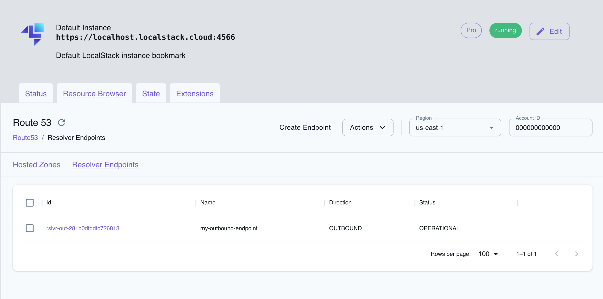

## Introduction

Route 53 Resolver allows you to route DNS queries between your virtual private cloud (VPC) and your network. Route 53 Resolver forwards DNS queries for domain names to the appropriate DNS service based on the configuration you set up. Route 53 Resolver can be used to resolve domain names between your VPC and your network, and to resolve domain names between your VPCs.

LocalStack allows you to use the Route 53 Resolver endpoints in your local environment.
The supported APIs are available on our [API coverage page](https://docs.localstack.cloud/references/coverage/coverage_route53resolver/), which provides information on the extent of Route 53 Resolver's integration with LocalStack.

## Getting started

This guide is designed for users new to Route53 Resolver and assumes basic knowledge of the AWS CLI and our [`awslocal`](https://github.com/localstack/awscli-local) wrapper script.

Start your LocalStack container using your preferred method. We will demonstrate how to create a resolver endpoint, list the endpoints, and delete the endpoint with the AWS CLI.

### Fetch the IP addresses & Security Group ID

Fetch the default VPC ID using the following command:


$ VPC_ID=$(awslocal ec2 describe-vpcs --query 'Vpcs[?IsDefault==`true`].VpcId' --output text)


Fetch the default VPC's security group ID using the following command:


$ awslocal ec2 describe-subnets --filters Name=vpc-id,Values=$VPC_ID --query 'Subnets[].SubnetId'


You should see the following output:

```bash
[
    "subnet-bdd58a47",
    "subnet-957d6ba6",
    "subnet-3f8669d3",
    "subnet-ec2a41c6",
    "subnet-3d583924",
    "subnet-8c1b0af8"
]
```

Choose two subnets from the list above and fetch the CIDR block of the subnets which tells you the range of IP addresses within it:


$ awslocal ec2 describe-subnets --subnet-ids subnet-957d6ba6 --query 'Subnets[*].CidrBlock'
<disable-copy>
[
    "172.31.16.0/20"
]
</disable-copy>
$ awslocal ec2 describe-subnets --subnet-ids subnet-bdd58a47 --query 'Subnets[*].CidrBlock'
<disable-copy>
[
    "172.31.0.0/20"
]
</disable-copy>


Save the CIDR blocks of the subnets as you will need them later. Lastly fetch the security group ID of the default VPC:


$ awslocal ec2 describe-security-groups \
    --filters Name=vpc-id,Values=$VPC_ID \
    --query 'SecurityGroups[0].GroupId'
<disable-copy>
sg-39936e572e797b360
</disable-copy>


Save the security group ID as you will need it later.

### Create a resolver endpoint

Create a new file named `create-outbound-resolver-endpoint.json` and add the following content:

```json
{
    "CreatorRequestId": "2020-01-01-18:47",
    "Direction": "OUTBOUND",
    "IpAddresses": [
       {
          "Ip": "172.31.0.0",
          "SubnetId": "subnet-bdd58a47"
       },
       {
          "Ip": "172.31.16.0",
          "SubnetId": "subnet-957d6ba6"
       }
    ],
    "Name": "my-outbound-endpoint",
    "SecurityGroupIds": [ "sg-39936e572e797b360" ],
    "Tags": [
       {
          "Key": "purpose",
          "Value": "test"
       }
    ]
 }
```

Replace the `Ip` and `SubnetId` values with the CIDR blocks and subnet IDs you fetched earlier.

You can now use the [`CreateResolverEndpoint`](https://docs.aws.amazon.com/Route53/latest/APIReference/API_route53resolver_CreateResolverEndpoint.html) API to create an outbound resolver endpoint. Run the following command:


$ awslocal route53resolver create-resolver-endpoint \
    --cli-input-json file://create-outbound-resolver-endpoint.json


The following output would be retrieved:

```bash
{
    "ResolverEndpoint": {
        "Id": "rslvr-out-5d61abaff9de06b99",
        "CreatorRequestId": "2020-01-01-18:47",
        "Arn": "arn:aws:route53resolver:us-east-1:000000000000:resolver-endpoint/rslvr-out-5d61abaff9de06b99",
        "Name": "my-outbound-endpoint",
        "SecurityGroupIds": [
            "sg-39936e572e797b360"
        ],
        "Direction": "OUTBOUND",
        "IpAddressCount": 2,
        "HostVPCId": "vpc-d78cf7bb",
        "Status": "CREATING",
        "StatusMessage": "[Trace id: 1-bf9fe209-b90acae7cbcefe68a98b2882] Successfully created Resolver Endpoint",
        "CreationTime": "2024-05-02T15:03:17.266471+00:00",
        "ModificationTime": "2024-05-02T15:03:17.266491+00:00"
    }
}
```

### List the resolver endpoints

You can list the resolver endpoints using the [`ListResolverEndpoints`](https://docs.aws.amazon.com/Route53/latest/APIReference/API_route53resolver_ListResolverEndpoints.html) API. Run the following command:


$ awslocal route53resolver list-resolver-endpoints


The following output would be retrieved:

```bash
{
    "ResolverEndpoints": [
        {
            "Id": "rslvr-out-5d61abaff9de06b99",
            "CreatorRequestId": "2020-01-01-18:47",
            "Arn": "arn:aws:route53resolver:us-east-1:000000000000:resolver-endpoint/rslvr-out-5d61abaff9de06b99",
            "Name": "my-outbound-endpoint",
            "SecurityGroupIds": [
                "sg-39936e572e797b360"
            ],
            "Direction": "OUTBOUND",
            "IpAddressCount": 2,
            "HostVPCId": "vpc-d78cf7bb",
            "Status": "OPERATIONAL",
            "StatusMessage": "[Trace id: 1-bf9fe209-b90acae7cbcefe68a98b2882] Successfully created Resolver Endpoint",
            "CreationTime": "2024-05-02T15:03:17.266471+00:00",
            "ModificationTime": "2024-05-02T15:03:17.266491+00:00"
        }
    ],
    "MaxResults": 10
}
```

### Delete the resolver endpoint

You can delete the resolver endpoint using the [`DeleteResolverEndpoint`](https://docs.aws.amazon.com/Route53/latest/APIReference/API_route53resolver_DeleteResolverEndpoint.html) API. Run the following command:


$ awslocal route53resolver delete-resolver-endpoint \
    --resolver-endpoint-id rslvr-out-5d61abaff9de06b99


Replace `rslvr-out-5d61abaff9de06b99` with the ID of the resolver endpoint you want to delete.

## Resource Browser

The LocalStack Web Application provides a Route53 Resolver for creating and managing resolver endpoints. You can access the Resource Browser by opening the LocalStack Web Application in your browser, navigating to the **Resource Browser** section, and then clicking on **Route53** under the **Analytics** section. Navigate to the **Resolver Endpoints** tab to view the resolver endpoints.



The Resource Browser allows you to perform the following actions:

- **Create resolver endpoint**: Create a resolver endpoint by clicking on the **Create Endpoint** button. This will open a modal where you can enter the name, VPC, and other parameters and click on the **Submit** button to create the resolver endpoint.
- **View resolver endpoint**: View the details of a resolver endpoint by clicking on the specific resolver endpoint name. This will open a modal where you can view the resolver endpoint details.
- **Edit resolver endpoint**: Edit the details of a resolver endpoint by clicking on the **Edit Endpoint** button in the specific resolver endpoint page. This will open a modal where you can edit the resolver endpoint details.
- **Delete resolver endpoint**: Select the resolver endpoints you want to delete by clicking on the checkbox next to the resolver endpoint name, followed by clicking on the **Actions** button and then clicking on **Remove Selected**.
