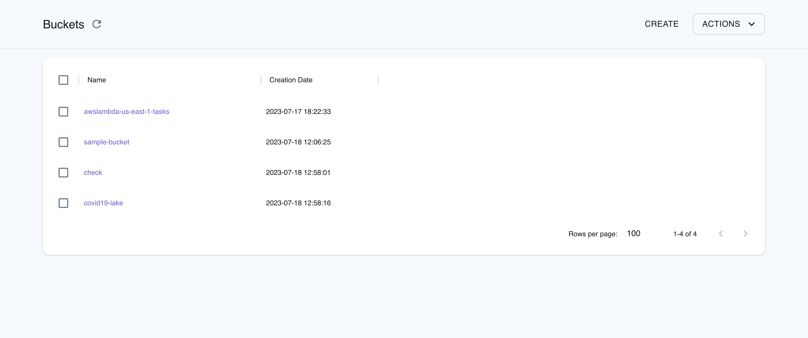

## Introduction

Simple Storage Service (S3) is an object storage service that provides a highly scalable and durable solution for storing and retrieving data. In S3, a bucket represents a directory, while an object corresponds to a file. Each object or file within S3 encompasses essential attributes such as a unique key denoting its name, the actual content it holds, a version ID for versioning support, and accompanying metadata. S3 can store unlimited objects, allowing you to store, retrieve, and manage your data in a highly adaptable and reliable manner.

LocalStack allows you to use the S3 APIs in your local environment to create new buckets, manage your S3 objects, and test your S3 configurations locally. The supported APIs are available on our [API coverage page](https://docs.localstack.cloud/references/coverage/coverage_s3/), which provides information on the extent of S3's integration with LocalStack.

## Getting started

This guide is designed for users new to S3 and assumes basic knowledge of the AWS CLI and our [`awslocal`](https://github.com/localstack/awscli-local) wrapper script.

Start your LocalStack container using your preferred method. We will demonstrate how you can create an S3 bucket, manage S3 objects, and generate pre-signed URLs for S3 objects.

### Create an S3 bucket

You can create an S3 bucket using the [`CreateBucket`](https://docs.aws.amazon.com/cli/latest/reference/s3api/create-bucket.html) API. Run the following command to create an S3 bucket named `sample-bucket`:


$ awslocal s3api create-bucket --bucket sample-bucket


You can list your S3 buckets using the [`ListBuckets`](https://docs.aws.amazon.com/cli/latest/reference/s3api/list-buckets.html) API. Run the following command to list your S3 buckets:


$ awslocal s3api list-buckets


On successful creation of the S3 bucket, you will see the following output:

```bash
{
    "Buckets": [
        {
            "Name": "sample-bucket",
            "CreationDate": "2023-07-18T06:36:25+00:00"
        }
    ],
    "Owner": {
        "DisplayName": "webfile",
        "ID": "75aa57f09aa0c8caeab4f8c24e99d10f8e7faeebf76c078efc7c6caea54ba06a"
    }
}
```

### Managing S3 objects

To upload a file to your S3 bucket, you can use the [`PutObject`](https://docs.aws.amazon.com/cli/latest/reference/s3api/put-object.html) API. Download a random image from the internet and save it as `image.jpg`. Run the following command to upload the file to your S3 bucket:


$ awslocal s3api put-object \
  --bucket sample-bucket \
  --key image.jpg \
  --body image.jpg


You can list the objects in your S3 bucket using the [`ListObjects`](https://docs.aws.amazon.com/cli/latest/reference/s3api/list-objects.html) API. Run the following command to list the objects in your S3 bucket:


$ awslocal s3api list-objects \
  --bucket sample-bucket


If your image has been uploaded successfully, you will see the following output:

```bash
{
    "Contents": [
        {
            "Key": "image.jpg",
            "LastModified": "2023-07-18T06:40:07+00:00",
            "ETag": "\"d41d8cd98f00b204e9800998ecf8427e\"",
            "Size": 0,
            "StorageClass": "STANDARD",
            "Owner": {
                "DisplayName": "webfile",
                "ID": "75aa57f09aa0c8caeab4f8c24e99d10f8e7faeebf76c078efc7c6caea54ba06a"
            }
        }
    ]
}
```

Run the following command to upload a file named `index.html` to your S3 bucket:



$ awslocal s3api put-object --bucket sample-bucket --key index.html --body index.html

{
    "ETag": "\"d41d8cd98f00b204e9800998ecf8427e\""
}


### Generate a pre-signed URL for S3 object

You can generate a pre-signed URL for your S3 object using the [`presign`](https://docs.aws.amazon.com/cli/latest/reference/s3/presign.html) command. Pre-signed URL allows anyone to retrieve the S3 object with an HTTP GET request.

Run the following command to generate a pre-signed URL for your S3 object:


$ awslocal s3 presign s3://sample-bucket/image.jpg


You will see a generated pre-signed URL for your S3 object. You can use [`cURL`](https://curl.se/) or [`wget`](https://www.gnu.org/software/wget/) to retrieve the S3 object using the pre-signed URL.

## Path-Style and Virtual Hosted-Style Requests

Similar to AWS, LocalStack categorizes requests as either [Path style or Virtual-Hosted style](https://docs.aws.amazon.com/AmazonS3/latest/userguide/VirtualHosting.html) based on the Host header of the request.
The following example illustrates this distinction:

```bash
http://<bucket-name>.s3.<region>.localhost.localstack.cloud:4566/<key-name> # host-style request
http://<bucket-name>.s3.localhost.localstack.cloud:4566/<key-name> # host-style request, region is not mandatory in LocalStack
http://s3.<region>.localhost.localstack.cloud:4566/<bucket-name>/<key-name> # path-style request
http://localhost:4566/<bucket-name>/<key-name> # path-style request
```

A **Virtual-Hosted style** request will have the `bucket` as part of the `Host` header of your request.
In order for LocalStack to be able to parse the bucket name from your request, your endpoint needs to be prefixed with `s3.`, like `s3.localhost.localstack.cloud`.

If your endpoint cannot be prefixed with `s3.`, you should configure your SDK to use **Path style** request instead, and make the bucket part of the path. 

By default, most SDKs will try to use **Virtual-Hosted style** requests and prepend your endpoint with the bucket name.
However, if the endpoint is not prefixed by `s3.`, LocalStack will not be able to understand the request and it will most likely result in an error.

You can either change the endpoint to an S3-specific one, or configure your SDK to use **Path style** requests instead.
Check out our [SDK documentation](https://docs.localstack.cloud/user-guide/integrations/sdks/) to learn how you can configure language SDKs to access LocalStack and S3.


While using [AWS language SDKs](https://aws.amazon.com/developer/tools/#SDKs), you would need to configure the `ForcePathStyle` parameter to `true` in the S3 client configuration to use **Path style** requests. If you want to use virtual host addressing of buckets, you can remove `ForcePathStyle` from the configuration.
The `ForcePathStyle` parameter name can vary between SDK and languages, please check our [SDK documentation](https://docs.localstack.cloud/user-guide/integrations/sdks/)


If your endpoint is not prefixed with `s3.`, all requests are treated as **Path style** requests.
Using the `s3.localhost.localstack.cloud` endpoint URL is recommended for all requests aimed at S3.

## Configuring Cross-Origin Resource Sharing on S3

You can configure Cross-Origin Resource Sharing (CORS) on a LocalStack S3 bucket using AWS Command Line Interface (CLI). It would allow your local application to communicate directly with an S3 bucket in LocalStack. By default, LocalStack will apply specific CORS rules to all requests to allow you to display and access your resources through [LocalStack Web Application](https://app.localstack.cloud). If no CORS rules are configured for your S3 bucket, LocalStack will apply default rules unless specified otherwise.

To configure CORS rules for your S3 bucket, you can use the `awslocal` wrapper. Optionally, you can run a local web application on [localhost:3000](http://localhost:3000). You can emulate the same behaviour with an AWS SDK or an integration you use. Follow this step-by-step guide to configure CORS rules on your S3 bucket.

Run the following command on your terminal to create your S3 bucket:


$ awslocal s3api create-bucket --bucket cors-bucket
{
    "Location": "/cors-bucket"
}


Next, create a JSON file with the CORS configuration. The file should have the following format:

```json
{
  "CORSRules": [
    {
      "AllowedHeaders": ["*"],
      "AllowedMethods": ["GET", "POST", "PUT"],
      "AllowedOrigins": ["http://localhost:3000"],
      "ExposeHeaders": ["ETag"]
    }
  ]
}
```


Note that this configuration is a sample, and you can tailor it to fit your needs better, for example, restricting the **AllowedHeaders** to specific ones.


Save the file locally with a name of your choice, for example, `cors-config.json`. Run the following command to apply the CORS configuration to your S3 bucket:


$ awslocal s3api put-bucket-cors --bucket cors-bucket --cors-configuration file://cors-config.json


You can further verify that the CORS configuration was applied successfully by running the following command:


$ awslocal s3api get-bucket-cors --bucket cors-bucket


On applying the configuration successfully, you should see the same JSON configuration file you created earlier. Your S3 bucket is configured to allow cross-origin resource sharing, and if you try to send requests from your local application running on [localhost:3000](http://localhost:3000), they should be successful.

However, if you try to access your bucket from [LocalStack Web Application](https://app.localstack.cloud), you'll see errors, and your bucket won't be accessible anymore. We can edit the JSON file `cors-config.json` you created earlier with the following configuration and save it:

```json
{
  "CORSRules": [
    {
      "AllowedHeaders": ["*"],
      "AllowedMethods": ["GET", "POST", "PUT", "HEAD", "DELETE"],
      "AllowedOrigins": [
        "http://localhost:3000",
        "https://app.localstack.cloud",
        "http://app.localstack.cloud"
      ],
      "ExposeHeaders": ["ETag"]
    }
  ]
}
```

You can now run the same steps as before to update the CORS configuration and verify if it is applied correctly:


$ awslocal s3api put-bucket-cors --bucket cors-bucket --cors-configuration file://cors-config.json
$ awslocal s3api get-bucket-cors --bucket cors-bucket


You can try again to upload files in your bucket from the [LocalStack Web Application](https://app.localstack.cloud) and it should work.

## S3 Docker image

LocalStack provides a Docker image for S3, which you can use to run S3 in a Docker container. The image is available on [Docker Hub](https://hub.docker.com/r/localstack/localstack) and can be pulled using the following command:


$ docker pull localstack/localstack:s3-latest


The S3 Docker image only supports the S3 APIs and does not include other services like Lambda, DynamoDB, etc. You can run the S3 Docker image using any of the following commands:



IMAGE_NAME=localstack/localstack:s3-latest localstack start


version: "3.8"

services:
  localstack:
    container_name: "${LOCALSTACK_DOCKER_NAME:-localstack-main}"
    image: localstack/localstack:s3-latest
    ports:
      - "127.0.0.1:4566:4566"            # LocalStack Gateway
    environment:
      - DEBUG=${DEBUG:-0}
    volumes:
      - "${LOCALSTACK_VOLUME_DIR:-./volume}:/var/lib/localstack"
      - "/var/run/docker.sock:/var/run/docker.sock"


docker run \
  --rm \
  -p 4566:4566 \
  localstack/localstack:s3-latest



The S3 Docker image has similar parity with the S3 APIs supported by LocalStack Docker image. You can use similar [configuration options](https://docs.localstack.cloud/references/configuration/#s3) to alter the behaviour of the S3 Docker image, such as `DEBUG` or `S3_SKIP_SIGNATURE_VALIDATION`.

## Resource Browser

The LocalStack Web Application provides a [Resource Browser](https://docs.localstack.cloud/user-guide/web-application/resource-browser/) for managing S3 buckets & configurations. You can access the Resource Browser by opening the LocalStack Web Application in your browser, navigating to the **Resources** section, and then clicking on **S3** under the **Storage** section.



The Resource Browser allows you to perform the following actions:

- **Create Bucket**: Create a new S3 bucket by specifying a **Bucket Name**, **Bucket Configuration**, **ACL**, **Object Ownership**, and more.
- **Objects & Permissions**: View, upload, download, and delete objects in your S3 buckets. You can also view and edit the permissions, like the CORS Configuration for the bucket.
- **Create Folder**: Create a new folder in your S3 bucket by clicking on the **Create Folder** button and specifying a **Folder Name**.
- **Delete Bucket**: Delete an S3 bucket by selecting the S3 bucket and clicking on **Actions** button and clicking on **Remove Selected**.

## Examples

The following code snippets and sample applications provide practical examples of how to use S3 in LocalStack for various use cases:

- [Full-Stack application with Lambda, DynamoDB & S3 for shipment validation](https://github.com/localstack-samples/sample-shipment-list-demo-lambda-dynamodb-s3).
- [Serverless Transcription application using Transcribe, S3, Lambda, SQS, and SES](https://github.com/localstack/sample-transcribe-app)
- [Query data in S3 Bucket with Amazon Athena, Glue Catalog & CloudFormation](https://github.com/localstack/query-data-s3-athena-glue-sample)
- [Serverless Image Resizer with Lambda, S3, SNS, and SES](https://github.com/localstack/serverless-image-resizer)
- [Host a static website locally using Simple Storage Service (S3) and Terraform with LocalStack](https://docs.localstack.cloud/tutorials/s3-static-website-terraform/)
