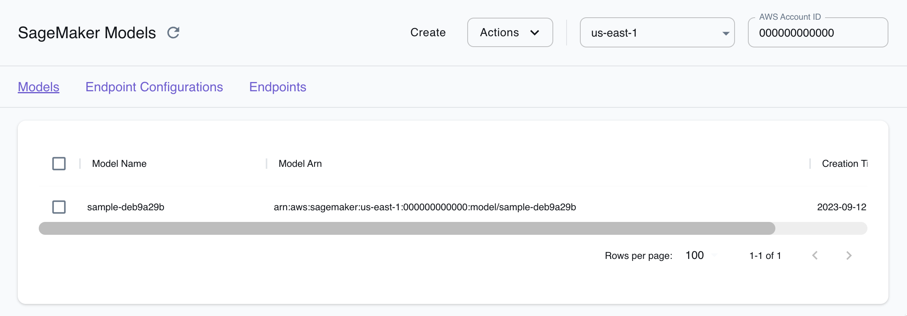
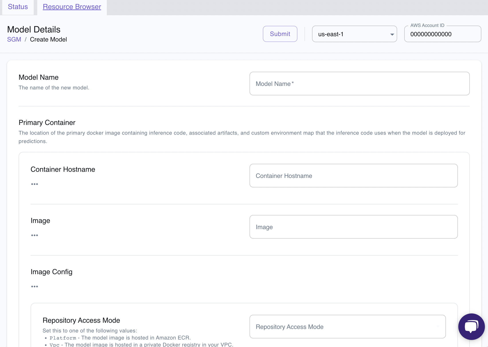

## Introduction 

Amazon SageMaker is a fully managed service provided by Amazon Web Services (AWS) that provides the tools to build, train, and deploy machine-learning models in the cloud for predictive analytics applications. It streamlines the machine learning development process, reduces the time and effort required to build and deploy models, and offers the scalability and flexibility needed for large-scale machine learning projects in the AWS cloud.

LocalStack Pro provides a local version of the SageMaker API, which allows running jobs to create machine learning models (e.g., using PyTorch) and to deploy them. The supported APIs are available on our [API coverage page](https://docs.localstack.cloud/references/coverage/coverage_sagemaker/), which provides information on the extent of Sagemaker's integration with LocalStack.


LocalStack supports custom-built models in SageMaker. You can push your Docker image to LocalStack's Elastic Container Registry (ECR) and use it in SageMaker. LocalStack will use the local ECR image to create a SageMaker model.


## Getting started

This guide is designed for users new to SageMaker and assumes basic knowledge of Python3 and [AWS SDK for Python (Boto3)](https://aws.amazon.com/sdk-for-python/).

We will demonstrate an application illustrating running a machine learning job using the SageMaker API locally that perform the following:

- Set up an MNIST model in SageMaker using LocalStack.
- Creates a SageMaker Endpoint for accessing the model
- Invokes the endpoint directly on the container via Boto3


SageMaker is a fairly comprehensive API for now. Currently a subset of the functionality is provided locally, but new features are being added on a regular basis.


### Download the sample application

You can download the sample application from [GitHub](https://github.com/localstack/localstack-pro-samples/tree/master/sagemaker-inference) or by running the following commands:


$ mkdir localstack-samples && cd localstack-samples
$ git init
$ git remote add origin -f git@github.com:localstack/localstack-pro-samples.git
$ git config core.sparseCheckout true
$ echo sagemaker-inference >> .git/info/sparse-checkout
$ git pull origin master


### Set up the environment

After downloading the sample application, you can set up your Docker Client to pull the AWS Deep Learning images by running the following command:


$ aws ecr get-login-password --region us-east-1 | docker login --username AWS --password-stdin 763104351884.dkr.ecr.us-east-1.amazonaws.com


Since the images are quite large (several gigabytes), it's a good idea to pull the images using Docker in advance.


$ docker pull 763104351884.dkr.ecr.us-east-1.amazonaws.com/pytorch-inference:1.5.0-cpu-py3


### Run the sample application

Start your LocalStack container using your preferred method. Run the sample application by executing the following command:


$ python3 main.,py


You should see the following output:

```bash
Creating bucket...
Uploading model data to bucket...
Creating model in SageMaker...
Adding endpoint configuration...
Creating endpoint...
Checking endpoint status...
Endpoint not ready - waiting...
Checking endpoint status...
Endpoint ready!
Invoking via boto...
Predicted digits: [7, 3]
Invoking endpoint directly...
Predicted digits: [2, 6]
```

You can also invoke a serverless endpoint, by navigating to `main.py` and uncommenting the [`run_serverless`](https://github.com/localstack/localstack-pro-samples/blob/cca7a59e0b2b46a18a3db226c31d44401b68447e/sagemaker-inference/main.py#L134) function call.

## Resource Browser

The LocalStack Web Application provides a [Resource Browser](https://docs.localstack.cloud/user-guide/web-application/resource-browser/) for managing Lambda resources. You can access the Resource Browser by opening the LocalStack Web Application in your browser, navigating to the **Resources** section, and then clicking on **Sagemaker** under the **Compute** section.

The Resource Browser displays Models, Endpoint Configurations and Endpoint. You can click on individual resources to view their details.



The Resource Browser allows you to perform the following actions:

- **Create and Remove Models**: You can remove existing model and create a new model with the required configuration


  


- **Endpoint Configurations & Endpoints**: You can create endpoints from the resource browser that hosts your deployed machine learning model. You can also create endpoint configuration that specifies the type and number of instances that will be used to serve your model on an endpoint.

## Examples 

The following code snippets and sample applications provide practical examples of how to use Sagemaker in LocalStack for various use cases:

- [MNIST handwritten digit recognition model](https://github.com/localstack-samples/sample-mnist-digit-recognition-sagemaker) demonstrates a web application that allows users to draw a digit and submit it to a locally running SageMaker endpoint.
