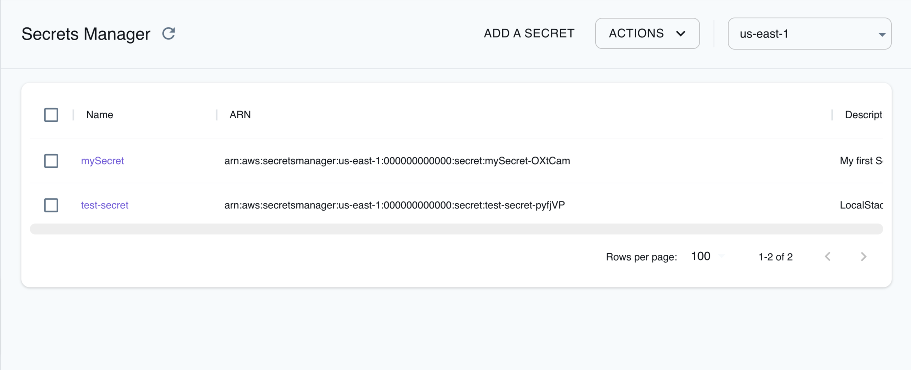

## Introduction

Secrets Manager is a service provided by Amazon Web Services (AWS) that enables you to securely store, manage, and retrieve sensitive information such as passwords, API keys, and other credentials.
Secrets Manager integrates seamlessly with AWS services, making it easier to manage secrets used by various applications and services.
Secrets Manager supports automatic secret rotation, replacing long-term secrets with short-term ones to mitigate the risk of compromise without requiring application updates.

LocalStack allows you to use the Secrets Manager APIs in your local environment to manage, retrieve, and rotate secrets.
The supported APIs are available on our [API coverage page](https://docs.localstack.cloud/references/coverage/coverage_secretsmanager/), which provides information on the extent of Secrets Manager's integration with LocalStack.

## Getting started

This guide is designed for users new to Secrets Manager and assumes basic knowledge of the AWS CLI and our [`awslocal`](https://github.com/localstack/awscli-local) wrapper script.

Start your LocalStack container using your preferred method.
We will demonstrate how to create a secret, get the secret value, and rotate the secret using the AWS CLI.

### Create a secret

Before your create a secret, create a file named `secrets.json` and add the following content:


$ touch secrets.json
$ cat > secrets.json << EOF
{
  "username": "admin",
  "password": "password"
}
EOF


You can now create a secret using the [`CreateSecret`](https://docs.aws.amazon.com/secretsmanager/latest/apireference/API_CreateSecret.html) API.
Execute the following command to create a secret named `test-secret`:


$ awslocal secretsmanager create-secret \
    --name test-secret \
    --description "LocalStack Secret" \
    --secret-string file://secrets.json


Upon successful execution, the output will provide you with the ARN of the newly created secret. This identifier will be useful for further operations or integrations.

The following output would be retrieved:


{
    "ARN": "arn:aws:secretsmanager:us-east-1:000000000000:secret:test-secret-pyfjVP",
    "Name": "test-secret",
    "VersionId": "a50c6752-3343-4eb0-acf3-35c74f00f707"
}


### Describe the secret

To retrieve the details of the secret you created earlier, you can use the [`DescribeSecret`](https://docs.aws.amazon.com/secretsmanager/latest/apireference/API_DescribeSecret.html) API.
Execute the following command:


$ awslocal secretsmanager describe-secret \
    --secret-id test-secret


The following output would be retrieved:


{
    "ARN": "arn:aws:secretsmanager:us-east-1:000000000000:secret:test-secret-pyfjVP",
    "Name": "test-secret",
    "Description": "LocalStack Secret",
    "LastChangedDate": 1692882479.857329,
    "VersionIdsToStages": {
        "a50c6752-3343-4eb0-acf3-35c74f00f707": [
            "AWSCURRENT"
        ]
    },
    "CreatedDate": 1692882479.857329
}


You can also get a list of the secrets available in your local environment that have **Secret** in the name using the [`ListSecrets`](https://docs.aws.amazon.com/secretsmanager/latest/apireference/API_ListSecrets.html) API.
Execute the following command:


$ awslocal secretsmanager list-secrets \
    --filters Key=name,Values=Secret


### Get the secret value

To retrieve the value of the secret you created earlier, you can use the [`GetSecretValue`](https://docs.aws.amazon.com/secretsmanager/latest/apireference/API_GetSecretValue.html) API.
Execute the following command:


$ awslocal secretsmanager get-secret-value \
    --secret-id test-secret


The following output would be retrieved:
 

{
    "ARN": "arn:aws:secretsmanager:us-east-1:000000000000:secret:test-secret-pyfjVP",
    "Name": "test-secret",
    "VersionId": "a50c6752-3343-4eb0-acf3-35c74f00f707",
    "SecretString": "{\n  \"username\": \"admin\",\n  \"password\": \"password\"\n}\n",
    "VersionStages": [
        "AWSCURRENT"
    ],
    "CreatedDate": 1692882479.857329
}


You can tag your secret using the [`TagResource`](https://docs.aws.amazon.com/secretsmanager/latest/apireference/API_TagResource.html) API.
Execute the following command:


$ awslocal secretsmanager tag-resource \
    --secret-id test-secret \
    --tags Key=Environment,Value=Development


### Rotate the secret

To rotate a secret, you need a Lambda function that can rotate the secret. You can copy the code from a [Secrets Manager template](https://docs.aws.amazon.com/secretsmanager/latest/userguide/reference_available-rotation-templates.html) or you can use a [generic Lambda function](https://github.com/aws-samples/aws-secrets-manager-rotation-lambdas/blob/master/SecretsManagerRotationTemplate/lambda_function.py) that rotates the secret.

Zip the Lambda function and create a Lambda function using the [`CreateFunction`](https://docs.aws.amazon.com/lambda/latest/dg/API_CreateFunction.html) API.
Execute the following command:


$ zip my-function.zip lambda_function.py
$ awslocal lambda create-function \
    --function-name my-rotation-function \
    --runtime python3.9 \
    --zip-file fileb://my-function.zip \
    --handler my-handler \
    --role arn:aws:iam::000000000000:role/service-role/rotation-lambda-role


You can now set a resource policy on the Lambda function to allow Secrets Manager to invoke it using [`AddPermission`](https://docs.aws.amazon.com/lambda/latest/dg/API_AddPermission.html) API.

Please note that this is not required with the default LocalStack settings, since IAM permission enforcement is disabled by default.

Execute the following command:


$ awslocal lambda add-permission \
    --function-name my-rotation-function \
    --action lambda:InvokeFunction \
    --statement-id SecretsManager \
    --principal secretsmanager.amazonaws.com


You can now create a rotation schedule for the secret using the [`RotateSecret`](https://docs.aws.amazon.com/secretsmanager/latest/apireference/API_RotateSecret.html) API.
Execute the following command:


$ awslocal secretsmanager rotate-secret \
    --secret-id MySecret \
    --rotation-lambda-arn arn:aws:lambda:us-east-1:000000000000:function:my-rotation-function \
    --rotation-rules "{\"ScheduleExpression\": \"cron(0 16 1,15 * ? *)\", \"Duration\": \"2h\"}"


## Resource Browser

The LocalStack Web Application provides a Resource Browser for managing secrets in your local environment.
You can access the Resource Browser by opening the LocalStack Web Application in your browser, navigating to the **Resources** section, and then clicking on **Secrets Manager** under the **Security Identity Compliance** section.

 
 
The Resource Browser allows you to perform the following actions:

- **Create Secret**: Create a new secret by clicking **Add a Secret** and providing the required details, such as Name, Tags, Kms Key Id, Secret String, and more.
- **View Secrets**: View the details of a secret by clicking on the secret name. You can also see the secret value by clicking on **Display Secret**.
- **Edit Secret**: Edit the details of a secret by clicking on the secret name and then clicking **Edit Secret** and adding the new secret value.
- **Delete Secret**: Delete a secret by clicking on the secret name and then clicking **Actions** and then **Remove Selected**.

## Examples

The following code snippets and sample applications provide practical examples of how to use Secrets Manager in LocalStack for various use cases:

- [Amazon RDS initialization using CDK, Lambda, ECR, and Secrets Manager](https://github.com/localstack/amazon-rds-init-cdk)
