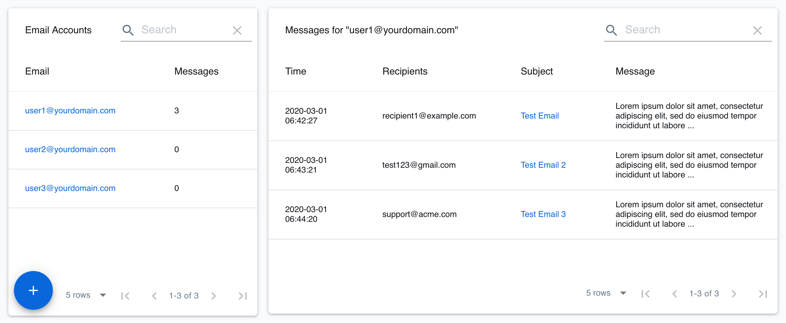

## Introduction

Simple Email Service (SES) is an emailing service that can be integrated with other cloud-based services.

LocalStack supports SES v1 in the Community edition, with SES v2 and SMTP integration supported in the Pro edition.
The full list of supported APIs can be found on the [API coverage page](https://docs.localstack.cloud/references/coverage/coverage_ses/).

## Getting Started

This is an introductory guide to get started with SES.
Basic knowledge of the AWS CLI and LocalStack [`awslocal`](https://github.com/localstack/awscli-local) command is assumed.

Start LocalStack using your preferred method.

To be able to send emails, we need to create a verified identity.
A verified identity appears as part of the 'From' field in the sent email.

A singular email identity can be added using the `VerifyEmailIdentity` operation.


$ awslocal ses verify-email-identity --email hello@example.com

$ awslocal ses list-identities
{
    "Identities": [
        "hello@example.com"
    ]
}


Next, emails can be sent using the `SendEmail` operation.


$ awslocal ses send-email \
        --from "hello@example.com"   \
        --message 'Body={Text={Data="This is the email body"}},Subject={Data="This is the email subject"}'   \
        --destination 'ToAddresses=jeff@aws.com'
{
    "MessageId": "labpqxukegeaftfh-ymaouvvy-ribr-qeoy-izfp-kxaxbfcfsgbh-wpewvd"
}


On LocalStack Community, this is a mock operation i.e. no actual email is sent.
On LocalStack Pro, you can enable [SMTP Integration](#smtp-integration) to send real emails.

## Sent Emails

LocalStack keeps track of all sent emails for retrospection.
The sent messages can be retrieved in following ways:
- **Filesystem:** All messages are saved to the state directory (see [filesystem layout]()).
    The files are saved as JSON in the `ses/` subdirectory and named by the message ID.
- **API endpoint:** LocalStack provides a service endpoint (`/_aws/ses`) which can be used to return in-memory saved messages.
    A `GET` call returns all messages.
    Query parameters `id` and `email` can be used to filter by message ID and message source respectively.
    
$ curl --silent localhost.localstack.cloud:4566/_aws/ses?email=hello@example.com | jq .
{
  "messages": [
    {
      "Id": "dqxhhgoutkmylpbc-ffuqlkjs-ljld-fckp-hcph-wcsrkmxhhldk-pvadjc",
      "Region": "eu-central-1",
      "Destination": {
        "ToAddresses": [
          "jeff@aws.com"
        ]
      },
      "Source": "hello@example.com",
      "Subject": "This is the email subject",
      "Body": {
        "text_part": "This is the email body",
        "html_part": null
      },
      "Timestamp": "2023-09-11T08:37:13"
    }
  ]
}
    
    A `DELETE` call clears all messages from the memory.
    The query parameter `id` can be used to delete only a specific message.
    
    $ curl --silent -X DELETE localhost.localstack.cloud:4566/_aws/ses?id=dqxhhgoutkmylpbc-ffuqlkjs-ljld-fckp-hcph-wcsrkmxhhldk-pvadjc
    

## SMTP Integration

LocalStack Pro ships with support for sending SES messages through an actual SMTP email server.

Please refer to the [Configuration]() guide for instructions on how to configure the connection parameters of your SMTP server (`SMTP_HOST`/`SMTP_USER`/`SMTP_PASS`).

Once the SMTP server has been configured, the SES user interface in the Web app can be used to create a new email account (e.g., `user1@yourdomain.com`).

## User Interface

[LocalStack Web app](https://app.localstack.cloud) can be used to view the sent email messages, as illustrated in the screenshot below:

