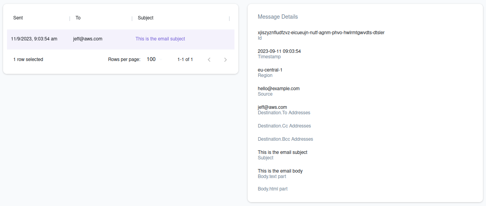

## Introduction

Simple Email Service (SES) is an emailing service that can be integrated with other cloud-based services.
It provides API to facilitate email templating, sending bulk emails and more.

LocalStack supports SES v1 in the Community edition, while the Pro edition also supports SES v2 and SMTP integration.
The full list of supported APIs can be found on the API coverage pages: [SES v1](https://docs.localstack.cloud/references/coverage/coverage_ses/) and [SES v2](https://docs.localstack.cloud/references/coverage/coverage_sesv2/)

## Getting Started

This is an introductory guide to get started with SES.
Basic knowledge of the AWS CLI and LocalStack [`awslocal`](https://github.com/localstack/awscli-local) command is assumed.

Start LocalStack using your preferred method.

To be able to send emails, we need to create a verified identity.
A verified identity appears as part of the 'From' field in the sent email.

A singular email identity can be added using the `VerifyEmailIdentity` operation.


$ awslocal ses verify-email-identity --email hello@example.com

$ awslocal ses list-identities
{
    "Identities": [
        "hello@example.com"
    ]
}



On AWS, verifying email identities or domain identities require additional steps like changing DNS configuration or clicking verification links respectively.
In LocalStack, verifying identities require no additional steps.


Next, emails can be sent using the `SendEmail` operation.


$ awslocal ses send-email \
        --from "hello@example.com"   \
        --message 'Body={Text={Data="This is the email body"}},Subject={Data="This is the email subject"}'   \
        --destination 'ToAddresses=jeff@aws.com'
{
    "MessageId": "labpqxukegeaftfh-ymaouvvy-ribr-qeoy-izfp-kxaxbfcfsgbh-wpewvd"
}


On LocalStack Community, this is a mock operation i.e. no actual email is sent.
On LocalStack Pro, you can enable [SMTP Integration](#smtp-integration) to send real emails.

## Sent Emails

LocalStack keeps track of all sent emails for retrospection.
Sent messages can be retrieved in following ways:
- **API endpoint:** LocalStack provides a service endpoint (`/_aws/ses`) which can be used to return in-memory saved messages.
    A `GET` call returns all messages.
    Query parameters `id` and `email` can be used to filter by message ID and message source respectively.
    
$ curl --silent localhost.localstack.cloud:4566/_aws/ses?email=hello@example.com | jq .
{
  "messages": [
    {
      "Id": "dqxhhgoutkmylpbc-ffuqlkjs-ljld-fckp-hcph-wcsrkmxhhldk-pvadjc",
      "Region": "eu-central-1",
      "Destination": {
        "ToAddresses": [
          "jeff@aws.com"
        ]
      },
      "Source": "hello@example.com",
      "Subject": "This is the email subject",
      "Body": {
        "text_part": "This is the email body",
        "html_part": null
      },
      "Timestamp": "2023-09-11T08:37:13"
    }
  ]
}
    
    A `DELETE` call clears all messages from the memory.
    The query parameter `id` can be used to delete only a specific message.
    
    $ curl -X DELETE localhost.localstack.cloud:4566/_aws/ses?id=dqxhhgoutkmylpbc-ffuqlkjs-ljld-fckp-hcph-wcsrkmxhhldk-pvadjc
    
- **Filesystem:** All messages are saved to the state directory (see [filesystem layout]()).
    The files are saved as JSON in the `ses/` subdirectory and named by the message ID.

## SMTP Integration

LocalStack Pro ships with support for sending emails via an SMTP email server.

Please refer to the [Configuration]() guide for instructions on how to configure the connection parameters of your SMTP server (`SMTP_HOST`/`SMTP_USER`/`SMTP_PASS`).


If you do not have access to a proper SMTP server, you can use tools like [MailDev](https://github.com/maildev/maildev) or [smtp4dev](https://github.com/rnwood/smtp4dev).
These run as Docker containers on your local machine.
Make sure they run in the same Docker network as the LocalStack container.


## Resource Browser

LocalStack Web Application provides a resource browser for managing email identities and introspecing sent emails.

 
 

The Resource Browser allows you to perform following actions:
- **Create Email Identity**: Create an email identity by clicking **Create Identity** and specifying the email address.
- **View Sent Emails**: View all sent emails from an email identity by clicking the email address. You can the view the details of a sent email by selecting them from the list.
- **Send Emails**: On selecting an email identity, click **Send Message** and specify destination fields (To, CC and BCC addresses) and the body (Plaintext, HTML) to send an email.

## Examples

You can discover reference architectures that offer insights into how SES can be used in LocalStack in our [Developer Hub](https://docs.localstack.cloud/developerhub/).


  

## Limitations

It is currently not possible to [receive emails via SES](https://docs.aws.amazon.com/ses/latest/dg/receiving-email.html) in LocalStack.
Consequently, all operations related to Receipt Rules are currently mocked.
