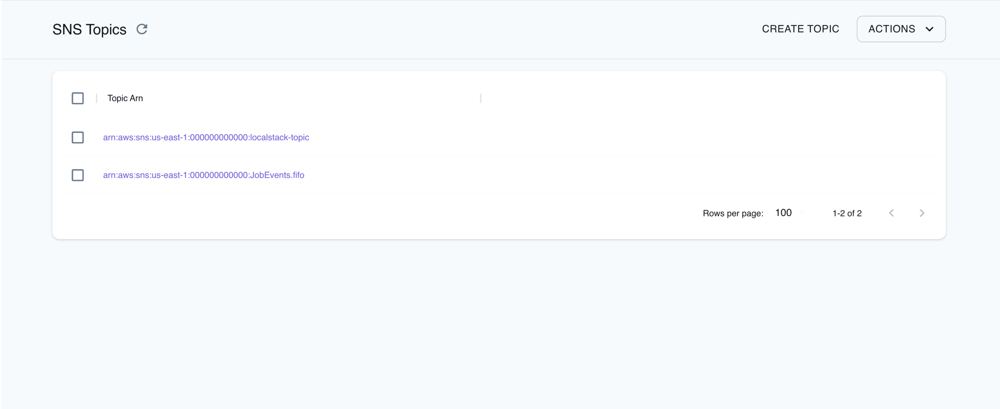

Simple Notification Service (SNS) is a serverless messaging service that can distribute a massive number of messages to multiple subscribers and can be used to send messages to mobile devices, email addresses, and HTTP(s) endpoints. SNS employs the Publish/Subscribe, an asynchronous messaging pattern that decouples services that produce events from services that process events.

LocalStack allows you to use the SNS APIs in your local environment to coordinate the delivery of messages to subscribing endpoints or clients. The supported APIs are available on our [API coverage page](https://docs.localstack.cloud/references/coverage/coverage_sns/), which provides information on the extent of SNS's integration with LocalStack.

## Getting started

This guide is intended for users who wish to get more acquainted with SNS over LocalStack. It assumes you have basic knowledge of the AWS CLI (and our [`awslocal`](https://github.com/localstack/awscli-local) wrapper script).

Start your LocalStack container using your preferred method. We will demonstrate how to create an SNS topic, publish messages, and subscribe to the topic.

### Create an SNS topic

To create an SNS topic, use the [`CreateTopic`](https://docs.aws.amazon.com/sns/latest/api/API_CreateTopic.html) API. Run the following command to create a topic named `localstack-topic`:


$ awslocal sns create-topic --name localstack-topic


You can set the SNS topic attribute using the SNS topic you created previously by using the [`SetTopicAttributes`](https://docs.aws.amazon.com/sns/latest/api/API_SetTopicAttributes.html) API. Run the following command to set the `DisplayName` attribute for the topic:


$ awslocal sns set-topic-attributes \
   --topic-arn arn:aws:sns:us-east-1:000000000000:localstack-topic \
   --attribute-name DisplayName \
   --attribute-value MyTopicDisplayName


You can list all the SNS topics using the [`ListTopics`](https://docs.aws.amazon.com/sns/latest/api/API_ListTopics.html) API. Run the following command to list all the SNS topics:


$ awslocal sns list-topics


### Get attributes and publish messages to SNS topic

You can get attributes for a single SNS topic using the [`GetTopicAttributes`](https://docs.aws.amazon.com/sns/latest/api/API_GetTopicAttributes.html) API. Run the following command to get the attributes for the SNS topic:


$ awslocal sns get-topic-attributes \
   --topic-arn arn:aws:sns:us-east-1:000000000000:localstack-topic


You can change the `topic-arn` to the ARN of the SNS topic you created previously.

To publish messages to the SNS topic, create a new file named `messages.txt` in your current directory and add some content. Run the following command to publish messages to the SNS topic using the [`Publish`](https://docs.aws.amazon.com/sns/latest/api/API_Publish.html) API:


$ awslocal sns publish \
   --topic-arn "arn:aws:sns:us-east-1:000000000000:localstack-topic" \
   --message file://message.txt


### Subscribing to SNS topics and setting subscription attributes

You can subscribe to the SNS topic using the [`Subscribe`](https://docs.aws.amazon.com/sns/latest/api/API_Subscribe.html) API. Run the following command to subscribe to the SNS topic:


$ awslocal sns subscribe \
   --topic-arn arn:aws:sns:us-east-1:000000000000:localstack-topic \
   --protocol email \
   --notification-endpoint test@gmail.com


You can configure the SNS Subscription attributes, using the `SubscriptionArn` returned by the previous step.
For example, run the following command to set the `RawMessageDelivery` attribute for the subscription:


$ awslocal sns set-subscription-attributes \
   --subscription-arn arn:aws:sns:us-east-1:000000000000:test-topic:b6f5e924-dbb3-41c9-aa3b-589dbae0cfff \
   --attribute-name RawMessageDelivery --attribute-value true


### Working with SQS subscriptions for SNS

The getting started covers email subscription, but SNS can integrate with many AWS technologies as seen in the [aws-cli docs](https://docs.aws.amazon.com/cli/latest/reference/sns/subscribe.html).
A Common technology to integrate with is SQS.

First we need to ensure we create an SQS queue named `my-queue`:

$ awslocal sqs create-queue --queue-name my-queue
{
    "QueueUrl": "http://sqs.us-east-1.localhost.localstack.cloud:4566/000000000000/my-queue"
}


Subscribe the SQS queue to the topic we created previously:

$ awslocal sns subscribe --topic-arn "arn:aws:sns:us-east-1:000000000000:localstack-topic" --protocol sqs --notification-endpoint "arn:aws:sqs:us-east-1:000000000000:my-queue"
{
    "SubscriptionArn": "arn:aws:sns:us-east-1:000000000000:localstack-topic:636e2a73-0dda-4e09-9fdf-77f113d0edd8"
}


Sending a message to the queue, via the topic

$ awslocal sns publish --topic-arn "arn:aws:sns:us-east-1:000000000000:localstack-topic" --message "hello"
{
    "MessageId": "5a1593ce-411b-44dc-861d-907daa05353b"
}


Check that our message has arrived:

$ awslocal sqs receive-message --queue-url "http://sqs.us-east-1.localhost.localstack.cloud:4566/000000000000/my-queue"
{
    "Messages": [
        {
            "MessageId": "72a15a17-5652-45ab-b4db-937f60f0c6d8",
            "ReceiptHandle": "YjQ0YjgzMjAtNTk2NC00ZDk0LWE4ZGYtNjljMTViOTkwOTFmIGFybjphd3M6c3FzOnVzLWVhc3QtMTowMDAwMDAwMDAwMDA6bXktcXVldWUgNzJhMTVhMTctNTY1Mi00NWFiLWI0ZGItOTM3ZjYwZjBjNmQ4IDE3MDM3MDQxMTEuNTI2MzEwNA==",
            "MD5OfBody": "2664b540fb6ce6fd7467cd8fb071c30f",
            "Body": "{\"Type\": \"Notification\", \"MessageId\": \"5a1593ce-411b-44dc-861d-907daa05353b\", \"TopicArn\": \"arn:aws:sns:us-east-1:000000000000:localstack-topic\", \"Message\": \"hello\", \"Timestamp\": \"2023-12-27T19:07:55.341Z\", \"SignatureVersion\": \"1\", \"Signature\": \"EXAMPLEpH+..\", \"SigningCertURL\": \"...\", \"UnsubscribeURL\": \"http://localhost.localstack.cloud:4566/?Action=Unsubscribe&SubscriptionArn=arn:aws:sns:us-east-1:000000000000:localstack-topic:636e2a73-0dda-4e09-9fdf-77f113d0edd8\"}"
        }
    ]
}



To remove the subscription you need the subscription ARN which you can find by listing the subscriptions.
You can list all the SNS subscriptions using the [`ListSubscriptions`](https://docs.aws.amazon.com/sns/latest/api/API_ListSubscriptions.html) API.
Run the following command to list all the SNS subscriptions:


$ awslocal sns list-subscriptions
{
    "Subscriptions": [
        {
            "SubscriptionArn": "arn:aws:sns:us-east-1:000000000000:localstack-topic:636e2a73-0dda-4e09-9fdf-77f113d0edd8",
            "Owner": "000000000000",
            "Protocol": "sqs",
            "Endpoint": "arn:aws:sqs:us-east-1:000000000000:my-queue",
            "TopicArn": "arn:aws:sns:us-east-1:000000000000:localstack-topic"
        }
    ]
}


Then, use the ARN to unsubscribe

$ awslocal sns unsubscribe --subscription-arn "arn:aws:sns:us-east-1:000000000000:localstack-topic:636e2a73-0dda-4e09-9fdf-77f113d0edd8"


## Developer endpoints

LocalStack’s SNS implementation offers additional endpoints for developers located at `/_aws/sns`.
These endpoints provide the ability to access different SNS internals, like Platform Endpoint messages which are not sent to those platforms, or Subscription Tokens which you might not be able to retrieve otherwise. 

### Platform Endpoint messages

For testing purposes, LocalStack retains all messages published to a platform endpoint in memory, making it easy to retrieve them.
To learn more about SNS mobile push notifications, refer to the [AWS documentation on SNS mobile push notifications](https://docs.aws.amazon.com/sns/latest/dg/sns-mobile-application-as-subscriber.html).

You can access these messages in JSON format through `GET /_aws/sns/platform-endpoint-messages`.
To retrieve specific messages, you can use query parameters to filter by `accountId`, `region`, and `endpointArn`.
You can also call `DELETE /_aws/sns/platform-endpoint-messages` to clear the messages. 

#### Query parameters

| Parameter | Required | Description |
| - | - | - |
| `accountId` | No | The AWS Account ID from which the messages have been published. If not specified, it will use the default `000000000000` |
| `region` | No | The AWS region from which the messages have been published. If not specified, it will use the default `us-east-1` |
| `endpointArn` | No | The target `EndpointArn` to which the messages have been published. If specified, the response will contain only messages sent to this target. Otherwise, it will return all endpoints with their messages. |

#### Response format and attributes

| Attribute | Description |
| - | - |
| `platform_endpoint_messages` | Contains endpoints ARN as field names. Each endpoint will have its messages in an Array. |
| `region` | The region of the endpoints and messages. | 

<br>

In this example, we will create a platform endpoint in SNS and publish a message to it. Run the following commands to create a platform endpoint:


$ awslocal sns create-platform-application --name app-test --platform APNS --attributes {}

An example response is shown below:
```json
{
    "PlatformApplicationArn": "arn:aws:sns:us-east-1:000000000000:app/APNS/app-test"
}
```

Using the `PlatformApplicationArn` from the previous call:

$ awslocal sns create-platform-endpoint --platform-application-arn "arn:aws:sns:us-east-1:000000000000:app/APNS/app-test" --token my-fake-token

```json
{
    "EndpointArn": "arn:aws:sns:us-east-1:000000000000:endpoint/APNS/app-test/c25f353e-856b-4b02-a725-6bde35e6e944"
}
```

Publish a message to the platform endpoint:


$ awslocal sns publish --target-arn "arn:aws:sns:us-east-1:000000000000:endpoint/APNS/app-test/c25f353e-856b-4b02-a725-6bde35e6e944" --message '{"APNS_PLATFORM": "{\"aps\": {\"content-available\": 1}}"}' --message-structure json

```json
{
    "MessageId": "ed501a7a-caab-45aa-a941-2fcc64b5c227"
}
```

Retrieve the messages published to the platform endpoint using `cURL`:


$ curl "http://localhost:4566/_aws/sns/platform-endpoint-messages" | jq .

```json
{
  "platform_endpoint_messages": {
    "arn:aws:sns:us-east-1:000000000000:endpoint/APNS/app-test/c25f353e-856b-4b02-a725-6bde35e6e944": [
      {
        "TargetArn": "arn:aws:sns:us-east-1:000000000000:endpoint/APNS/app-test/c25f353e-856b-4b02-a725-6bde35e6e944",
        "Message": "{\"APNS_PLATFORM\": \"{\\\"aps\\\": {\\\"content-available\\\": 1}}\"}",
        "MessageAttributes": null,
        "MessageStructure": "json",
        "Subject": null
      }
    ]
  },
  "region": "us-east-1"
}
```


With those same filters, you can reset the saved messages at `DELETE /_aws/sns/platform-endpoint-messages`. Run the following command to reset the saved messages:


$ curl -X "DELETE" "http://localhost:4566/_aws/sns/platform-endpoint-messages"

We can now check that the messages have been properly deleted:

$ curl "http://localhost:4566/_aws/sns/platform-endpoint-messages" | jq .

```json
{
  "platform_endpoint_messages": {},
  "region": "us-east-1"
}
```

### SMS messages

For testing purposes, LocalStack also retains all SMS messages published to a phone number in memory, making it easy to retrieve them.
To learn more about SNS SMS notifications, refer to the [AWS documentation on SNS mobile text messaging (SMS)](https://docs.aws.amazon.com/sns/latest/dg/sns-mobile-phone-number-as-subscriber.html).

You can access these messages in JSON format through `GET /_aws/sns/sms-messages`.
To retrieve specific messages, you can use query parameters to filter by `accountId`, `region`, and `phoneNumber`.
You can also call `DELETE /_aws/sns/sms-messages` to clear the messages.

#### Query parameters

| Parameter | Required | Description |
| - | - | - |
| `accountId` | No | The AWS Account ID from which the messages have been published. If not specified, it will use the default `000000000000` |
| `region` | No | The AWS region from which the messages have been published. If not specified, it will use the default `us-east-1` |
| `phoneNumber` | No | The `phoneNumber` to which the messages have been published. If specified, the response will contain only messages sent to this number. Otherwise, it will return all phone numbers with their messages. |

#### Response format and attributes

| Attribute | Description |
| - | - |
| `sms_messages` | Contains phone numbers as field names. Each phone number will have its messages in an Array. |
| `region` | The region from where the messages were sent. | 

<br>

In this example, we will publish a message to a phone number and retrieve it:

Publish a message to a phone number:


$ awslocal sns publish --phone-number "" --message "Hello World!"

An example response is shown below:
```json
{
    "MessageId": "9ce56934-dcc4-45f5-ba40-13691329fc67"
}
```

Retrieve the message published using `cURL` and `jq`:


$ curl "http://localhost:4566/_aws/sns/sms-messages" | jq .

```json
{
  "sms_messages": {
    "+123123123": [
      {
        "PhoneNumber": "+123123123",
        "TopicArn": null,
        "SubscriptionArn": null,
        "MessageId": "9ce56934-dcc4-45f5-ba40-13691329fc67",
        "Message": "Hello World",
        "MessageAttributes": {},
        "MessageStructure": null,
        "Subject": null
      }
    ]
  },
  "region": "us-east-1"
}
```

You can reset the saved messages at `DELETE /_aws/sns/sms-messages`.
Using the query parameters, you can also selectively reset messages only in one region or from one phone number.
Run the following command to reset the saved messages:


$ curl -X "DELETE" "http://localhost:4566/_aws/sns/sms-messages"

We can now check that the messages have been properly deleted:

$ curl "http://localhost:4566/_aws/sns/sms-messages" | jq .

```json
{
  "sms_messages": {},
  "region": "us-east-1"
}
```

### Subscription Tokens

In case of email and HTTP(S) subscriptions, a special message is sent to the subscriber with a link to confirm the subscription so that it will be able to receive the messages afterwards. SNS does not send messages to endpoints pending confirmation.

However, when working with external integrations, the link sent will most probably point to your local environment, which won't be accessible from the external integration to confirm.

To still be able to test your external integrations, we expose the subscription tokens so that you can manually confirm the subscription.
The subscription tokens are never deleted from memory, because they can be re-used. To manually confirm the subscription, you will use [`ConfirmSubscription`](https://docs.aws.amazon.com/sns/latest/api/API_ConfirmSubscription.html). 

To learn more about confirming subscriptions, refer to the [AWS documentation](https://docs.aws.amazon.com/sns/latest/dg/SendMessageToHttp.confirm.html).

You can access the subscription tokens in JSON format through `GET /_aws/sns/subscription-tokens/<subscription-arn>`.

#### Path parameters

| Parameter | Required | Description |
| - | - | - |
| `subscription-arn` | Yes | The SNS Subscription ARN for which you would like to fetch the tokens |

#### Response format and attributes

| Attribute | Description |
| - | - |
| `subscription_token` | The Subscription token to be used with `ConfirmSubscription`. |
| `subscription_arn` | The Subscription ARN provided. | 

<br>

In this example, we will susbcribe to an external SNS integration not confirming the subscription, retrieve the subscription token and manually confirm it:

Create an SNS topic, and create a subscription to a external HTTP SNS integration:


awslocal sns create-topic --name "test-external-integration"

```json
{
    "TopicArn": "arn:aws:sns:us-east-1:000000000000:test-external-integration"
}
```
We now create an HTTP SNS subscription to an external endpoint:

awslocal sns subscribe --topic-arn "arn:aws:sns:us-east-1:000000000000:test-external-integration" --protocol https --notification-endpoint "https://api.opsgenie.com/v1/json/amazonsns?apiKey=b13fd59a-9" --return-subscription-arn

```json
{
    "SubscriptionArn": "arn:aws:sns:us-east-1:000000000000:test-external-integration:c3ab47f3-b964-461d-84eb-903d8765b0c8"
}
```

Now, we can check the `PendingConfirmation` status of our subscription, showing our endpoint did not confirm the subscription. You will need to use the `SubscriptionArn` from the response of your subscribe call:

awslocal sns get-subscription-attributes --subscription-arn "arn:aws:sns:us-east-1:000000000000:test-external-integration:c3ab47f3-b964-461d-84eb-903d8765b0c8"

```json
{
    "Attributes": {
        "TopicArn": "arn:aws:sns:us-east-1:000000000000:test-external-integration",
        "Endpoint": "https://api.opsgenie.com/v1/json/amazonsns?apiKey=b13fd59a-9",
        "Protocol": "https",
        "SubscriptionArn": "arn:aws:sns:us-east-1:000000000000:test-external-integration:c3ab47f3-b964-461d-84eb-903d8765b0c8",
        "PendingConfirmation": "true",
        "Owner": "000000000000",
        "RawMessageDelivery": "false",
        "SubscriptionPrincipal": "arn:aws:iam::000000000000:user/DummySNSPrincipal"
    }
}
```

To manually confirm the subscription, we will fetch its token with our developer endpoint:

curl "http://localhost:4566/_aws/sns/subscription-tokens/arn:aws:sns:us-east-1:000000000000:test-external-integration:c3ab47f3-b964-461d-84eb-903d8765b0c8" | jq .

```json
{
  "subscription_token": "75732d656173742d312f3b875fb03b875fb03b875fb03b875fb03b875fb03b87",
  "subscription_arn": "arn:aws:sns:us-east-1:000000000000:test-external-integration:c3ab47f3-b964-461d-84eb-903d8765b0c8"
}
```

We can now use this token to manually confirm the subscription:

awslocal sns confirm-subscription --topic-arn "arn:aws:sns:us-east-1:000000000000:test-external-integration" --token 75732d656173742d312f3b875fb03b875fb03b875fb03b875fb03b875fb03b87

```json
{
    "SubscriptionArn": "arn:aws:sns:us-east-1:000000000000:test-external-integration:c3ab47f3-b964-461d-84eb-903d8765b0c8"
}
```

We can now finally verify the subscription has been confirmed:

awslocal sns get-subscription-attributes --subscription-arn "arn:aws:sns:us-east-1:000000000000:test-external-integration:c3ab47f3-b964-461d-84eb-903d8765b0c8"

```json
{
    "Attributes": {
        "TopicArn": "arn:aws:sns:us-east-1:000000000000:test-external-integration",
        "Endpoint": "https://api.opsgenie.com/v1/json/amazonsns?apiKey=b13fd59a-9",
        "Protocol": "https",
        "SubscriptionArn": "arn:aws:sns:us-east-1:000000000000:test-external-integration:c3ab47f3-b964-461d-84eb-903d8765b0c8",
        "PendingConfirmation": "false",
        "Owner": "000000000000",
        "RawMessageDelivery": "false",
        "SubscriptionPrincipal": "arn:aws:iam::000000000000:user/DummySNSPrincipal",
        "ConfirmationWasAuthenticated": "true"
    }
}
```

SNS will now publish messages to your HTTP endpoint, even if it did not confirm itself the subscription. 


## Resource Browser

The LocalStack Web Application provides a Resource Browser for managing SNS topics. You can access the Resource Browser by opening the LocalStack Web Application in your browser, navigating to the **Resources** section, and then clicking on **SNS** under the **App Integration** section.



The Resource Browser allows you to perform the following actions:

- **Create Topic**: Create a new SNS topic by specifying a topic name, attributes, and tags.
- **View Details and Subscription**: View details and subscription of an SNS topic by selecting the topic name and navigating to the **Details** and **Subscriptions** tabs.
- **Create Subscription**: Create a new subscription for an SNS topic by selecting the topic name, navigating to the **Subscriptions** tab, and clicking the **Create Subscription** button. Fill in the required details such as protocol, endpoint, and attributes, delivery policy, return subscription ARN, and click **Create**.
- **Delete Topic**: Delete an SNS topic by selecting the topic name and clicking the **Action** button, followed by **Delete Selected**.

## Examples

The following code snippets and sample applications provide practical examples of how to use SNS in LocalStack for various use cases:

- [Full-Stack application with AWS Lambda, DynamoDB & S3 for shipment validation](https://github.com/localstack/shipment-list-demo)
- [Event-driven architecture with Amazon SNS FIFO, DynamoDB, Lambda, and S3](https://github.com/localstack/event-driven-architecture-with-amazon-sns-fifo)
- [Loan Broker application with AWS Step Functions, DynamoDB, Lambda, SQS, and SNS](https://github.com/localstack/loan-broker-stepfunctions-lambda-app)
- [Serverless Image Resizer with AWS Lambda, S3, SNS, and SES](https://github.com/localstack/serverless-image-resizer)
