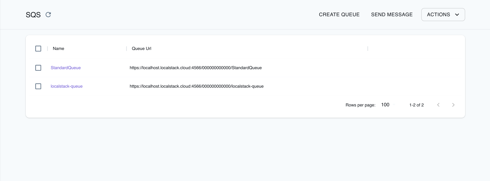

## Introduction

Simple Queue Service (SQS) is a managed messaging service offered by AWS.
It allows you to decouple different components of your applications by enabling asynchronous communication through message queues.
SQS allows you to reliably send, store, and receive messages with support for standard and FIFO queues.

LocalStack allows you to use the SQS APIs in your local environment to integrate and decouple distributed systems via hosted queues.
The supported APIs are available on our [API coverage page](https://docs.localstack.cloud/references/coverage/coverage_sqs/), which provides information on the extent of SQS's integration with LocalStack.

## Getting started

This guide is designed for users new to SQS and assumes basic knowledge of the AWS CLI and our [`awslocal`](https://github.com/localstack/awscli-local) wrapper script.

Start your LocalStack container using your preferred method.
We will demonstrate how to create an SQS queue, retrieve queue attributes and URLs, and receive and delete messages from the queue.

### Create a queue

To create an SQS queue, use the [`CreateQueue`](https://docs.aws.amazon.com/AWSSimpleQueueService/latest/APIReference/API_CreateQueue.html) API.
Run the following command to create a queue named `localstack-queue`:


$ awslocal sqs create-queue --queue-name localstack-queue


You can list all queues in your account using the [`ListQueues`](https://docs.aws.amazon.com/AWSSimpleQueueService/latest/APIReference/API_ListQueues.html) API.
Run the following command to list all queues in your account:


$ awslocal sqs list-queues


You will see the following output:

```json
{
    "QueueUrls": [
        "http://sqs.us-east-1.localhost.localstack.cloud:4566/000000000000/localstack-queue"
    ]
}
```

You can query queue attributes with the [`GetQueueAttributes`](https://docs.aws.amazon.com/AWSSimpleQueueService/latest/APIReference/API_GetQueueAttributes.html) API.
You need to pass the `queue-url` and `attribute-names` parameters.

Run the following command to retrieve the queue attributes:


$ awslocal sqs get-queue-attributes --queue-url http://sqs.us-east-1.localhost.localstack.cloud:4566/000000000000/localstack-queue --attribute-names All


### Sending and receiving messages from the queue

You can send a message to the SQS queue which will be queued and a consumer can pick it up.
To send a message to a SQS queue, you can use the [`SendMessage`](https://docs.aws.amazon.com/AWSSimpleQueueService/latest/APIReference/API_SendMessage.html) API.

Run the following command to send a message to the queue:


$ awslocal sqs send-message --queue-url http://sqs.us-east-1.localhost.localstack.cloud:4566/000000000000/localstack-queue --message-body "Hello World"


It will return the MD5 hash of the Message Body and a Message ID.
You will see output similar to the following:

```json
{
    "MD5OfMessageBody": "b10a8db164e0754105b7a99be72e3fe5",
    "MessageId": "92612c02-4879-47db-92f6-40bf2b341c07"
}
```

You can receive messages from the queue using the [`ReceiveMessage`](https://docs.aws.amazon.com/AWSSimpleQueueService/latest/APIReference/API_ReceiveMessage.html) API.
Run the following command to receive messages from the queue:


$ awslocal sqs receive-message --queue-url http://sqs.us-east-1.localhost.localstack.cloud:4566/000000000000/localstack-queue


You will see the Message ID, MD5 hash of the Message Body, Receipt Handle, and the Message Body in the output.

### Delete a message from the queue

To delete a message from the queue, you can use the [`DeleteMessage`](https://docs.aws.amazon.com/AWSSimpleQueueService/latest/APIReference/API_DeleteMessage.html) API.
You need to pass the `queue-url` and `receipt-handle` parameters.

Run the following command to delete a message from the queue:


$ awslocal sqs delete-message --queue-url http://sqs.us-east-1.localhost.localstack.cloud:4566/000000000000/localstack-queue --receipt-handle <receipt-handle>


Replace `<receipt-handle>` with the receipt handle you received in the previous step.
If you have sent multiple messages to the queue, you can purge the queue using the [`PurgeQueue`](https://docs.aws.amazon.com/AWSSimpleQueueService/latest/APIReference/API_PurgeQueue.html) API.

Run the following command to purge the queue:


$ awslocal sqs purge-queue --queue-url http://sqs.us-east-1.localhost.localstack.cloud:4566/000000000000/localstack-queue


## Dead-letter queue testing

LocalStack's SQS implementation supports both regular [dead-letter queues (DLQ)](https://docs.aws.amazon.com/AWSSimpleQueueService/latest/SQSDeveloperGuide/sqs-dead-letter-queues.html) and [DLQ redrive](https://docs.aws.amazon.com/AWSSimpleQueueService/latest/SQSDeveloperGuide/sqs-configure-dead-letter-queue-redrive.html) via move message tasks.
Here's an end-to-end example of how to use message move tasks to test DLQ redrive.

First, create three queues. One will serve as original input queue, one as DLQ, and the third as target for DLQ redrive.

$ awslocal sqs create-queue --queue-name input-queue
$ awslocal sqs create-queue --queue-name dead-letter-queue
$ awslocal sqs create-queue --queue-name recovery-queue
{
    "QueueUrl": "http://sqs.us-east-1.localhost.localstack.cloud:4566/000000000000/input-queue"
}
{
    "QueueUrl": "http://sqs.us-east-1.localhost.localstack.cloud:4566/000000000000/dead-letter-queue"
}
{
    "QueueUrl": "http://sqs.us-east-1.localhost.localstack.cloud:4566/000000000000/recovery-queue"
}



Configure `dead-letter-queue` to be a DLQ for `input-queue`:

$ awslocal sqs set-queue-attributes \
--queue-url http://sqs.us-east-1.localhost.localstack.cloud:4566/000000000000/input-queue \
--attributes '{
    "RedrivePolicy": "{\"deadLetterTargetArn\":\"arn:aws:sqs:us-east-1:000000000000:dead-letter-queue\",\"maxReceiveCount\":\"1\"}"
}'


Send a message to the input queue:

$ awslocal sqs send-message --queue-url http://sqs.us-east-1.localhost.localstack.cloud:4566/000000000000/input-queue --message-body '{"hello": "world"}'


Receive the message twice to provoke a move into the dead-letter queue:

$ awslocal sqs receive-message --visibility-timeout 0 --queue-url http://sqs.us-east-1.localhost.localstack.cloud:4566/000000000000/input-queue
$ awslocal sqs receive-message --visibility-timeout 0 --queue-url http://sqs.us-east-1.localhost.localstack.cloud:4566/000000000000/input-queue


In the localstack logs you should see something like the following line, indicating the message was moved to the DLQ:
```
2024-01-24T13:51:16.824 DEBUG --- [   asgi_gw_1] l.services.sqs.models      : message SqsMessage(id=5be95a04-93f0-4b9d-8bd5-6695f34758cf,group=None) has been received 2 times, marking it for DLQ
```

Now, start a message move task to asynchronously move the messages from the DLQ into the recovery queue:

$ awslocal sqs start-message-move-task \
        --source-arn arn:aws:sqs:us-east-1:000000000000:dead-letter-queue \
        --destination-arn arn:aws:sqs:us-east-1:000000000000:recovery-queue


Listing the message move tasks should yield something like

$ awslocal sqs list-message-move-tasks --source-arn arn:aws:sqs:us-east-1:000000000000:dead-letter-queue
{
    "Results": [
        {
            "Status": "COMPLETED",
            "SourceArn": "arn:aws:sqs:us-east-1:000000000000:dead-letter-queue",
            "DestinationArn": "arn:aws:sqs:us-east-1:000000000000:recovery-queue",
            "ApproximateNumberOfMessagesMoved": 1,
            "ApproximateNumberOfMessagesToMove": 1,
            "StartedTimestamp": 1706097183866
        }
    ]
}


Receiving messages from the recovery queue should now show us the original message:

$ awslocal sqs receive-message --queue-url http://sqs.us-east-1.localhost.localstack.cloud:4566/000000000000/recovery-queue
{
    "Messages": [
        {
            "MessageId": "5be95a04-93f0-4b9d-8bd5-6695f34758cf",
            "ReceiptHandle": "NzkwMWJiZDYtMzgyNy00Nzc3LTlkODMtMmEzYTNjYjlhZWQwIGFybjphd3M6c3FzOnV...",
            "MD5OfBody": "49dfdd54b01cbcd2d2ab5e9e5ee6b9b9",
            "Body": "{\"hello\": \"world\"}"
        }
    ]
}



## SQS Query API

The [SQS Query API](https://docs.aws.amazon.com/AWSSimpleQueueService/latest/SQSDeveloperGuide/sqs-making-api-requests.html), provides SQS Queue URLs as endpoints, enabling direct HTTP requests to the queues.
LocalStack extends support for the Query API.

With LocalStack, you can conveniently test SQS Query API calls without the need to sign or include `AUTHPARAMS` in your HTTP requests.

For instance, you can use a basic `cURL` command to send a `SendMessage` command along with a MessageBody attribute:


$ curl "http://sqs.us-east-1.localhost.localstack.cloud:4566/000000000000/localstack-queue?Action=SendMessage&MessageBody=hello%2Fworld"


You will see the following output:

```xml
<?xml version='1.0' encoding='utf-8'?>
<SendMessageResponse
	xmlns="http://queue.amazonaws.com/doc/2012-11-05/">
	<SendMessageResult>
		<MD5OfMessageBody>c6be4e95a26409675447367b3e79f663</MD5OfMessageBody>
		<MessageId>466144ab-1d03-4ec5-8d70-97535b2957fb</MessageId>
	</SendMessageResult>
	<ResponseMetadata>
		<RequestId>JU40AF5GORK0WSR75MOY3VNQ1KZ3TAI7S5KAJYGK9C5P4W4XKMGF</RequestId>
	</ResponseMetadata>
</SendMessageResponse>
```

Adding the `Accept: application/json` header will make the server return JSON:

To receive JSON responses from the server, include the `Accept: application/json` header in your request.
Here's an example using the `cURL` command:


$ curl -H "Accept: application/json" "http://sqs.us-east-1.localhost.localstack.cloud:4566/000000000000/localstack-queue?Action=SendMessage&MessageBody=hello%2Fworld"


The response will be in JSON format:

```json
{
	"SendMessageResponse": {
		"SendMessageResult": {
			"MD5OfMessageBody": "c6be4e95a26409675447367b3e79f663",
			"MessageId": "748297f2-4abd-4ec2-afc0-4d1a497fe604"
		},
		"ResponseMetadata": {
			"RequestId": "XEA5L5AX16RTPET25U3TIRIASN6KNIT820WIT3EY7RCH7164W68T"
		}
	}
}
```

## Configuration

### Queue URLs

You can control the format of the generated Queue URLs by setting the environment variable `SQS_ENDPOINT_STRATEGY` when starting LocalStack to one of the following values.

| Value      | URL format                                                                 | Description                                                                                                                                                                                                                                                                            |
|------------|----------------------------------------------------------------------------|----------------------------------------------------------------------------------------------------------------------------------------------------------------------------------------------------------------------------------------------------------------------------------------|
| `standard` | `sqs.<region>.localhost.localstack.cloud:4566/<account_id>/<queue_name>`   | Default. This strategy resembles AWS the closest (see [Identifiers for Amazon SQS](https://docs.aws.amazon.com/AWSSimpleQueueService/latest/SQSDeveloperGuide/sqs-queue-message-identifiers.html#sqs-general-identifiers)) and comes with full multi-account and multi-region support. |
| `domain`   | `<region>.queue.localhost.localstack.cloud:4566/<account_id>/<queue_name>` | This strategy behaves like the [SQS legacy service endpoints](https://docs.aws.amazon.com/general/latest/gr/sqs-service.html#sqs_region), and uses `localhost.localstack.cloud` to resolve to localhost. While using the `us-east-1` region, the `<region>.` prefix is omitted.        |
| `path`     | `localhost:4566/queue/<region>/<account_id>/<queue_name>`                  | An alternative that can be useful if you cannot resolve LocalStack's `localhost` domain.                                                                                                                                                                                               |
| `dynamic`  | either of the above, using the hostname used from the request              | Based on the format of the hostname used by the client to call localstack, the URL will be constructed accordingly. The URL will also use the hostname specified in the request to make sure the client will be able to reach the URl.                                                 |
| `off`      | `localhost:4566/<account_id>/<queue_name>`                                 | It is the current default for maintaining backward compatibility. However, this format does not encode the region information. As a result, you will encounter limitations when querying queues with the same name that exist in different regions.                                    |

### Enabling `PurgeQueue` errors

In AWS, there is a restriction that allows only one call to the `PurgeQueue` operation every 60 seconds.
You can refer to the [`PurgeQueue` API Reference](https://docs.aws.amazon.com/AWSSimpleQueueService/latest/APIReference/API_PurgeQueue.html) for more details.

By default, LocalStack disables this behavior.
However, if you want to enable the retry delay for `PurgeQueue` in LocalStack, you can start it with the `SQS_DELAY_PURGE_RETRY=1` environment variable.

### Enabling `QueueDeletedRecently` errors

In AWS, there is a restriction that prevents the creation of a queue with the same name within 60 seconds after it has been deleted.
You can find more information about this behavior in the [`DeleteQueue` API Reference](https://docs.aws.amazon.com/AWSSimpleQueueService/latest/APIReference/API_DeleteQueue.html).

By default, LocalStack disables this behavior.
However, if you want to enable the delay for creating a recently deleted queue in LocalStack, you can start it with the `SQS_DELAY_RECENTLY_DELETED=1` environment variable.

### Enabling `MessageRetentionPeriod`

In AWS, you can set the `MessageRetentionPeriod` to control the length of time, in seconds, for which Amazon SQS retains a message.
You can find more details in the [`SetQueueAttributes` API reference](https://docs.aws.amazon.com/AWSSimpleQueueService/latest/APIReference/API_SetQueueAttributes.html#API_SetQueueAttributes_RequestParameters).

You can enable this behavior in LocalStack by setting the `SQS_ENABLE_MESSAGE_RETENTION_PERIOD=1` environment variable.
In AWS, valid values for message retention range from 60 (1 minute) to 1,209,600 (14 days).
In LocalStack, we do not put constraints on the value which can be helpful for test scenarios.


Note that, if you enable this option, [persistence]() or [cloud pods]() for SQS may not work as expected.
The reason is that, LocalStack does not adjust timestamps when restoring a state, so time appears to pass between LocalStack runs.
Consequently, when you restart LocalStack after a period that is longer than the message retention period, LocalStack will remove all those messages when SQS starts.


### Disable CloudWatch Metrics Reporting

When working with SQS messages, actions like sending, receiving, and deleting them will automatically trigger CloudWatch metrics.
This feature, known as [CloudWatch metrics for Amazon SQS](https://docs.aws.amazon.com/AWSSimpleQueueService/latest/SQSDeveloperGuide/sqs-available-cloudwatch-metrics.html), is enabled by default but can be deactivated if needed.

Disabling CloudWatch metrics can enhance the performance of SQS message operations.
However, it's important to note that deactivation will also disable any integration with CloudWatch, including the triggering of alarms based on metrics.

By default, metrics related to `Approximate*` messages are sent to CloudWatch once every minute.
You can customize the reporting interval (in seconds) by setting the `SQS_CLOUDWATCH_METRICS_REPORT_INTERVAL` variable to the desired value, such as `SQS_CLOUDWATCH_METRICS_REPORT_INTERVAL=120`.

If you wish to disable all CloudWatch metrics for SQS, including the `Approximate*` metrics, you can set the `SQS_DISABLE_CLOUDWATCH_METRICS` variable to `1`.

## Accessing queues from Lambdas or other containers

Using the SQS Query API, Queue URLs act as accessible endpoints via HTTP. Several SDKs, such as the Java SDK, leverage the SQS Query API for SQS interaction.

By default, Queue URLs are configured to point to `http://localhost:4566`. This configuration can pose problems when Lambdas or other containers attempt to make direct calls to these queue URLs. These issues arise due to the fact that a Lambda function operates within a separate Docker container, and LocalStack is not accessible at the `localhost` address within that container.

For instance, users of the Java SDK often encounter the following error when trying to access an SQS queue from their Lambda functions:

```bash
2023-07-28 15:04:00 Unable to execute HTTP request: Connect to localhost:4566 [localhost/127.0.0.1] failed: Connection refused (Connection refused): com.amazonaws.SdkClientException
2023-07-28 15:04:00 com.amazonaws.SdkClientException: Unable to execute HTTP request: Connect to localhost:4566 [localhost/127.0.0.1] failed: Connection refused (Connection refused)
...
```

To address this issue, you can consider the steps documented below.

### Lambda

When utilizing the SQS Query API in Lambdas, we suggest configuring `SQS_ENDPOINT_STRATEGY=domain`. This configuration results in queue URLs using `*.queue.localhost.localstack.cloud` as their domain names. Our Lambda implementation automatically resolves these URLs to the LocalStack container, ensuring smooth interaction between your code and the SQS service.

### Other containers

When your code run within different containers like ECS tasks or your custom ones, it's advisable to establish your Docker network setup. You can follow these steps:

1.  Override the `LOCALSTACK_HOST` variable as outlined in our [network troubleshooting guide]().
2.  Ensure that your containers can resolve `LOCALSTACK_HOST` to the LocalStack container within the Docker network.
3.  We recommend employing `SQS_ENDPOINT_STRATEGY=path`, which generates queue URLs in the format `http://<LOCALSTACK_HOST>/queue/...`.

## Developer endpoints

LocalStack's SQS implementation offers additional endpoints for developers located at `/_aws/sqs`.
These endpoints provide the ability to inspect queues without causing any side effects.
This can be particularly useful when you need to examine the content of queues without executing a `ReceiveMessage` operation, which would normally remove messages from the queue.

### Peeking into queues

The `/_aws/sqs/messages` endpoint provides access to all messages within a queue without triggering the visibility timeout or modifying access metrics.
This endpoint is particularly useful in scenarios such as tests, where you need to wait until a specific message arrives in the queue.

The `/_aws/sqs/messages` endpoint is fully compatible with the `ReceiveMessage` operation from the SQS API.
By default, it returns all messages in the queue along with their attributes and system attributes.
The endpoint ignores any additional parameters from the `ReceiveMessage` operation, except for the `QueueUrl`.

You can call the `/_aws/sqs/messages` endpoint in two different ways:

1.  Using the query argument `QueueUrl`, like this:
    
    $ http://localhost.localstack.cloud:4566/_aws/sqs/messages?QueueUrl=http://sqs.us-east-1.localhost.localstack.cloud:4566/000000000000/my-queue
     
    
2.  Utilizing the path-based endpoint, as shown in this example:
    
    $ http://localhost.localstack.cloud:4566/_aws/sqs/messages/us-east-1/000000000000/my-queue
    

#### XML response

You can directly call the endpoint to obtain the raw AWS XML response.



curl "http://localhost.localstack.cloud:4566/_aws/sqs/messages?QueueUrl=http://sqs.us-east-1.localhost.localstack.cloud:4566/000000000000/my-queue"


import requests

response = requests.get(
    url="http://localhost.localstack.cloud:4566/_aws/sqs/messages",
    params={"QueueUrl": "http://sqs.us-east-1.localhost.localstack.cloud:4566/000000000000/my-queue"},
)
print(response.text)  # outputs the response XML



An example response is shown below:

```xml
<?xml version='1.0' encoding='utf-8'?>
<ReceiveMessageResponse xmlns="http://queue.amazonaws.com/doc/2012-11-05/">
    <ReceiveMessageResult>
        <Message>
            <MessageId>6a736e5d-4997-4895-8c96-b65a2d7dd600</MessageId>
            <MD5OfBody>5d41402abc4b2a76b9719d911017c592</MD5OfBody>
            <Body>hello</Body>
            <Attribute>
                <Name>SenderId</Name>
                <Value>000000000000</Value>
            </Attribute>
            <Attribute>
                <Name>SentTimestamp</Name>
                <Value>1672853965675</Value>
            </Attribute>
            <Attribute>
                <Name>ApproximateReceiveCount</Name>
                <Value>0</Value>
            </Attribute>
            <Attribute>
                <Name>ApproximateFirstReceiveTimestamp</Name>
                <Value>1672855121076</Value>
            </Attribute>
            <ReceiptHandle>SQS/BACKDOOR/ACCESS</ReceiptHandle>
        </Message>
        <Message>
            <MessageId>173c5aee-503a-4249-90be-159e0d427b48</MessageId>
            <MD5OfBody>7d793037a0760186574b0282f2f435e7</MD5OfBody>
            <Body>world</Body>
            <Attribute>
                <Name>SenderId</Name>
                <Value>000000000000</Value>
            </Attribute>
            <Attribute>
                <Name>SentTimestamp</Name>
                <Value>1672853968176</Value>
            </Attribute>
            <Attribute>
                <Name>ApproximateReceiveCount</Name>
                <Value>0</Value>
            </Attribute>
            <Attribute>
                <Name>ApproximateFirstReceiveTimestamp</Name>
                <Value>1672855121076</Value>
            </Attribute>
            <ReceiptHandle>SQS/BACKDOOR/ACCESS</ReceiptHandle>
        </Message>
    </ReceiveMessageResult>
    <ResponseMetadata>
        <RequestId>KR3H1IN3JQ4LO1592IMGK2JLH8HW3J0Y4LRY1TVW2SAFGZFVXJGI</RequestId>
    </ResponseMetadata>
</ReceiveMessageResponse>
```

#### JSON response

You can include the `Accept: application/json` header in your request if you prefer a JSON response.



curl -H "Accept: application/json" \
    "http://localhost.localstack.cloud:4566/_aws/sqs/messages?QueueUrl=http://sqs.us-east-1.localhost.localstack.cloud:4566/000000000000/my-queue"


import requests

response = requests.get(
    url="http://localhost.localstack.cloud:4566/_aws/sqs/messages",
    params={"QueueUrl": "http://sqs.us-east-1.localhost.localstack.cloud:4566/000000000000/my-queue""},
)
print(response.text)  # outputs the response XML



An example response is shown below:

```json
{
  "ReceiveMessageResponse": {
    "ReceiveMessageResult": {
      "Message": [
        {
          "MessageId": "6a736e5d-4997-4895-8c96-b65a2d7dd600",
          "MD5OfBody": "5d41402abc4b2a76b9719d911017c592",
          "Body": "hello",
          "Attribute": [
            {
              "Name": "SenderId",
              "Value": "000000000000"
            },
            {
              "Name": "SentTimestamp",
              "Value": "1672853965675"
            },
            {
              "Name": "ApproximateReceiveCount",
              "Value": "0"
            },
            {
              "Name": "ApproximateFirstReceiveTimestamp",
              "Value": "1672855535794"
            }
          ],
          "ReceiptHandle": "SQS/BACKDOOR/ACCESS"
        },
        {
          "MessageId": "173c5aee-503a-4249-90be-159e0d427b48",
          "MD5OfBody": "7d793037a0760186574b0282f2f435e7",
          "Body": "world",
          "Attribute": [
            {
              "Name": "SenderId",
              "Value": "000000000000"
            },
            {
              "Name": "SentTimestamp",
              "Value": "1672853968176"
            },
            {
              "Name": "ApproximateReceiveCount",
              "Value": "0"
            },
            {
              "Name": "ApproximateFirstReceiveTimestamp",
              "Value": "1672855535794"
            }
          ],
          "ReceiptHandle": "SQS/BACKDOOR/ACCESS"
        }
      ]
    },
    "ResponseMetadata": {
      "RequestId": "TF87187MUBXJHA39J4Y6OVQG57J51OEEMX62UWYBUQJKC8YVID3P"
    }
  }
}
```

#### AWS Client

Since the `/_aws/sqs/messages` endpoint is compatible with the SQS `ReceiveMessage` operation, you can use the endpoint as the endpoint URL parameter in your AWS client call.



aws --endpoint-url=http://localhost.localstack.cloud:4566/_aws/sqs/messages sqs receive-message \
  --queue-url=http://sqs.us-east-1.localhost.localstack.cloud:4566/000000000000/my-queue


import boto3
sqs = boto3.client("sqs", endpoint_url="http://localhost.localstack.cloud:4566/_aws/sqs/messages")
response = sqs.receive_message(QueueUrl="http://sqs.us-east-1.localhost.localstack.cloud:4566/000000000000/my-queue")
print(response)



An example response is shown below:

```json
{
    "Messages": [
        {
            "MessageId": "6a736e5d-4997-4895-8c96-b65a2d7dd600",
            "ReceiptHandle": "SQS/BACKDOOR/ACCESS",
            "MD5OfBody": "5d41402abc4b2a76b9719d911017c592",
            "Body": "hello",
            "Attributes": {
                "SenderId": "000000000000",
                "SentTimestamp": "1672853965675",
                "ApproximateReceiveCount": "0",
                "ApproximateFirstReceiveTimestamp": "1672854900237"
            }
        },
        {
            "MessageId": "173c5aee-503a-4249-90be-159e0d427b48",
            "ReceiptHandle": "SQS/BACKDOOR/ACCESS",
            "MD5OfBody": "7d793037a0760186574b0282f2f435e7",
            "Body": "world",
            "Attributes": {
                "SenderId": "000000000000",
                "SentTimestamp": "1672853968176",
                "ApproximateReceiveCount": "0",
                "ApproximateFirstReceiveTimestamp": "1672854900237"
            }
        }
    ]
}
```

#### Show invisible or delayed messages

The developer endpoint also supports showing invisible and delayed messages via the query arguments `ShowInvisible` and `ShowDelayed`.



curl -H "Accept: application/json" \
    "http://localhost.localstack.cloud:4566/_aws/sqs/messages?ShowInvisible=true&ShowDelayed=true&QueueUrl=http://sqs.us-east-1.localhost.localstack.cloud:4566/000000000000/my-queue


import requests

response = requests.get(
    "http://localhost.localstack.cloud:4566/_aws/sqs/messages",
    params={"QueueUrl": queue_url, "ShowInvisible": True, "ShowDelayed": True},
    headers={"Accept": "application/json"},
)
print(response.text)



This will also include messages that currently have an active visibility timeout or were delayed and are not actually in the queue yet.
Here's an example:

```json
[
    {
        "MessageId": "1c4187cc-f2c9-4f1c-9702-4a3bfaaa4817",
        "MD5OfBody": "a06498de7fb4bd539c8895748f03175d",
        "Body": "message-3",
        "Attribute": [
            {"Name": "SenderId", "Value": "000000000000"},
            {"Name": "SentTimestamp", "Value": "1697494407799"},
            {"Name": "ApproximateReceiveCount", "Value": "0"},
            {"Name": "ApproximateFirstReceiveTimestamp", "Value": "0"},
            {"Name": "IsVisible", "Value": "true"},   <--
            {"Name": "IsDelayed", "Value": "false"},  <--
        ],
        "ReceiptHandle": "SQS/BACKDOOR/ACCESS",
    },
  ...
]
```

## Resource Browser

The LocalStack Web Application provides a Resource Browser for managing SQS queues.
You can access the Resource Browser by opening the LocalStack Web Application in your browser, navigating to the **Resources** section, and then clicking on **SQS** under the **App Integration** section.



The Resource Browser allows you to perform the following actions:

- **Create Queue**: Create a new SQS queue by specifying a queue name, optional attributes, and tags.
- **Send Message**: Send a message to an SQS queue by specifying the queue name, message body, delay seconds, optional message attributes, and more.
- **View Details and Messages**: View details and messages of an SQS queue by selecting the queue name and navigating to the **Details** and **Messages** tabs.
- **Delete Queue**: Delete an SQS queue by selecting the queue name and clicking the **Action** button, followed by **Remove Selected**.

## Examples

The following code snippets and sample applications provide practical examples of how to use SQS in LocalStack for various use cases:

- [Serverless microservices with Amazon API Gateway, DynamoDB, SQS, and Lambda](https://github.com/localstack/microservices-apigateway-lambda-dynamodb-sqs-sample)
- [Loan Broker application with AWS Step Functions, DynamoDB, Lambda, SQS, and SNS](https://github.com/localstack/loan-broker-stepfunctions-lambda-app)
- [Messaging Processing application with SQS, DynamoDB, and Fargate](https://github.com/localstack/sqs-fargate-ddb-cdk-go)
- [Serverless Transcription application using Transcribe, S3, Lambda, SQS, and SES](https://github.com/localstack/sample-transcribe-app)

## Current Limitations

* Updating a queue's `MessageRetentionPeriod` currently has no effect on existing messages
