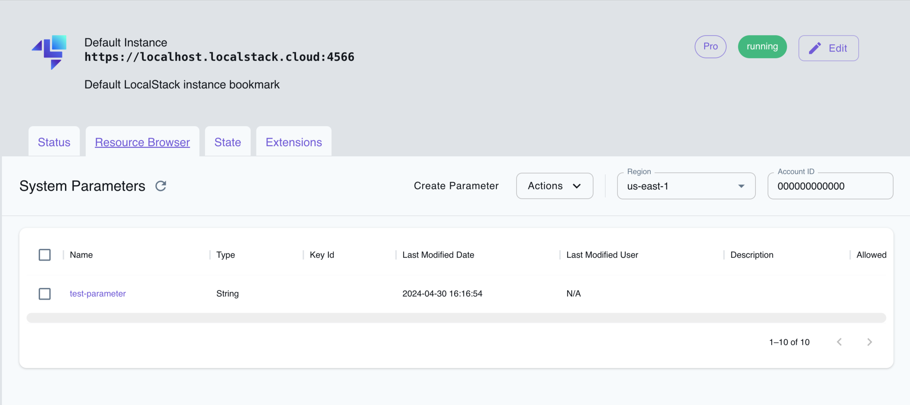

## Introduction

Systems Manager (SSM) is a management service provided by Amazon Web Services that helps you effectively manage and control your infrastructure resources. SSM simplifies tasks related to system and application management, patching, configuration, and automation, allowing you to maintain the health and compliance of your environment.

LocalStack allows you to use the SSM APIs in your local environment to run operational tasks on the Dockerized instances. The supported APIs are available on our [API coverage page](https://docs.localstack.cloud/references/coverage/coverage_ssm/), which provides information on the extent of SSM's integration with LocalStack.

## Getting started

This guide is designed for users new to Systems Manager (SSM) and assumes basic knowledge of the AWS CLI and our [`awslocal`](https://github.com/localstack/awscli-local) wrapper script.

Start your LocalStack container using your preferred method with an additional `EC2_VM_MANAGER=docker` configuration variable. We will demonstrate how to use EC2 and SSM functionalities when using the Docker backend with LocalStack with the AWS CLI.

### Create an EC2 instance

To get started, pull the `ubuntu:focal` image from Docker Hub and tag it as `localstack-ec2/ubuntu-focal-docker-ami:ami-00a001`. LocalStack uses a naming scheme to recognise and manage the containers and images associated with it. The container are named `localstack-ec2.<InstanceId>`, while images are tagged `localstack-ec2/<AmiName>:<AmiId>`.


$ docker pull ubuntu:focal
$ docker tag ubuntu:focal localstack-ec2/ubuntu-focal-docker-ami:ami-00a001


LocalStack's Docker backend treats Docker images with the above naming scheme as AMIs. The AMI ID is the last part of the image tag, `ami-00a001` in this case. You can run an EC2 instance using the [`RunInstances`](https://docs.aws.amazon.com/systems-manager/latest/APIReference/API_RunInstances.html) API. Execute the following command to create an EC2 instance using the `ami-00a001` AMI.


$ awslocal ec2 run-instances \
    --image-id ami-00a001 --count 1


The following output would be retrieved:

```bash
{
    ...
    "Instances": [
        {
            ...
            "InstanceId": "i-abf6920789a06dd84",
            "InstanceType": "m1.small",
            ...
            "SecurityGroups": [],
            "SourceDestCheck": true,
            "Tags": [],
            "VirtualizationType": "paravirtual"
        }
    ],
    "OwnerId": "000000000000",
    "ReservationId": "r-e9b21a68"
    ...
```

You can copy the `InstanceId` value and use it in the following commands.

### Send command using SSM

You can use the [`SendCommand`](https://docs.aws.amazon.com/systems-manager/latest/APIReference/API_SendCommand.html) API to send commands to the EC2 instance. The following command sends a `cat lsb-release` command in the `/etc` directory to the EC2 instance.


$ awslocal ssm send-command --document-name "AWS-RunShellScript" \
    --document-version "1" \
    --instance-ids i-abf6920789a06dd84 \
    --parameters "commands='cat lsb-release',workingDirectory=/etc"


The following output would be retrieved:

```bash
{
    "Command": {
        "CommandId": "23547a9b-6993-4967-9446-f96b9b5dac70",
        "DocumentName": "AWS-RunShellScript",
        "DocumentVersion": "1",
        "InstanceIds": [
            "i-abf6920789a06dd84"
        ],
        "Status": "InProgress"
    }
}
```

You can copy the `CommandId` value and use it in the following commands.

### Retrieve the command output

You can use the [`GetCommandInvocation`](https://docs.aws.amazon.com/systems-manager/latest/APIReference/API_GetCommandInvocation.html) API to retrieve the command output. The following command retrieves the output of the command sent in the previous step.


$ awslocal ssm get-command-invocation \
    --command-id 23547a9b-6993-4967-9446-f96b9b5dac70 \
    --instance-id i-abf6920789a06dd84


Change the `CommandId` and `InstanceId` values to the ones you received in the previous step. The following output would be retrieved:

```bash
{
    "CommandId": "23547a9b-6993-4967-9446-f96b9b5dac70",
    "InstanceId": "i-abf6920789a06dd84",
    "DocumentName": "AWS-RunShellScript",
    "DocumentVersion": "1",
    "Status": "Success",
    "StandardOutputContent": "DISTRIB_ID=Ubuntu\nDISTRIB_RELEASE=20.04\nDISTRIB_CODENAME=focal\nDISTRIB_DESCRIPTION=\"Ubuntu 20.04.6 LTS\"\n",
    "StandardErrorContent": ""
}
```

## Resource Browser

The LocalStack Web Application provides a Resource Browser for managing SSM System Parameters. You can access the Resource Browser by opening the LocalStack Web Application in your browser, navigating to the **Resource Browser** section, and then clicking on **Simple Systems Manager (SSM)** under the **Management/Governance** section.



The Resource Browser allows you to perform the following actions:

- **Create System Parameter**: Create a new System Parameter by clicking on the **Create Parameter** button and providing the required details.
- **View the System Parameter**: View the details of a System Parameter, such as its value, by clicking on the parameter name.
- **Delete the System Parameter**: Delete a System Parameter by selecting the parameter and clicking on the **Actions** dropdown menu followed by **Remove Selected**.

## Current Limitations

The following table highlights some differences between LocalStack SSM and AWS SSM.

| LocalStack                               | AWS                                                                                                                                                |
| ---------------------------------------- | -------------------------------------------------------------------------------------------------------------------------------------------------- |
| Automated SSM registration for instances | Manual instance registration using [`CreateActivation`](https://docs.aws.amazon.com/systems-manager/latest/APIReference/API_CreateActivation.html) |
| Operations performed through Docker exec | Operations facilitated by [Amazon SSM Agent](https://github.com/aws/amazon-ssm-agent)                                                              |
| Instance IDs prefixed with `i-`          | Instance IDs prefixed with `mi-`                                                                                                                   |

The other limitations of LocalStack SSM are:

-   Dockerized instances only support `AWS-RunShellScript` commands.
-   Commands returning non-zero codes won't capture standard output or error streams, leaving them empty.
-   Shell constructs such as job controls (`&&`, `||`), and redirection (`>`) are not supported.
