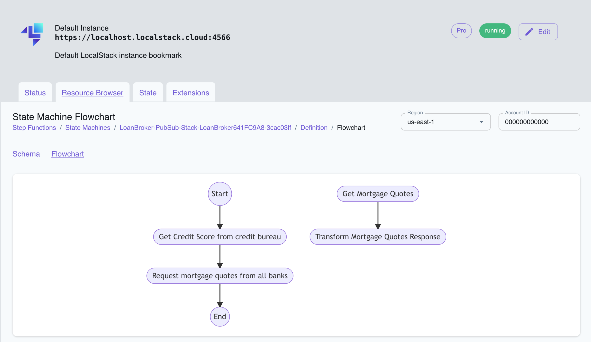

## Introduction

Step Functions is a serverless workflow engine that enables the orchestrating of multiple AWS services. It provides a JSON-based structured language called Amazon States Language (ASL) which allows to specify how to manage a sequence of tasks and actions that compose the application's workflow. Thus making it easier to build and maintain complex and distributed applications.

LocalStack allows you to use the Step Functions APIs in your local environment to create, execute, update, and delete state machines locally. The supported APIs are available on our [API coverage page](https://docs.localstack.cloud/references/coverage/coverage_stepfunctions/), which provides information on the extent of Step Function's integration with LocalStack.

## Getting started

This guide is designed for users new to Step Functions and assumes basic knowledge of the AWS CLI and our [`awslocal`](https://github.com/localstack/awscli-local) wrapper script.

Start your LocalStack container using your preferred method. We will demonstrate how you can create a state machine, execute it, and check the status of the execution.

### Create a state machine

You can create a state machine using the [`CreateStateMachine`](https://docs.aws.amazon.com/step-functions/latest/apireference/API_CreateStateMachine.html) API. The API requires the name of the state machine, the state machine definition, and the role ARN that the state machine will assume to call AWS services. Run the following command to create a state machine:


$ awslocal stepfunctions create-state-machine \
    --name "CreateAndListBuckets" \
    --definition '{
        "Comment": "Create bucket and list buckets",
        "StartAt": "CreateBucket",
            "States": {
            "CreateBucket": {
                "Type": "Task",
                "Resource": "arn:aws:states:::aws-sdk:s3:createBucket",
                "Parameters": {
                    "Bucket": "new-sfn-bucket"
                },
                "Next": "ListBuckets"
            },
            "ListBuckets": {
                "Type": "Task",
                "Resource": "arn:aws:states:::aws-sdk:s3:listBuckets",
                "End": true
            }
        }
    }' \
    --role-arn "arn:aws:iam::000000000000:role/stepfunctions-role"


The output of the above command is the ARN of the state machine:

```json
{
    "stateMachineArn": "arn:aws:states:us-east-1:000000000000:stateMachine:CreateAndListBuckets",
    "creationDate": 1714643996.18017
}
```

### Execute the state machine

You can execute the state machine using the [`StartExecution`](https://docs.aws.amazon.com/step-functions/latest/apireference/API_StartExecution.html) API. The API requires the state machine's ARN and the state machine's input. Run the following command to execute the state machine:


$ awslocal stepfunctions start-execution \
    --state-machine-arn "arn:aws:states:us-east-1:000000000000:stateMachine:CreateAndListBuckets"


The output of the above command is the execution ARN:

```json
{
    "executionArn": "arn:aws:states:us-east-1:000000000000:execution:CreateAndListBuckets:bf7d2138-e96f-42d1-b1f9-41f0c1c7bc3e",
    "startDate": 1714644089.748442
}
```

### Check the execution status

To check the status of the execution, you can use the [`DescribeExecution`](https://docs.aws.amazon.com/step-functions/latest/apireference/API_DescribeExecution.html) API. Run the following command to describe the execution:


$ awslocal stepfunctions describe-execution \
        --execution-arn "arn:aws:states:us-east-1:000000000000:execution:CreateAndListBuckets:bf7d2138-e96f-42d1-b1f9-41f0c1c7bc3e"


Replace the `execution-arn` with the ARN of the execution you want to describe.

The output of the above command is the execution status:

```json
{
    "executionArn": "arn:aws:states:us-east-1:000000000000:execution:CreateAndListBuckets:bf7d2138-e96f-42d1-b1f9-41f0c1c7bc3e",
    "stateMachineArn": "arn:aws:states:us-east-1:000000000000:stateMachine:CreateAndListBuckets",
    "name": "bf7d2138-e96f-42d1-b1f9-41f0c1c7bc3e",
    "status": "SUCCEEDED",
    "startDate": 1714644089.748442,
    "stopDate": 1714644089.907964,
    "input": "{}",
    "inputDetails": {
        "included": true
    },
    "output": "{\"Buckets\":[{\"Name\":\"cdk-hnb659fds-assets-000000000000-us-east-1\",\"CreationDate\":\"2024-05-02T09:53:54+00:00\"},{\"Name\":\"new-sfn-bucket\",\"CreationDate\":\"2024-05-02T10:01:29+00:00\"}],\"Owner\":{\"DisplayName\":\"webfile\",\"Id\":\"75aa57f09aa0c8caeab4f8c24e99d10f8e7faeebf76c078efc7c6caea54ba06a\"}}",
    "outputDetails": {
        "included": true
    }
}
```

## Supported services and operations

Step Functions integrates with AWS services, allowing you to invoke API actions for each service within your workflow. LocalStack's Step Functions emulation supports the following AWS services:

| Supported service integrations | Service                 | Request Response | Run a Job (.sync) | Run a Job (.sync2) | Wait for Callback (.waitForTaskToken) |
|--------------------------------|-------------------------|:---:             |:---:              |:---:               |:---:                                  |
| Optimized integrations         | Lambda                  | &#10003;         |                   |                    | &#10003;                              |
|                                | DynamoDB                | &#10003;         |                   |                    |                                       |
|                                | Amazon ECS/AWS Fargate  | &#10003;         | &#10003;          |                    | &#10003;                              |
|                                | Amazon SNS              | &#10003;         |                   |                    | &#10003;                              |
|                                | Amazon SQS              | &#10003;         |                   |                    | &#10003;                              |
|                                | API Gateway             | &#10003;         |                   |                    | &#10003;                              |
|                                | Amazon EventBridge      | &#10003;         |                   |                    | &#10003;                              |
|                                | AWS Glue                | &#10003;         | &#10003;          |                    |                                       |
|                                | AWS Step Functions      | &#10003;         | &#10003;          | &#10003;           | &#10003;                              |
| AWS SDK integrations           | All LocalStack services | &#10003;         |                   |                    | &#10003;                              |

## Resource Browser

The LocalStack Web Application provides a Resource Browser for managing Step Functions state machines. You can access the Resource Browser by opening the LocalStack Web Application in your browser, navigating to the **Resource Browser** section, and then clicking on **Step Functions** under the **App Integration** section.


<br>
<br>

The Resource Browser allows you to perform the following actions:

- **Create state machine**: Create a new state machine by clicking on the **Create state machine** button and providing the required information.
- **View state machine details**: Click on a state machine to view its details, including the state executions, definition details, such as the schema and flowchart, and the state machine's ARN.
- **Start execution**: Start a new execution of the state machine by clicking on the **Start Execution** button and providing the input data.
- **Delete state machine**: Delete a state machine by selecting it and clicking on the **Actions** button followed by **Remove Selected** button.

## Examples

The following code snippets and sample applications provide practical examples of how to use Step Functions in LocalStack for various use cases:

- [Loan Broker application with AWS Step Functions, DynamoDB, Lambda, SQS, and SNS](https://github.com/localstack/loan-broker-stepfunctions-lambda-app)
- [Integrating Step Functions with local Lambda functions on LocalStack](https://github.com/localstack/localstack-pro-samples/tree/master/stepfunctions-lambda)
