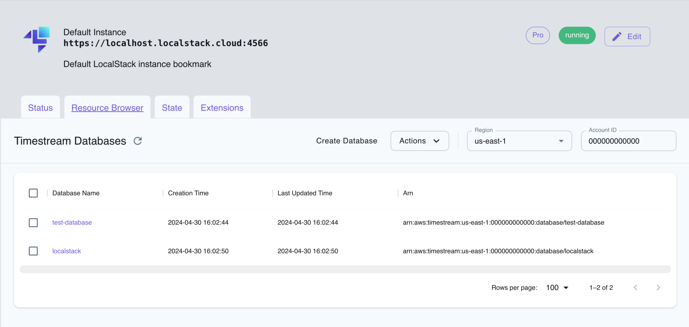

## Introduction

LocalStack contains basic support for Timestream time series databases, including these operations:

* Creating databases
* Creating tables
* Writing records to tables
* Querying timeseries data from tables

The supported APIs are available on our API Coverage Page ([Timestream-Query](https://docs.localstack.cloud/references/coverage/coverage_timestream-query/)/[Timestream-Write](https://docs.localstack.cloud/references/coverage/coverage_timestream-write/)), which provides information on the extent of Timestream integration with LocalStack.

## Getting Started

The following example illustrates the basic operations, using the [`awslocal`](https://github.com/localstack/awscli-local) command line.

First, we create a test database and table:


$ awslocal timestream-write create-database --database-name testDB
$ awslocal timestream-write create-table --database-name testDB --table-name testTable


We can then add a few records with a timestamp, measure name, and value to the table:


$ awslocal timestream-write write-records --database-name testDB --table-name testTable --records '[{"MeasureName":"cpu","MeasureValue":"60","TimeUnit":"SECONDS","Time":"1636986409"}]'
$ awslocal timestream-write write-records --database-name testDB --table-name testTable --records '[{"MeasureName":"cpu","MeasureValue":"80","TimeUnit":"SECONDS","Time":"1636986412"}]'
$ awslocal timestream-write write-records --database-name testDB --table-name testTable --records '[{"MeasureName":"cpu","MeasureValue":"70","TimeUnit":"SECONDS","Time":"1636986414"}]'


Finally, we can run a query to retrieve the timeseries data (or aggregate values) from the table:

$ awslocal timestream-query query --query-string "SELECT CREATE_TIME_SERIES(time, measure_value::double) as cpu FROM testDB.timeStreamTable WHERE measure_name='cpu'"
{
  "Rows": [{
    "Data": [{
      "TimeSeriesValue": [{
        "Time": "2021-11-15T14:26:49",
        "Value": {
            "ScalarValue": 60
        }
    },
...


## Resource Browser

The LocalStack Web Application provides a Resource Browser for managing Timestream databases. You can access the Resource Browser by opening the LocalStack Web Application in your browser, navigating to the **Resources** section, and then clicking on **Timestream** under the **Database** section.

 
 

The Resource Browser allows you to perform the following actions:

- **Create Database**: Create a new Timestream database by clicking on the **Create Database** button and providing a name for the database among other optional details.
- **Create Table**: Create a new Timestream table by clicking on the **Create Table** button in the database view and providing a name for the table among other optional details.
- **Run Query**: Run a Timestream query by clicking on the **Run Query** button in the table view and providing a query string.
- **View Database/Table Details**: Click on a database or table to view its details, including the schema, retention policy, and other metadata.
- **Delete Database/Table**: Delete the Timestream database/table by selecting it and clicking on the **Actions** button followed by **Remove Selected** button.

## Current Limitations

LocalStack's Timestream implementation is under active development and only supports a limited set of operations, please refer to the API Coverage pages for an up-to-date list of implemented and tested functions within [Timestream-Query](https://docs.localstack.cloud/references/coverage/coverage_timestream-query/) and [Timestream-Write](https://docs.localstack.cloud/references/coverage/coverage_timestream-write/).

If you have a usecase that uses Timestream but doesn't work with our implementation yet, we encourage you to [get in touch](https://localstack.cloud/contact/), so we can streamline any operations you rely on.
