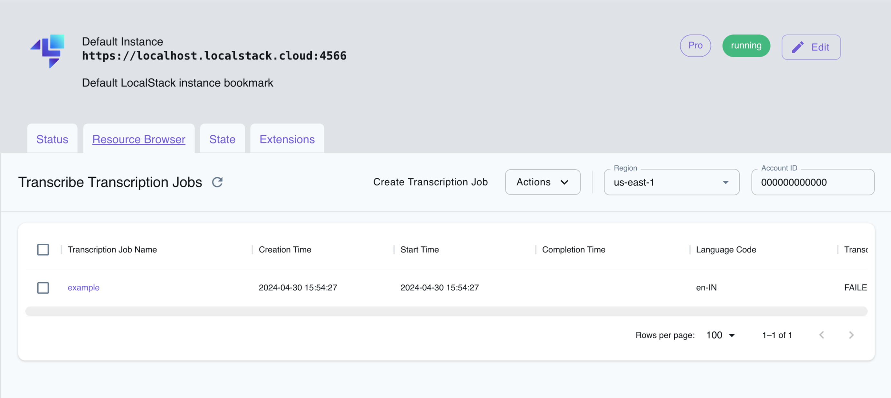

## Introduction

Transcribe is a service provided by Amazon Web Services (AWS) that offers automatic speech recognition (ASR) capabilities. It enables developers to convert spoken language into written text, making it valuable for a wide range of applications, from transcription services to voice analytics. 

LocalStack allows you to use the Transcribe APIs for offline speech-to-text jobs in your local environment. The supported APIs are available on our [API Coverage Page](https://docs.localstack.cloud/references/coverage/coverage_transcribe/), which provides information on the extent of Transcribe integration with LocalStack.


LocalStack's Transcribe relies on the offline speech-to-text service called [Vosk](https://alphacephei.com/vosk/). Therefore, LocalStack requires an internet connection during the initial creation of a transcription job for a specific language. This initial connection is required to download and cache the language model.

Once the language model is cached, subsequent transcriptions for the same language can be performed offline. These language models typically have a size of around 50 MiB, and they are saved to the cache directory (for more details, refer to the [Filesystem Layout]() section).


## Getting Started

This guide is designed for users new to Transcribe and assumes basic knowledge of the AWS CLI and our [`awslocal`](https://github.com/localstack/awscli-local)  wrapper script.

Start your LocalStack container using your preferred method. We will demonstrate how to create a transcription job and view the transcript in an S3 bucket using the AWS CLI.

### Create an S3 bucket

You can create an S3 bucket using the [`mb`](https://docs.aws.amazon.com/cli/latest/reference/s3/mb.html) command. Run the following command to create a bucket named `foo` to upload a sample audio file named `example.wav`:


$ awslocal s3 mb s3://foo
$ awslocal s3 cp ~/example.wav s3://foo/example.wav


### Create a transcription job

You can create a transcription job using the [`StartTranscriptionJob`](https://docs.aws.amazon.com/transcribe/latest/APIReference/API_StartTranscriptionJob.html) API. Run the following command to create a transcription job named `example` for the audio file `example.wav`:


$ awslocal transcribe start-transcription-job \
    --transcription-job-name example \
    --media MediaFileUri=s3://foo/example.wav \
    --language-code en-IN


You can list the transcription jobs using the [`ListTranscriptionJobs`](https://docs.aws.amazon.com/transcribe/latest/APIReference/API_ListTranscriptionJobs.html) API. Run the following command to list the transcription jobs:


$ awslocal transcribe list-transcription-jobs
<disable-copy> 
{
    "TranscriptionJobSummaries": [
        {
            "TranscriptionJobName": "example",
            "CreationTime": "2022-08-17T14:04:39.277000+05:30",
            "StartTime": "2022-08-17T14:04:39.308000+05:30",
            "LanguageCode": "en-IN",
            "TranscriptionJobStatus": "IN_PROGRESS"
        }
    ]
}
</disable-copy>


### View the transcript

After the job is complete, the transcript can be retrieved from the S3 bucket using the [`GetTranscriptionJob`](https://docs.aws.amazon.com/transcribe/latest/APIReference/API_GetTranscriptionJob.html) API. Run the following command to get the transcript:


$ awslocal transcribe get-transcription-job --transcription-job example
<disable-copy> 
{
    "TranscriptionJob": {
        "TranscriptionJobName": "example",
        "TranscriptionJobStatus": "COMPLETED",
        "LanguageCode": "en-IN",
        "MediaFormat": "wav",
        "Media": {
            "MediaFileUri": "s3://foo/example.wav"
        },
        "Transcript": {
            "TranscriptFileUri": "s3://foo/7844aaa5.json"
        },
        "CreationTime": "2022-08-17T14:04:39.277000+05:30",
        "StartTime": "2022-08-17T14:04:39.308000+05:30",
        "CompletionTime": "2022-08-17T14:04:57.400000+05:30",
    }
}
</disable-copy>
$ awslocal s3 cp s3://foo/7844aaa5.json .
$ jq .results.transcripts[0].transcript 7844aaa5.json
<disable-copy>
"it is just a question of getting rid of the illusion that we are separate from nature"
</disable-copy>


## Resource Browser

The LocalStack Web Application provides a Resource Browser for managing Transcribe Transcription Jobs. You can access the Resource Browser by opening the LocalStack Web Application in your browser, navigating to the **Resource Browser** section, and then clicking on **Transcribe Service** under the **Machine Learning** section.

 
 

The Resource Browser allows you to perform the following actions:

- **Create Transcription Job**: Create a new transcription job by clicking on the **Create Transcription Job** button, and then providing the required details.
- **View Transcription Job**: View the details of a specific transcription job by clicking on the job in the list.
- **Delete Transcription Job**: Delete the transcription job by clicking on the **Actions** button followed by **Remove Selected** button.

## Examples

The following code snippets and sample applications provide practical examples of how to use Transcribe in LocalStack for various use cases:

- [Serverless Transcription App using Transcribe, S3, Lambda, SQS, SES](https://github.com/localstack-samples/sample-serverless-transcribe)

## Current Limitations

Currently, our Transcribe emulation offers only supported formats and languages.

### Supported Formats

The following input media formats are supported:

- Adaptive Multi-Rate (AMR)
- Free Lossless Audio Codec (FLAC)
- MPEG-1 Audio Layer-3 (MP3)
- MPEG-4 Part 14 (MP4)
- OGG
- Matroska Video files (MKV)
- Waveform Audio File Format (WAV)

### Supported Languages

The following languages and dialects are supported:

| Language         | Language Code |
| ---------------- | ------------- |
| German           | `de-DE`       |
| English, British | `en-GB`       |
| English, Indian  | `en-IN`       |
| English, US      | `en-US`       |
| Spanish          | `es-ES`       |
| Farsi            | `fa-IR`       |
| French           | `fr-FR`       |
| Hindi            | `hi-IN`       |
| Italian          | `it-IT`       |
| Japan            | `ja-JP`       |
| Dutch            | `nl-NL`       |
| Portuguese       | `pt-BR`       |
| Russian          | `ru-RU`       |
| Turkish          | `tr-TR`       |
| Vietnamese       | `vi-VN`       |
| Chinese          | `zh-CN`       |
