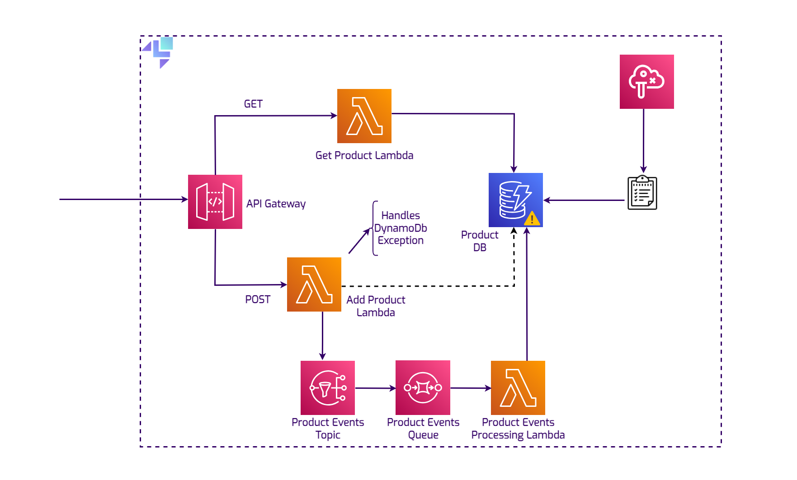

## Introduction

AWS Fault Injection Simulator (FIS) is a service that facilitates controlled chaos engineering experiments on AWS 
infrastructure to identify weaknesses and enhance system resilience. It provides a framework for injecting failures 
and monitoring their effects, enabling developers to proactively prepare for real-world outages.

## Getting started

This guide is designed for users new to the Fault Injection Simulator and assumes basic knowledge of the AWS CLI and our
[`awslocal`](https://github.com/localstack/awscli-local) wrapper script. To read extensively about the FIS service, please
refer to the dedicated [documentation page](https://docs.localstack.cloud/user-guide/aws/fis/).


In this example of utilizing AWS Fault Injection Simulator (FIS) to cause controlled outages to a DynamoDB database we will
demonstrate testing software behavior and error handling. This kind of test helps to ensure that the software can handle 
database downtime gracefully by implementing strategies such as queuing requests to prevent data loss. This proactive error
handling ensures that the system can maintain its operations despite partial failures. You can follow along with the full solution
in this GitHub [repository]().

Start LocalStack using the `docker-compose.yml` file from the repository and make sure you provide your API key as an environment
variable:


$ LOCALSTACK_API_KEY=<YOUR_LOCALSTACK_API_KEY>
$ docker compose up




The resources will be created upon the LocalStack start.

## Creating an experiment template

Before creating any FIS experiments, let's make sure our system works as expected by creating an entity and persist it.
We'll call the API Gateway endpoint for the POST method via cURL:

```bash
$ curl --location 'http://12345.execute-api.localhost.localstack.cloud:4566/dev/productApi' \
--header 'Content-Type: application/json' \
--data '{
  "id": "prod-2004",
  "name": "Ultimate Gadget",
  "price": "49.99",
  "description": "The Ultimate Gadget is the perfect tool for tech enthusiasts looking for the next level in gadgetry. Compact, powerful, and loaded with features."
}
'

Product added/updated successfully.
```

We create a file containing the FIS experiment called `experiment-ddb.json`. This has a JSON configuration that will be utilized
during the subsequent invocation of the `CreateExperimentTemplate` API in the FIS resource.

```bash
 $ cat experiment-ddb.json
{
        "actions": {
                "Test action 1": {
                        "actionId": "localstack:generic:api-error",
                        "parameters": {
                                "service": "dynamodb",
                                "api": "all",
                                "percentage": "100",
                                "exception": "DynamoDbException",
                                "errorCode": "500"
                        }
                }
        },
        "description": "Template for interfering with the DynamoDB service",
        "stopConditions": [{
                "source": "none"
        }],
        "roleArn": "arn:aws:iam:000000000000:role/ExperimentRole"
}
```

With this template definition we are targeting all APIs of the DynamoDB resource. Specific operations, such as `PutItem` or `GetItem` can also
be specified, but in this case, we just want to cut off the database completely. This configuration will result in a 100% failure rate
for all API calls, each accompanied by an HTTP 500 status code, with a DynamoDbException.

```bash
$ awslocal fis create-experiment-template --cli-input-json file://experiment-ddb.json
{
    "experimentTemplate": {
        "id": "895591e8-11e6-44c4-adc3-86592010562b",
        "description": "Template for interfering with the DynamoDB service",
        "actions": {
            "Test action 1": {
                "actionId": "localstack:generic:api-error",
                "parameters": {
                    "service": "dynamodb",
                    "api": "all",
                    "percentage": "100",
                    "exception": "DynamoDbException",
                    "errorCode": "500"
                }
            }
        },
        "stopConditions": [
            {
                "source": "none"
            }
        ],
        "creationTime": 1699308754.415716,
        "lastUpdateTime": 1699308754.415716,
        "roleArn": "arn:aws:iam:000000000000:role/ExperimentRole"
    }
}
```

We take note of the template ID for the next command.

## Starting the experiment

Based on the experiment template that was just created, a new experiment can be started, using the template ID.

```bash
$ awslocal fis start-experiment --experiment-template-id 895591e8-11e6-44c4-adc3-86592010562b
{
    "experiment": {
        "id": "1b1238fd-316d-4956-93e7-5ada677a6f69",
        "experimentTemplateId": "895591e8-11e6-44c4-adc3-86592010562b",
        "roleArn": "arn:aws:iam:000000000000:role/ExperimentRole",
        "state": {
            "status": "running"
        },
        "actions": {
            "Test action 1": {
                "actionId": "localstack:generic:api-error",
                "parameters": {
                    "service": "dynamodb",
                    "api": "all",
                    "percentage": "100",
                    "exception": "DynamoDbException",
                    "errorCode": "500"
                }
            }
        },
        "stopConditions": [
            {
                "source": "none"
            }
        ],
        "creationTime": 1699308823.74327,
        "startTime": 1699308823.74327
    }
}
```

## The outage

Now that the experiment is started, the database will be inaccessible, meaning the user can't retrieve and can't add any new
products. The API Gateway will return an Internal Server Error. This is obviously problematic, as anyone who has ever worked
with enterprise applications can tell you, downtime and data loss are two things crucial to avoid.
Luckily, this potential issue has been caught early enough in the development phase, that the developer can include proper error handling and a mechanism
that prevents data loss in case of an outage of the database. This of course is not limited to DynamoDB, an outage can be
simulated for any storage resource.

## The solution



The potential solution could be deploying an SNS topic, an SQS queue and a Lambda function that will pick up the queued element and retry the
`PutItem` operation on the database. In case DynamoDB is still unavailable, the item will be re-queued.

```bash
$ curl --location 'http://12345.execute-api.localhost.localstack.cloud:4566/dev/productApi' \
                                                           --header 'Content-Type: application/json' \
                                                           --data '{
                                                         "id": "prod-1003",
                                                         "name": "Super Widget",
                                                         "price": "29.99",
                                                         "description": "A versatile widget that can be used for a variety of purposes. Durable, reliable, and affordable."
                                                       }
                                                       '
                                                       
A DynamoDB error occurred. Message sent to queue.⏎      
     
```

If we check the logs, we can see that the `DynamoDbException` is handled gracefully:

```bash
2023-11-06T22:21:40.789 DEBUG --- [   asgi_gw_2] l.services.fis.handler     : FIS handler called with configs: {'dynamodb': {None: [(100, 'DynamoDbException', '500')]}}
2023-11-06T22:21:40.789  INFO --- [   asgi_gw_2] localstack.request.aws     : AWS dynamodb.PutItem => 500 (DynamoDbException)
2023-11-06T22:21:40.834 DEBUG --- [   asgi_gw_4] l.services.sns.publisher   : Topic 'arn:aws:sns:us-east-1:000000000000:ProductEventsTopic' publishing '5520d37a-fc21-4a73-b1bf-f9b9afce5908' to subscribed 
'arn:aws:sqs:us-east-1:000000000000:ProductEventsQueue' with protocol 'sqs' (subscription 'arn:aws:sns:us-east-1:000000000000:ProductEventsTopic:0a4abf8c-744a-404a-9ff9-f132e25d1b30')
```

Now this element sits in the queue, until the outage is over. 

## Stopping the experiment

We can stop the experiment by using the following command:

```bash
$ awslocal fis stop-experiment --id 1b1238fd-316d-4956-93e7-5ada677a6f69
{
    "experiment": {
        "id": "1b1238fd-316d-4956-93e7-5ada677a6f69",
        "experimentTemplateId": "895591e8-11e6-44c4-adc3-86592010562b",
        "roleArn": "arn:aws:iam:000000000000:role/ExperimentRole",
        "state": {
            "status": "stopped"
        },
        "actions": {
            "Test action 1": {
                "actionId": "localstack:generic:api-error",
                "parameters": {
                    "service": "dynamodb",
                    "api": "all",
                    "percentage": "100",
                    "exception": "DynamoDbException",
                    "errorCode": "500"
                },
                "startTime": 1699308823.750742,
                "endTime": 1699309736.259625
            }
        },
        "stopConditions": [
            {
                "source": "none"
            }
        ],
        "creationTime": 1699308823.74327,
        "startTime": 1699308823.74327,
        "endTime": 1699309736.259646
    }
}
```

The experiment ID comes from the prior used `start-experiment` command.
The experiment has been stopped, meaning that the Product that initially has not reached the database, has finally reached
the destination. We can verify that by scanning the database:

```bash
$ awslocal dynamodb scan --table-name Products
{
    "Items": [
        {
            "name": {
                "S": "Super Widget"
            },
            "description": {
                "S": "A versatile widget that can be used for a variety of purposes. Durable, reliable, and affordable."
            },
            "id": {
                "S": "prod-1003"
            },
            "price": {
                "N": "29.99"
            }
        },
        {
            "name": {
                "S": "Ultimate Gadget"
            },
            "description": {
                "S": "The Ultimate Gadget is the perfect tool for tech enthusiasts looking for the next level in gadgetry. Compact, powerful, and loaded with features."
            },
            "id": {
                "S": "prod-2004"
            },
            "price": {
                "N": "49.99"
            }
        }
    ],
    "Count": 2,
    "ScannedCount": 2,
    "ConsumedCapacity": null
}
```

## Adding latency

The LocalStack FIS service is also capable of adding latency by using the following experiment template:

```bash
{
  "description": "template for testing delays in API calls",
  "actions": {
    "latency": {
      "actionId": "localstack:generic:api-error",
      "parameters": {
        "latency": "4"
      }
    }
  },
  "stopConditions": [
    {
      "source": "none"
    }
  ],
  "roleArn": "arn:aws:iam:000000000000:role/ExperimentRole"
}
```

Let's add this experiment definition to a JSON file and create an experiment template via the FIS service:

```bash
$ awslocal fis create-experiment-template --cli-input-json file://latency-experiment.json
{
    "experimentTemplate": {
        "id": "966f5632-4e2c-4567-b99c-436c333e523f",
        "description": "template for testing delays in API calls",
        "actions": {
            "latency": {
                "actionId": "localstack:generic:api-error",
                "parameters": {
                    "latency": "4"
                }
            }
        },
        "stopConditions": [
            {
                "source": "none"
            }
        ],
        "creationTime": 1699619228.208613,
        "lastUpdateTime": 1699619228.208613,
        "roleArn": "arn:aws:iam:000000000000:role/ExperimentRole"
    }
}

$ awslocal fis start-experiment --experiment-template-id 966f5632-4e2c-4567-b99c-436c333e523f
```

With the experiment active, we can try using the same sample stack to better understand what happens when there's a 4 second delay on 
each service call:

```bash
 curl --location 'http://12345.execute-api.localhost.localstack.cloud:4566/dev/productApi' \
                                                           --header 'Content-Type: application/json' \
                                                           --data '{
                                                         "id": "prod-1088",
                                                         "name": "Super Widget",
                                                         "price": "29.99",
                                                         "description": "A versatile widget that can be used for a variety of purposes. Durable, reliable, and affordable."
                                                       }
                                                       '
An error occurred (InternalError) when calling the GetResources operation (reached max retries: 4): Failing as per Fault Injection Simulator configuration⏎
```

