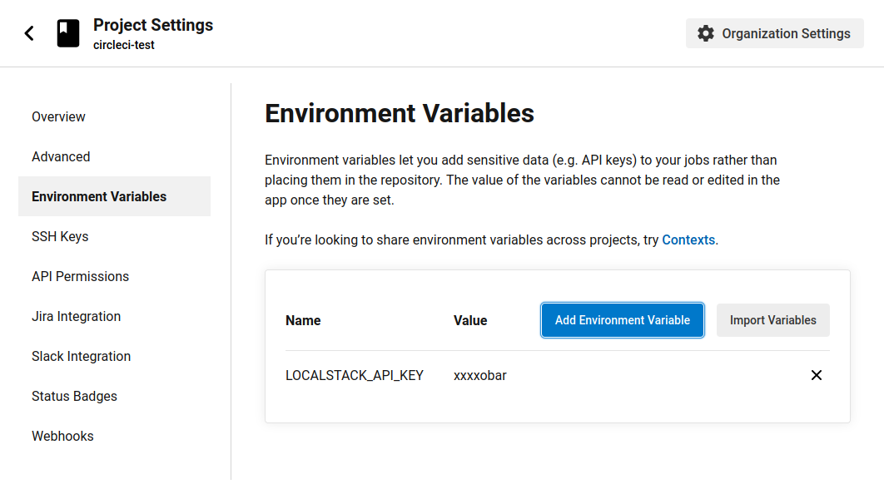

[Circle CI](https://circleci.com) is a continuous integration and continuous delivery (CI/CD) platform which uses a configuration file (usually named `.circleci/config.yml`) to define the build, test, and deployment workflows. LocalStack supports CircleCI out of the box and can be easily integrated into your pipeline to run your tests against a local cloud emulator.

## Getting started

This guide is designed for users new to CircleCI and assumes basic knowledge of YAML and LocalStack tooling. To create a CircleCI job that uses LocalStack, follow these steps:

- Under the "Projects" tab, find your project and click "Set Up Project"
- You'll be prompted to add a configuration. You can add the configuration manually or choose a starter pipeline.
- If you choose the starter CI pipeline, a sample `config.yml` file is created and committed to a `circleci-project-setup` branch in your repo.
- You can add the following configuration to the `config.yml` file to start LocalStack and run your tests against it.



version: 2.1

orbs:
  python: circleci/python@2.0.3

jobs:
  example-job:
    machine:
      image: ubuntu-2004:2022.04.1

    steps:
      - checkout

      - run:
          name: Start LocalStack
          command: |
            pip3 install localstack awscli-local[ver1]
            docker pull localstack/localstack
            localstack start -d                     

            echo "Waiting for LocalStack startup..."  
            localstack wait -t 30                     
            echo "Startup complete"
            
      - run:
          name: Run AWS CLI commands against LocalStack
          command: |
            awslocal s3 mb s3://test-bucket
            awslocal sqs create-queue --queue-name test-queue
            awslocal sns create-topic --name test-topic

workflows:
  version: 2
  build:
    jobs:
      - example-job


version: 2.1

orbs:
  python: circleci/python@2.0.3

jobs:
  example-job:
    machine:
      image: ubuntu-2004:2022.04.1
    environment:
      LOCALSTACK_API_KEY: YOUR_API_KEY_HERE

    steps:
      - checkout

      - run:
          name: Start LocalStack
          command: |
            pip3 install localstack awscli-local[ver1]
            docker pull localstack/localstack-pro
            localstack start -d
            echo "Waiting for LocalStack startup..."
            localstack wait -t 30
            echo "Startup complete"
            
      - run:
          name: Run AWS CLI commands against LocalStack
          command: |
            awslocal s3 mb s3://test-bucket
            awslocal sqs create-queue --queue-name test-queue
            awslocal sns create-topic --name test-topic

workflows:
  version: 2
  build:
    jobs:
      - example-job



The above CircleCI job does the following:

- Defines a job called `example-job` that installs the `localstack` CLI and `awslocal` wrapper script to execute AWS CLI commands against LocalStack.
- Pulls the LocalStack Docker image depending on the product tier (For Community, the image is `localstack/localstack`, while for Pro it is `localstack/localstack-pro`).
- Starts LocalStack in the background and waits for it to become ready. After 30 seconds, the job will execute basic AWS CLI commands against LocalStack.

## Configuring a CI key

To enable LocalStack Pro, you need to add your LocalStack CI API key to the project's environment variables. The LocalStack container will automatically pick it up and activate the licensed features. 

Go to the [API Key Settings](https://app.localstack.cloud/account/apikeys) page and copy your CI key. To add the CI key to your CircleCI project, follow these steps:

- Click on **Project Settings**.
- Select **Environment Variables** from the left side menu.
- Click **Add Environment Variable**.
- Name your environment variable `LOCALSTACK_API_KEY`.
- Paste your CI key into the input field.

