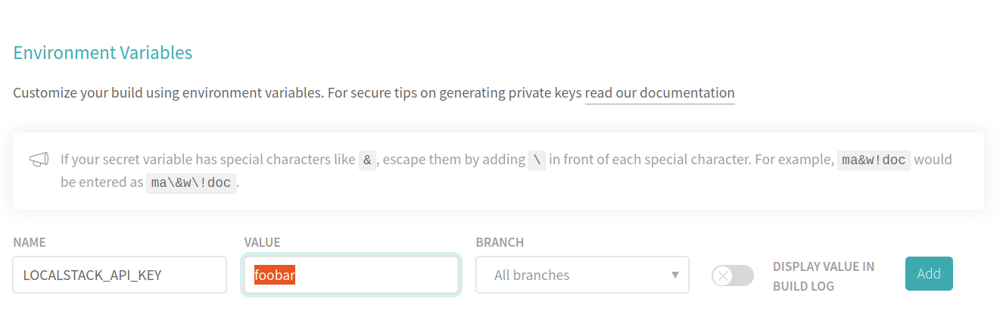

This guide shows how to start and use LocalStack in your Travis CI jobs.

## Setting up the Travis CI job

When you want to integrate LocalStack into your job configuration, you just have to execute the following steps:
- Install the LocalStack CLI (and maybe also `awslocal`).
- Make sure your LocalStack docker image is up-to-date by pulling the latest version.
- Use the LocalStack CLI to start LocalStack.
  Make sure to use the `-d` flag to start the LocalStack docker container in detached mode.
- Wait for the container to report that it is up and running.

The following example Travis CI job config (`.travis.yaml`) executes these steps, creates a new S3 bucket, and prints a nice message in the end:

```yaml
language: python

services:
    - docker

python:
  - "3.8"

before_install:
  # Install the LocalStack CLI and awslocal
  - python -m pip install localstack awscli-local[ver1]
  # Make sure to pull the latest version of the image
  - docker pull localstack/localstack
  # Start LocalStack in the background
  - localstack start -d
  # Wait 30 seconds for the LocalStack container to become ready before timing out
  - echo "Waiting for LocalStack startup..."
  - localstack wait -t 30
  - echo "Startup complete"

script:
  # Test LocalStack by creating a new S3 bucket (and verify that it has been created by listing all buckets)
  - awslocal s3 mb s3://test
  - awslocal s3 ls
  - echo "Execute your tests here :)"
```

## Configuring a CI key

You can easily enable LocalStack Pro by using the `localstack/localstack-pro` image and adding your CI key to the project's environment variables.
The LocalStack CLI will automatically pick it up and activate the Pro features.

Just go to the project settings in Travis CI (`More options` → `Settings`), scroll down to the `Environment Variables` section, and add your CI key:



Here is an example:

```yaml
before_install:
  # Install the LocalStack CLI and awslocal
  - python -m pip install localstack awscli-local[ver1]
  # Make sure to pull the latest version of the image
  - docker pull localstack/localstack-pro
  # Start LocalStack in the background
  - localstack start -d
  # Wait 30 seconds for the LocalStack container to become ready before timing out
  - echo "Waiting for LocalStack startup..."
  - localstack wait -t 30
  - echo "Startup complete"
```
