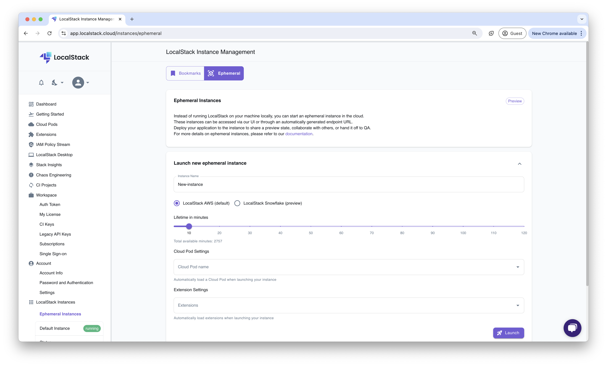
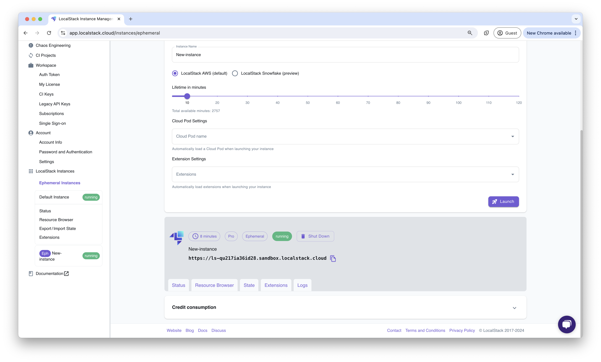
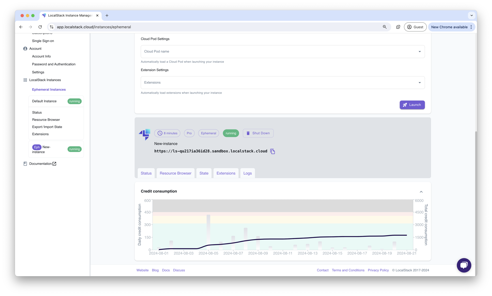

## Introduction

Ephemeral Instances allows you to run a LocalStack instance in the cloud.
You can interact with these instances via the LocalStack Web Application, or by configuring your integrations and developer tools with the endpoint URL of the ephemeral instance.


Ephemeral Instances is offered as a **preview** feature and under active development.


## Getting started

This guide is designed for users new to Ephemeral Instance and assumes basic knowledge of the LocalStack Web Application.
In this guide, we will create an Ephemeral Instance and interact with it via the LocalStack Web Application and the AWS CLI.

### Create a new Ephemeral Instance

Navigate to the [**LocalStack Ephemeral Instance Management**](https://app.localstack.cloud/instances/ephemeral) page.
In the form, enter the name of the new Ephemeral Instance, select the lifetime of the instance by dragging the slider, and click on **Launch**.

Optionally, you can specify a LocalStack Extension to be installed or loaded in the Ephemeral Instance.
You can select the extension from the **Extension settings** dropdown list before launching the Ephemeral Instance.
In case you have access to Cloud Pods and a pod you want to start your instance with, you can also choose it from the **Cloud Pod Settings** dropdown.

### Interact with the Ephemeral Instance

After the Ephemeral Instance is created, you will be able to see the instance in the **LocalStack Instance Management** page.

You will also be able to access the following features with your Ephemeral Instance:

- Status Page
- Resource Browser
- State Management
- Extensions
- Logs

### Access the Ephemeral Instance via AWS CLI

You can access the Ephemeral Instance via the AWS CLI by configuring the AWS CLI with the endpoint URL of the Ephemeral Instance.
You can find the endpoint URL of the Ephemeral Instance in the **LocalStack Instance Management** page.
Copy the endpoint URL and set it as the `--endpoint-url` parameter in the AWS CLI command.

To create an S3 bucket in the Ephemeral Instance, run the following command:


$ aws --endpoint-url=<EPHEMERAL_INSTANCE_ENDPOINT_URL> s3 mb s3://<BUCKET_NAME>


You can replace `<EPHEMERAL_INSTANCE_ENDPOINT_URL>` with the endpoint URL of the Ephemeral Instance and `<BUCKET_NAME>` with the name of the S3 bucket you want to create.
To query the list of S3 buckets in the Ephemeral Instance, run the following command:


$ aws --endpoint-url=<EPHEMERAL_INSTANCE_ENDPOINT_URL> s3 ls


You can also use integrations, such as [CDK](https://docs.localstack.cloud/user-guide/integrations/aws-cdk/), [SAM CLI](https://docs.localstack.cloud/user-guide/integrations/aws-sam/), and [Terraform](https://docs.localstack.cloud/user-guide/integrations/terraform/), to interact with the Ephemeral Instance.
In these integrations, you can change the `AWS_ENDPOINT_URL` environment variable to the endpoint URL of the Ephemeral Instance.

### View the Logs of the Ephemeral Instance

You can view the logs of the Ephemeral Instance by navigating to the **Logs** tab in the **LocalStack Instance Management** page.

### Shut Down the Ephemeral Instance

You can shut down the instance by navigating to the [Ephemeral Instances page](https://app.localstack.cloud/instances/ephemeral) and clicking on the **Shut Down** button.


Ephemeral Instances, by default, are created with the latest version of LocalStack.
If you have created a Cloud Pod from an older version of LocalStack, you need to update the Cloud Pod to the latest version before loading it into an Ephemeral Instance.


## Credit Consumption

Ephemeral Instances consume credits based on the resources used and the duration of the instance.
You can view the credit consumption of the Ephemeral Instance in the **Ephemeral Instance** page.
Currently, for every 1 credit, you can run an Ephemeral Instance for 1 minute.
You can view the available minutes under the **Lifetime in minutes** slider when creating an Ephemeral Instance.
You can also see the credit consumption in the **Credit Consumption** section of the Ephemeral Instance page.

  
