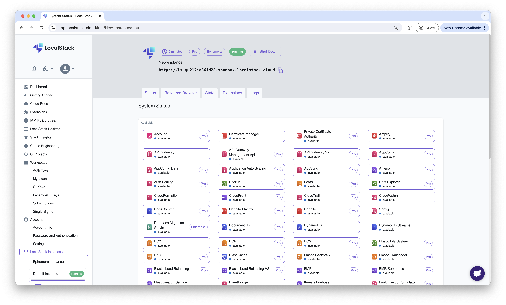

## Introduction

LocalStack Ephemeral Instance allows you to run an LocalStack instance in the cloud. You can interact with these remote instances via the LocalStack Web Application, or by configuring your integrations and developer tools with the endpoint URL of the remote instance.


Ephemeral Instance is available on invite-only preview.
If you'd like to try it out, please [contact us](https://www.localstack.cloud/demo) to request access.


## Getting started

This guide is designed for users new to Ephemeral Instance and assumes basic knowledge of the LocalStack Web Application. In this guide, we will create an Ephemeral Instance and interact with it via the LocalStack Web Application and the AWS CLI.

### Create a new Ephemeral Instance

Navigate to the [**LocalStack Instance Management**](https://app.localstack.cloud/instances) and click on the **Ephemeral (Team)** tab. Click on the **Create Ephemeral Instance** button.

You will be able to specify the name of the new Epheemeral Instance. Click on **Create Instance** to create the new Ephemeral Instance.

### Interact with the Ephemeral Instance

After the Epheemeral Instance is created, you will be able to see the instance in the **LocalStack Instance Management** page.

You will also be able to access the following with your Ephemeral Instance:

- Status Page
- Resource Browser
- State Management
- Extensions

### Access the Ephemeral Instance via AWS CLI

You can access the Ephemeral Instance via the AWS CLI by configuring the AWS CLI with the endpoint URL of the Ephemeral Instance. You can find the endpoint URL of the Ephemeral Instance in the **LocalStack Instance Management** page.

To create an S3 bucket in the Ephemeral Instance, run the following command:


$ aws --endpoint-url=<EPHEMERAL_INSTANCE_ENDPOINT_URL> s3 mb s3://<BUCKET_NAME>


You can replace `<EPHEMERAL_INSTANCE_ENDPOINT_URL>` with the endpoint URL of the Ephemeral Instance and `<BUCKET_NAME>` with the name of the S3 bucket you want to create. To query the list of S3 buckets in the Ephemeral Instance, run the following command:


$ aws --endpoint-url=<EPHEMERAL_INSTANCE_ENDPOINT_URL> s3 ls


You can further use integrations, such as [CDK](https://docs.localstack.cloud/user-guide/integrations/aws-cdk/), [SAM CLI](https://docs.localstack.cloud/user-guide/integrations/aws-sam/), and [Terraform](https://docs.localstack.cloud/user-guide/integrations/terraform/), to interact with the Ephemeral Instance. In these integrations, you can change the `LOCALSTACK_HOSTNAME` environment variable to the endpoint URL of the Ephemeral Instance.

### Remove the Ephemeral Instance

You can delete the Ephemeral Instance by clicking on the **Remove** button in the **LocalStack Instance Management** page. These instances are automatically terminated after 90 minutes, in case you don`t remove them manually.

## Load Cloud Pod into an Ephmeral Instance

You can load a Cloud Pod into an Ephemeral Instance to seed your pre-existing cloud resources into a freshly created Ephemeral Instance. You can further use AWS CLI or other integrations to interact with these resources, along with using other features of the LocalStack Web Application.

To load a pre-defined Cloud Pod, navigate to the **Cloud Pods Details** for the specific Cloud Pod and click on the **Browse Version** button. Clicking on the button will open a modal where you will be asked to confirm that this will start a new LocalStack instance and load the selected Cloud Pod version.

  

Click **Continue** to start the Ephemeral Instance and load the Cloud Pod. You will be able to see the Ephemeral Instance on the sidebar. You can copy the endpoint URL of the Ephemeral Instance and use it to manage your cloud resources.
