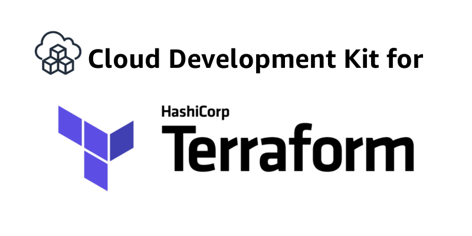

## Overview

Cloud Development Kit for Terraform (CDKTF) allows you to use general-purpose programming languages, such as TypeScript, Python, Java, and more, to create infrastructure declaratively. It allows you to create, update, and delete AWS infrastructure by leveraging a Terraform backend without manually configuring Terraform using HCL and [AWS Cloud Development Kit](https://aws.amazon.com/cdk/) to translate your code into infrastructure configuration files for Terraform. CDKTF supports every Terraform provider and module available on the [Terraform Registry](https://registry.terraform.io/).

## LocalStack & CDKTF

Using Terraform with LocalStack requires additional configuration to leverage the [Terraform Override mechanism](https://www.terraform.io/language/files/override) to configure the endpoints for the AWS `provider` section. The endpoints for all services are configured to point to the LocalStack API (`http://localhost:4566` by default) instead of sending requests to the real AWS cloud.

To configure your existing CDKTF configuration to work with LocalStack, manually configure the local service endpoints and credentials. It includes:

- General configuration to specify mock credentials for the AWS provider (`region`, `access_key`, `secret_key`).
- Request Management to avoid issues with routing and authentication, if needed.
- Service configuration to point the individual services to LocalStack.

Here is a configuration example to use with Python & TypeScript CDKTF configurations: 



AWS_CONFIG = {
    "region": "us-east-1",
    "endpoints": [
        {
            "s3": "http://localhost:4566",
            "sts": "http://localhost:4566",
            "apigateway": "http://localhost:4566",
            "apigatewayv2": "http://localhost:4566",
            "cloudformation": "http://localhost:4566",
            "cloudwatch": "http://localhost:4566",
            "dynamodb": "http://localhost:4566",
            "ec2": "http://localhost:4566",
            "es": "http://localhost:4566",
            "elasticache": "http://localhost:4566",
            "firehose": "http://localhost:4566",
            "iam": "http://localhost:4566",
            "kinesis": "http://localhost:4566",
            "lambda": "http://localhost:4566",
            "rds": "http://localhost:4566",
            "redshift": "http://localhost:4566",
            "route53": "http://localhost:4566",
            "s3": "http://s3.localhost.localstack.cloud:4566",
            "secretsmanager": "http://localhost:4566",
            "ses": "http://localhost:4566",
            "sns": "http://localhost:4566",
            "sqs": "http://localhost:4566",
            "ssm": "http://localhost:4566",
            "stepfunctions": "http://localhost:4566",
            "sts": "http://localhost:4566",
        }
    ],
} 


export const AWS_CONFIG = {
  region: "us-east-1",
  endpoints: [
    {
      apigateway: "http://localhost:4566",
      apigatewayv2: "http://localhost:4566",
      cloudformation: "http://localhost:4566",
      cloudwatch: "http://localhost:4566",
      dynamodb: "http://localhost:4566",
      ec2: "http://localhost:4566",
      es: "http://localhost:4566",
      elasticache: "http://localhost:4566",
      firehose: "http://localhost:4566",
      iam: "http://localhost:4566",
      kinesis: "http://localhost:4566",
      lambda: "http://localhost:4566",
      rds: "http://localhost:4566",
      redshift: "http://localhost:4566",
      route53: "http://localhost:4566",
      s3: "http://s3.localhost.localstack.cloud:4566",
      secretsmanager: "http://localhost:4566",
      ses: "http://localhost:4566",
      sns: "http://localhost:4566",
      sqs: "http://localhost:4566",
      ssm: "http://localhost:4566",
      stepfunctions: "http://localhost:4566",
      sts: "http://localhost:4566",
    },
  ],
}; 



You can further import the above configuration in your project's code, and use it to configure the AWS provider:



...
from localstack_config import AWS_CONFIG
...
AwsProvider(self, "Aws", **AWS_CONFIG)
...


...
import { AWS_CONFIG } from "./aws-config";
...
new AwsProvider(this, "aws", AWS_CONFIG);
...



## Quick Start

To get started with CDKTF on LocalStack, we will set up a simple TypeScript stack to create some AWS resources. We will then deploy the stack to LocalStack, and verify that the resources have been created successfully. Before we start, make sure you have the following prerequisites:

* LocalStack
* [`cdktf`](https://www.npmjs.com/package/cdktf)
* [`tsc`](https://www.npmjs.com/package/typescript)

Create a new directory named `cdktf-localstack` and initialize a new CDKTF project using the following command:


$ cdktf init

? Do you want to continue with Terraform Cloud remote state management? No
? What template do you want to use? python

Initializing a project using the python template.
? Project Name sample-app
? Project Description A simple getting started project for cdktf.
? Do you want to start from an existing Terraform project? No
? Do you want to send crash reports to the CDKTF team? See 
https://www.terraform.io/cdktf/create-and-deploy/configuration-file#enable-crash-reporting-for-the-cli for more information
Creating a virtualenv for this project...
...
? What providers do you want to use?
```


Next, we can install the AWS provider for CDKTF, by running the following command:


$ npm install @cdktf/provider-aws


Navigate to `main.ts` and add the following code to import the AWS provider and create a new S3 bucket:

```typescript
import { Construct } from "constructs";
import { App, TerraformStack } from "cdktf";
import { AwsProvider } from "@cdktf/provider-aws/lib/provider";
import {S3Bucket} from "@cdktf/provider-aws/lib/s3-bucket";

class MyStack extends TerraformStack {
  constructor(scope: Construct, id: string) {
    super(scope, id);

    new AwsProvider(this, "aws",{
      region: "us-east-1",
      s3UsePathStyle: true,
      endpoints: [
          {
            s3: "http://localhost:4566",
            sts: "http://localhost:4566"
          },
      ],
    });

    new S3Bucket(this, "bucket", {});
  }
}

const app = new App();
new MyStack(app, "example");
app.synth();
```

Run the following command to compile the TypeScript code to JavaScript:


$ npm run build


Run the following command to deploy the CDKTF stack to LocalStack:


$ cdktf synth && cdktf deploy


You should see the following output:

```sh
example  Initializing the backend...
example  
         Successfully configured the backend "local"! Terraform will automatically
         use this backend unless the backend configuration changes.
...
example  aws_s3_bucket.bucket (bucket): Creating...
example  aws_s3_bucket.bucket (bucket): Creation complete after 5s [id=terraform-20230418074657926600000001]
example  
         Apply complete! Resources: 1 added, 0 changed, 0 destroyed.
```

Verify that the S3 bucket has been created successfully by running the following command:


$ awslocal s3 ls


Your CDKTF stack is now successfully deployed to LocalStack. You can now start using CDKTF to create and manage your AWS resources on LocalStack.
