## Overview

[DevContainers](https://containers.dev/) is a local tool to create a self-contained, reproducible and containerized development environment that you can setup to encapsulate your project with all its libraries and dependencies.

In this guide, you will learn how to use [DevContainers](https://containers.dev/) with LocalStack.
You can use the following two approaches to set up LocalStack with DevContainers:

* [LocalStack templates](#localstack-templates)
* [LocalStack feature](#localstack-feature)

## LocalStack Templates

LocalStack provides two different approaches for [Templates](https://github.com/localstack/devcontainer-template) which can be used via [supporting tools](https://containers.dev/supporting).

| **Type**                     | **Advantages**                                                                                      | **Disadvantages**                                                                                                                                                                         |
|------------------------------|----------------------------------------------------------------------------------------------------|-------------------------------------------------------------------------------------------------------------------------------------------------------------------------------------------|
| **Docker-in-Docker**         | • Strict separation from host Docker service<br>• Control LocalStack with LocalStack CLI<br>• All-in-one container      | • Resources are limited as all resources spawned by LocalStack are encapsulated within the container<br>• LocalStack volume directory must exist beforehand<br>• Larger container size<br>• Cannot use existing images on host system |
| **Docker-outside-of-Docker** | • Easy addition of external services managed by Docker Compose<br>• DNS service for custom domains | • Host's Docker socket mounted into containers, raising security concerns<br>• Limited LocalStack CLI usage<br>• LocalStack volume directory must exist beforehand                        |

### Docker-in-Docker

* [Dev Container CLI](#dev-container-cli)
* [VS Code](#vscode)
* [Reference file](#reference-file)

#### Dev Container CLI

You can use the DevContainer CLI to create a `devcontainer.json` file from the LocalStack template.
Before you start, ensure that you have the [DevContainer CLI](https://code.visualstudio.com/docs/devcontainers/devcontainer-cli) installed.

Create a JSON file called `options.json` with the desired options in it.

```json
{
    "imageVariant": "bullseye",
    "awslocal": "true",
    "logLevel": "debug",
    "debug": "true",
    "startup": "true"
}
```

Use the command below to generate your `devcontainer.json` from the template.
Include additional features with the `--features` option if needed.


devcontainer templates apply \
    --template-id ghcr.io/localstack/devcontainer-template/localstack-dind \
    --template-args "$(cat ./options.json)" \
    --features '[{"id":"ghcr.io/devcontainers/features/aws-cli:1"}]'


Start your container using the following command.


devcontainer up --id-label project=localstack --workspace-folder .


Connect to it using the `id-label`.


devcontainer exec --id-label project=localstack /bin/bash


Check that the LocalStack CLI is installed by executing:


vscode ➜ ~ $ localstack --version
3.6.0
vscode ➜ ~ $


To remove the container, run this cleanup script since the devcontainer CLI cannot currently do it.


for container in $(docker ps -q); do \
    [[ "$(docker inspect --format '{{ index .Config.Labels "project"}}' $container)" = "localstack" ]] && \
    docker rm -f $container; \
done


#### VSCode


The DevContainer extension is currently reporting issues & bugs.
Follow the [issue](https://github.com/microsoft/vscode-remote-release/issues/10180) for details.


To get started with LocalStack and DevContainers in VS Code, follow these steps:

* Open VS Code with the DevContainers extension installed.
* From the Command Palette, select **Dev Containers: Add Dev Container configuration file**.
  <br><br>
  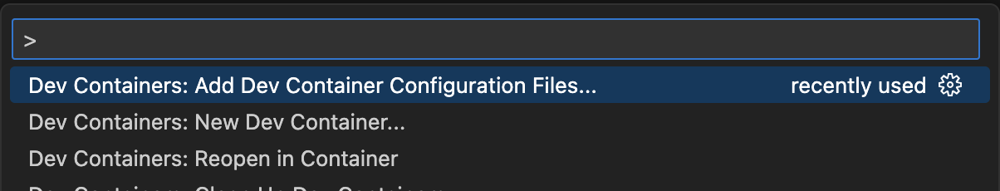
  <br><br>

* Choose **Add configuration to workspace**; alternatively, select **Add configuration to user data folder** for general usage.
  <br><br>
  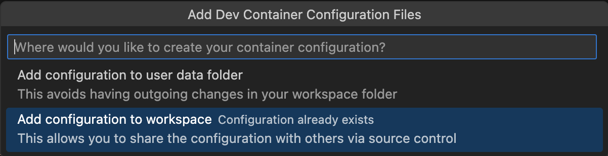
  <br><br>

* Select **Show All Definitions...** to view community templates.
  <br><br>
  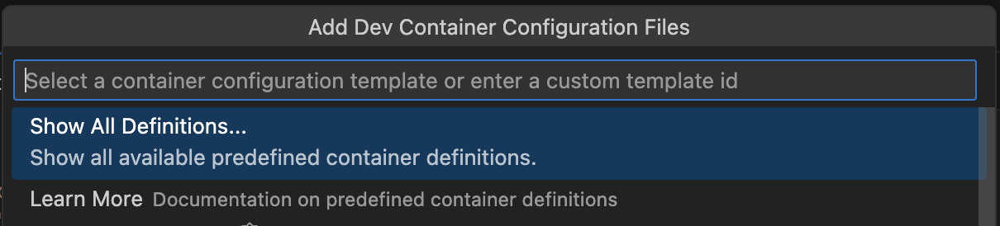
  <br><br>

* Filter by typing "localstack" in the search bar and select the **LocalStack Docker-in-Docker** template.
  <br><br>
  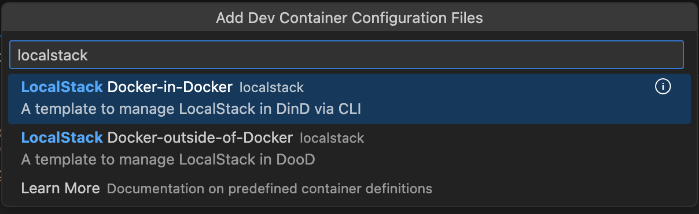
  <br><br>

* Proceed through the configuration by selecting or entering values.
  Pressing **Enter** through the options will apply default settings, which include:
  <br><br>
  * Select the image variant (only Debian-based images are supported).
    <br><br>
    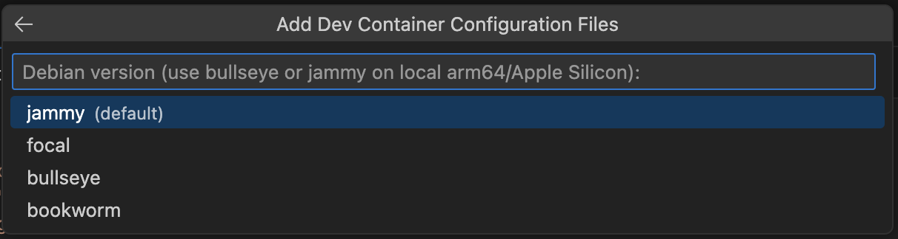
    <br><br>
  * Select the log level.
    <br><br>
    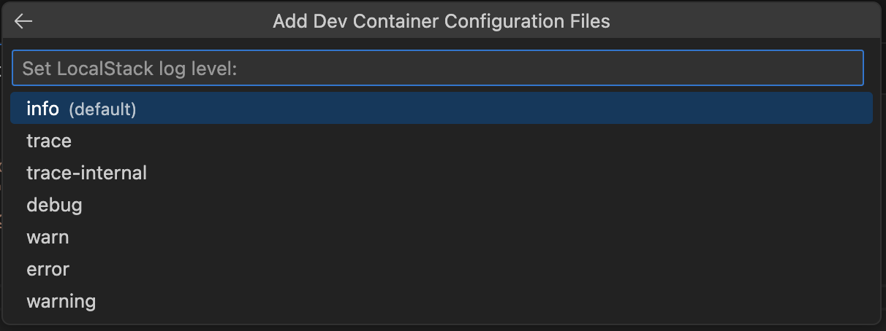
    <br><br>
  * Select the LocalStack version.
    <br><br>
    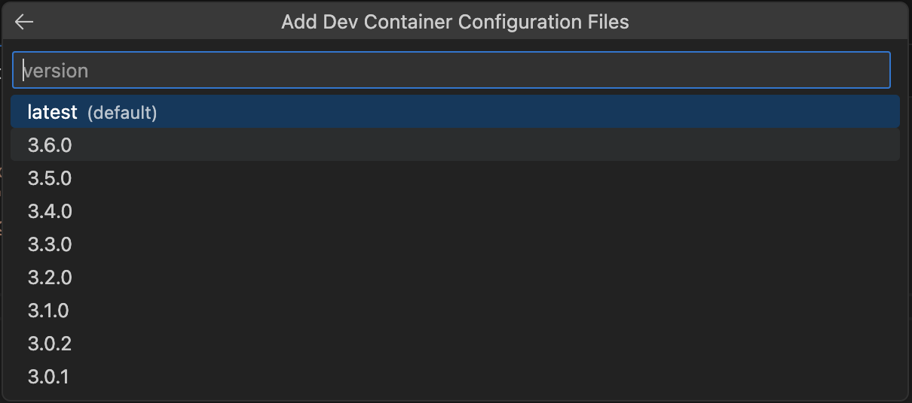
    <br><br>

* Relative paths are acceptable for the volume path, but the specified mount folder must be created prior to building the container.
  <br><br>
  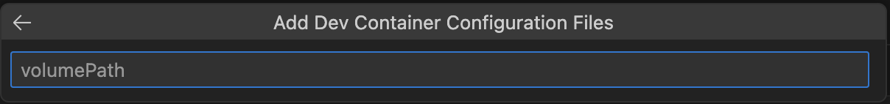
  <br><br>
  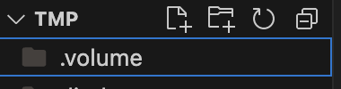
  <br><br>

* Select various tools and configuration options from the checklist.
  For local tools, either select the appropriate SDK or tool feature, or install it manually.
  The template and LocalStack CLI feature do not manage these installations.
  <br><br>
  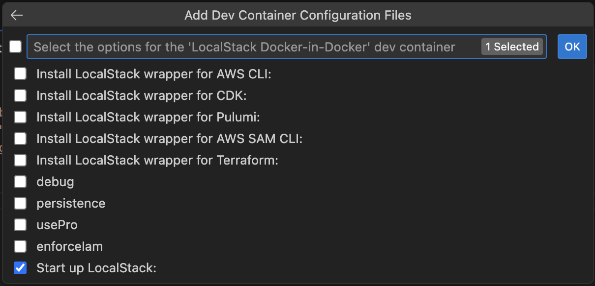
  <br><br>

* You can also add additional features.
  <br><br>
  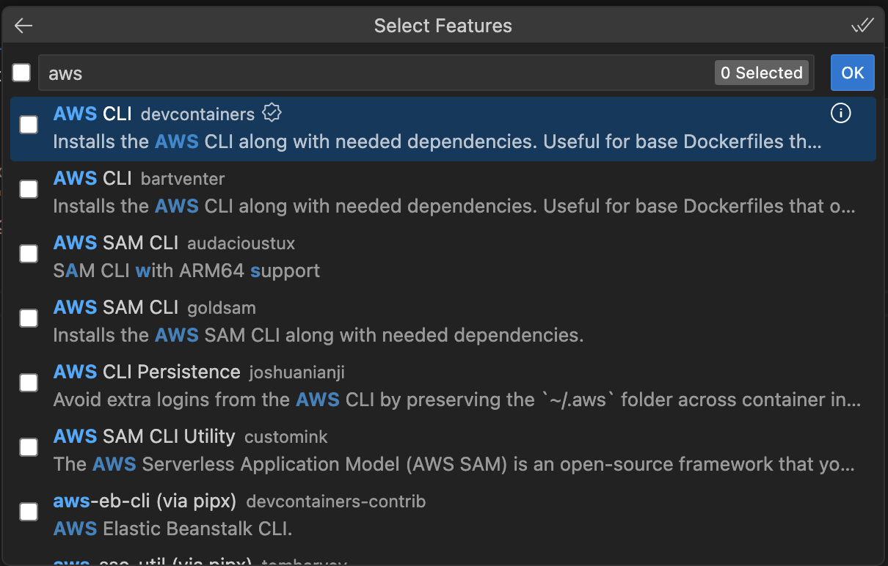
  <br><br>

* This results in the following folder structure in your workspace.
  <br><br>
  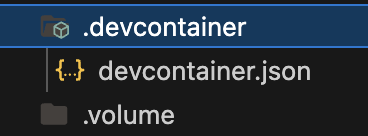
  <br><br>

#### Reference file

The `devcontainer.json` will look similar to the following:

```json
{
 "name": "LocalStack DinD setup",
 "image": "mcr.microsoft.com/devcontainers/base:bullseye",

 "remoteEnv": {
  // Activate LocalStack Pro: https://docs.localstack.cloud/getting-started/auth-token/
  "LOCALSTACK_AUTH_TOKEN": "${localEnv:LOCALSTACK_AUTH_TOKEN}",  // required for Pro, not processed via template due to security reasons
  "LOCALSTACK_API_KEY": "${localEnv:LOCALSTACK_API_KEY}",
  // LocalStack configuration: https://docs.localstack.cloud/references/configuration/
  "ACTIVATE_PRO": false,
  "DEBUG": true,
  "LS_LOG": "debug",
  "PERSISTENCE": false,
  "AWS_ENDPOINT_URL": "http://localhost.localstack.cloud:4566",
  "AUTO_LOAD_POD": " ",
  "ENFORCE_IAM": false,
  "AWS_REGION": "us-east-1",
  "AWS_DEFAULT_REGION": "us-east-1",
  "IMAGE_NAME": "localstack/localstack-pro:latest",
  "LOCALSTACK_VOLUME_DIR": "/data"
 },

 // 👇 Features to add to the Dev Container.
 // More info: https://containers.dev/implementors/features.
 "features": {
  "ghcr.io/devcontainers/features/docker-in-docker:2": {},
  "ghcr.io/localstack/devcontainer-feature/localstack-cli:latest": {
   "version": "latest",
   "awslocal": true,  // if true, add in features manually: ghcr.io/devcontainers/features/aws-cli
   "cdklocal": false,  // if true, add in features manually: ghcr.io/devcontainers-contrib/features/aws-cdk
   "pulumilocal": false,  // if true, add in features manually: ghcr.io/devcontainers-contrib/features/pulumi
   "samlocal": false,  // if true, add in features manually: ghcr.io/customink/codespaces-features/sam-cli
   "tflocal": false  // if true, add in features manually: ghcr.io/devcontainers-contrib/features/terraform-asdf
  },
  "ghcr.io/devcontainers/features/aws-cli:1": {}
 },

 // 👇 Use 'postCreateCommand' to run commands after the container is created.
 "postCreateCommand": "type localstack; true && localstack start -d || true",
 "mounts": [
  {
   // to persist build data and images
   "source": "dind-var-lib-docker",
   "target": "/var/lib/docker",
   "type": "volume"
  },
  {
   "source": "./.volume",
   "target": "/data",
   "type": "bind",
   "consistency": "cached"
  }
 ]
}
```

### Docker-outside-of-Docker

* [Dev Container CLI](#dev-container-cli)
* [VS Code](#vscode)
* [Reference files](#reference-files)

#### Dev Container CLI

Create a JSON file called `options.json` with the desired options in it.

```json
{
    "imageVariant": "bookworm",
    "awslocal": "true",
    "logLevel": "debug",
    "debug": "true",
    "networkName": "localstack-network",
    "networkCidr": "192.168.9.0/24",
    "ipAddress": "192.168.9.13"
}
```

Run the below command to build your `devcontainer.json` file from the template.
If necessary add extra features with the `--features` option.


devcontainer templates apply \
    --template-id ghcr.io/localstack/devcontainer-template/localstack-dood \
    --template-args "$(cat ./options.json)" \
    --features '[{"id":"ghcr.io/devcontainers/features/aws-cli:1"}]'


Then start up your container.


devcontainer up --id-label project=localstack --workspace-folder .


And connect to it by the `id-label`.


devcontainer exec --id-label project=localstack /bin/bash


Then verify the existence of the LocalStack CLI by running the command below.


vscode ➜ ~ $ localstack --version
3.6.0
vscode ➜ ~ $


To clean up simply run the following script as the devcontainer CLI currently unable to remove the created containers.


docker compose --project-name "$(basename $PWD)_devcontainer" -f ./.devcontainer/docker-compose.yml down


#### VSCode


_Note: Currently we're experiencing buggy behavior by the DevContainer extension, follow the [issue](https://github.com/microsoft/vscode-remote-release/issues/10180) for details._


Open VSCode with the DevContainers extension installed.
From the Command Palette choose the **Dev Containers: Add Dev Container configuration file**.


Choose the **Add configuration to workspace** option, but for general usage feel free to choose the **Add configuration to user data folder**.


Select **Show All Definitions...** to show community templates.


Start typing "localstack" in the search bar to filter on the official LocalStack templates and choose **LocalStack Docker-outside-of-Docker**.
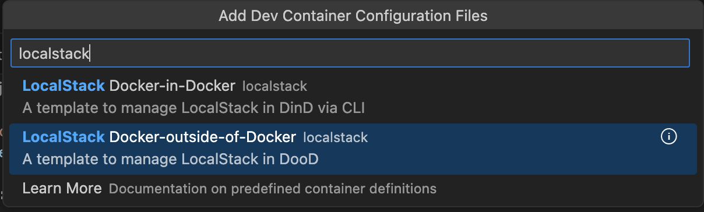

Navigate through the configuration inputs either by selecting or typing in values.
There are defaults selected in the template navigating through the options by hitting Enter will result in a valid config.
The template defines among others, the image variant (currently only Debian based images are supported),

the log level,

the LocalStack version,

and so on.


_Note: LocalStack's IP address must be in the defined CIDR range.
The network CIDR defaults to `10.0.2.0/24` and the container IP to `10.0.2.20`._



_Note: For the volume path relative paths are accepted, however one must create the defined mount's folder before being able to build the container successfully._
_This defaults to `./.volume`._




Select multiple tools and config options from the checklist.
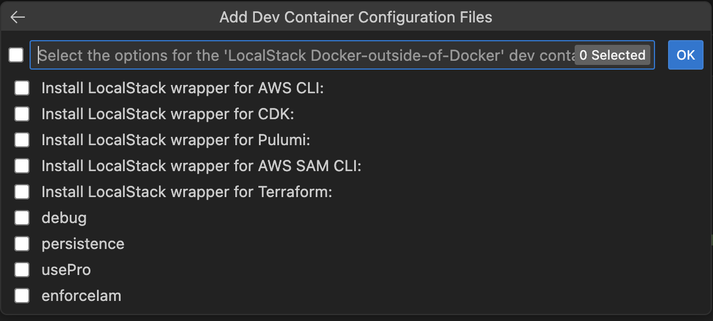


_Note: For local-tools one must select the underlying SDK or tool's feature or install it manually._
_**The Template and the underlying LocalStack CLI Feature is not managing these installations!**_


And some additional Features.


As a result we end up with the folder structure below.
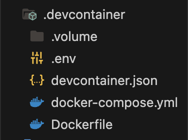

###### Reference files



{
 "name": "LocalStack DooD setup",
 "dockerComposeFile": "docker-compose.yml",
 "service": "app",
 "workspaceFolder": "/workspaces/${localWorkspaceFolderBasename}",

 // 👇 Features to add to the Dev Container.
 // More info: https://containers.dev/implementors/features.
 "features": {
  "ghcr.io/devcontainers/features/docker-outside-of-docker:1": {},
  "ghcr.io/localstack/devcontainer-feature/localstack-cli:latest": {
   "version": "latest",
   "awslocal": true,  // if true, add in features manually: ghcr.io/devcontainers/features/aws-cli
   "cdklocal": false,  // if true, add in features manually: ghcr.io/devcontainers-contrib/features/aws-cdk
   "pulumilocal": false,  // if true, add in features manually: ghcr.io/devcontainers-contrib/features/pulumi
   "samlocal": false,  // if true, add in features manually: ghcr.io/customink/codespaces-features/sam-cli
   "tflocal": false  // if true, add in features manually: ghcr.io/devcontainers-contrib/features/terraform-asdf
  },
  "ghcr.io/devcontainers/features/aws-cli:1": {}
 }
}




```yaml
version: "3.8"

services:
  localstack:
    container_name: "localstack-main"
    image: localstack/localstack-pro:latest  # required for Pro
    ports:
      - "127.0.0.1:4566:4566"            # LocalStack Gateway
      - "127.0.0.1:4510-4559:4510-4559"  # external services port range
      - "127.0.0.1:443:443"              # LocalStack HTTPS Gateway (Pro)
    env_file:
      - .env
    volumes:
      - "/var/run/docker.sock:/var/run/docker.sock"
      - "./.volume:/var/lib/localstack"
    networks:
      ls:
        # Set the container IP address in the 10.0.2.0/24 subnet
        ipv4_address: 10.0.2.20
  
  app:
    build: 
      context: .
      dockerfile: Dockerfile
    volumes:
      - ../..:/workspaces:cached
    # Overrides default command so things don't shut down after the process ends.
    command: sleep infinity
    init: true
    env_file:
      - .env
    dns:
      # Set the DNS server to be the LocalStack container
      - 10.0.2.20
    networks:
      - ls

networks:
  ls:
    ipam:
      config:
        # Specify the subnet range for IP address allocation
        - subnet: 10.0.2.0/24
```





```dockerfile
FROM mcr.microsoft.com/devcontainers/base:bookworm
```





```bash
# Activate LocalStack Pro: https://docs.localstack.cloud/getting-started/auth-token/
LOCALSTACK_AUTH_TOKEN=${LOCALSTACK_AUTH_TOKEN:-}  # required for Pro, not processed via template due to security reasons
LOCALSTACK_API_KEY=${LOCALSTACK_API_KEY:-}
# LocalStack configuration: https://docs.localstack.cloud/references/configuration/
ACTIVATE_PRO=false
DEBUG=true
LS_LOG=debug
PERSISTENCE=false
AWS_ENDPOINT_URL=http://localhost.localstack.cloud:4566
LOCALSTACK_HOST=localhost.localstack.cloud:4566
AUTO_LOAD_POD= 
ENFORCE_IAM=false
AWS_REGION=us-east-1
AWS_DEFAULT_REGION=us-east-1
IMAGE_NAME=localstack/localstack-pro:latest
```




## LocalStack Feature

Add the following minimal [Feature](https://github.com/localstack/devcontainer-feature) snippet to your DevContainer config.

```json
...
 "features": {
    "ghcr.io/localstack/devcontainer-feature/localstack-cli:latest": {}
  }
...
```

That's it.
By building your container the LocalStack CLI and any of the enabled local-tools (currently these are awslocal, cdklocal, pulumilocal, samlocal and tflocal) will be installed.

**The LocalStack Feature not taking care of the underlying tool installations (ie for awslocal, aws-cli is not installed).
For more information on dependencies please refer to the Feature documentation.**
