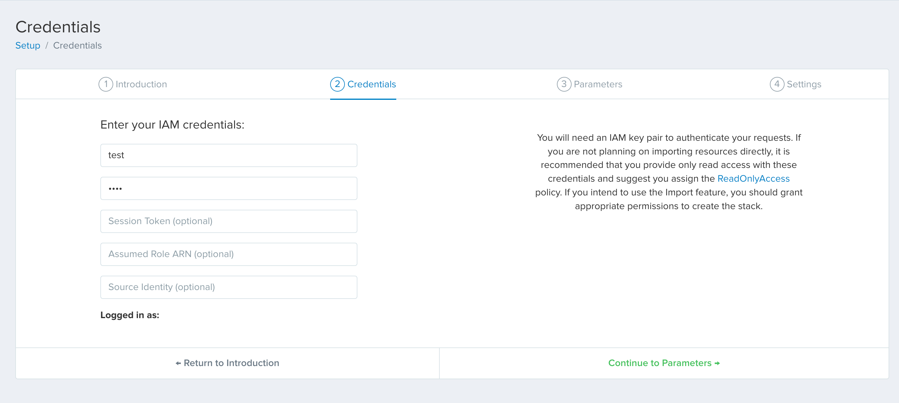
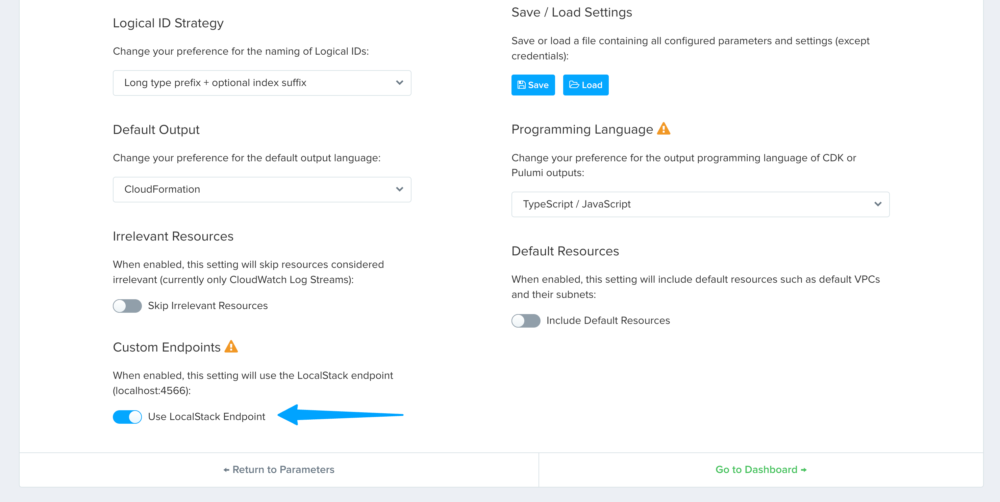
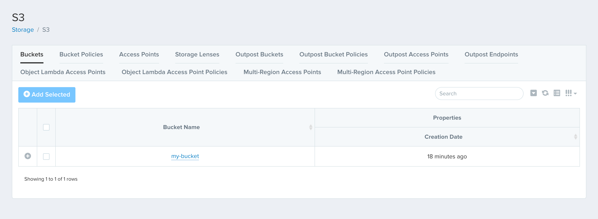
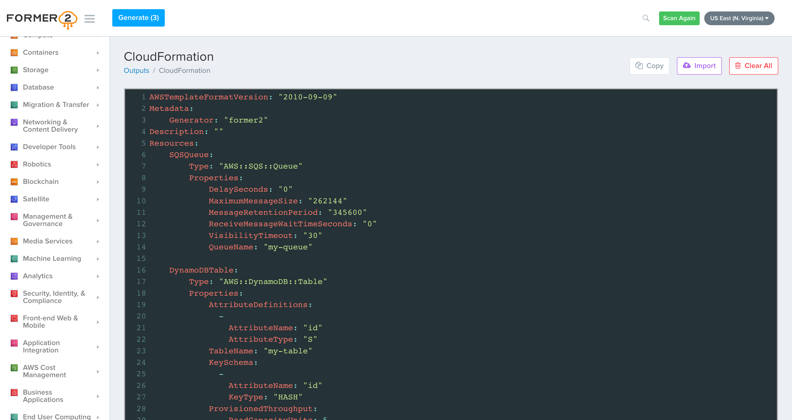

## Introduction

[Former2](https://github.com/iann0036/former2) allows you to generate Infrastructure-as-Code (IaC) outputs using your pre-existing AWS resources.
It uses the AWS JavaScript SDK to make relevant API calls, scans your infrastructure, and provides you with a resource list.
You can then select the resources for which you want to generate IaC outputs.
Former2 currently supports the following outputs:

- [CloudFormation](https://aws.amazon.com/cloudformation/)
- [Terraform](https://www.terraform.io/)
- [Troposphere](https://github.com/cloudtools/troposphere)
- [CDK V1 (Cfn Primitives) & CDK V2 (Cfn Primitives)](https://docs.aws.amazon.com/cdk/latest/guide/getting_started.html) (TypeScript, Python, Java, C#)
- [CDK for Terraform](https://developer.hashicorp.com/terraform/cdktf) (TypeScript)
- [Pulumi](https://www.pulumi.com/docs/get-started/aws/) (TypeScript)
- [Diagrams](https://diagrams.mingrammer.com/)

With Former2, you can scan the resources within your LocalStack instance and produce Infrastructure-as-Code (IaC) outputs.
These outputs enable you to redeploy your resources while spinning a new LocalStack instance or deploy them to a live Amazon Web Services (AWS) environment.

## Getting started

This guide is designed for users new to Former2 and assumes basic knowledge of the AWS CLI and our [`awslocal`](https://github.com/localstack/awscli-local) wrapper script.
We will demonstrate how you can create local AWS resources using LocalStack, and import a CloudFormation output via Former2.

### Install Former2

You can use the publicly hosted [Former2 Web Application](https://former2.com/) or a [self-hosted version](https://github.com/iann0036/former2/blob/master/HOSTING.md) to generate IaC outputs.
For this guide, we will use the publicly hosted version.
You would also need a Former2 Helper extension/add-on for your preferred web browser:

- [Google Chrome](https://chrome.google.com/webstore/detail/former2-helper/fhejmeojlbhfhjndnkkleooeejklmigi)
- [Mozilla Firefox](https://addons.mozilla.org/en-US/firefox/addon/former2-helper/)
- [Microsoft Edge](https://microsoftedge.microsoft.com/addons/detail/okkjnfohglnomdbpimkcdkiojbeiedof)

Alternatively, you can [download and install](https://github.com/iann0036/former2-helper) the extension yourself.

### Create local resources

Start your LocalStack container using your preferred method with the following environment variables, depending on the browser you are using:

- **Google Chrome**: `EXTRA_CORS_ALLOWED_ORIGINS=chrome-extension://fhejmeojlbhfhjndnkkleooeejklmigi`
- **Mozilla Firefox**: `EXTRA_CORS_ALLOWED_ORIGINS=moz-extension://853c673f-1bd8-4226-a5ff-f1473f7b3d90`
- **Microsoft Edge**: `EXTRA_CORS_ALLOWED_ORIGINS=extension://okkjnfohglnomdbpimkcdkiojbeiedof`

You can create local AWS resources using the AWS CLI and the `awslocal` wrapper script.
For example, you can create a new S3 bucket, SQS queue, and DynamoDB table using the following commands:


$ awslocal s3 mb s3://my-bucket
$ awslocal sqs create-queue --queue-name my-queue
$ awslocal dynamodb create-table \
    --table-name my-table \
    --attribute-definitions AttributeName=id,AttributeType=S \
    --key-schema AttributeName=id,KeyType=HASH \
    --provisioned-throughput ReadCapacityUnits=5,WriteCapacityUnits=5


You can verify that the resources were created successfully by running the following command:


$ localstack logs
<disable-copy>
2023-10-14T15:31:08.852  INFO --- [   asgi_gw_0] localstack.request.aws     : AWS s3.CreateBucket => 200
2023-10-14T15:31:09.356  INFO --- [   asgi_gw_0] localstack.request.aws     : AWS sqs.CreateQueue => 200
2023-10-14T15:31:12.920  INFO --- [   asgi_gw_0] botocore.credentials       : Found credentials in environment variables.
2023-10-14T15:31:13.332  INFO --- [   asgi_gw_0] localstack.utils.bootstrap : Execution of "require" took 2028.25ms
2023-10-14T15:31:13.712  INFO --- [   asgi_gw_0] localstack.request.aws     : AWS dynamodb.CreateTable => 200
</disable-copy>
$ awslocal s3 ls
<disable-copy>
2023-10-14 21:01:08 my-bucket
</disable-copy>
$ awslocal sqs list-queues
<disable-copy>
{
    "QueueUrls": [
        "http://localhost:4566/000000000000/my-queue"
    ]
}
</disable-copy>
$ awslocal dynamodb list-tables
<disable-copy>
{
    "TableNames": [
        "my-table"
    ]
}
</disable-copy>


### Configure Former2

Navigate to the Former2 setup dashboard.
Open the [**Credentials**](https://former2.com/#section-setup-credentials) tab and enter your IAM credentials.
For LocalStack, you can just configure the `AWS_ACCESS_KEY_ID` and `AWS_SECRET_ACCESS_KEY` environment variables as `test` and `test`, respectively.

  

Click on [**Continue to Parameters**](https://former2.com/#section-setup-parameters) and include your own CloudFormation stack parameters by adding them below.
Click on [**Continue to Settings**](https://former2.com/#section-setup-settings) and navigate to **Custom Endpoints**.
Toggle the **Use LocalStack Endpoint** switch to enable the LocalStack endpoint URL (`http://localhost:4566`).
Click on [**Go to Dashboard**](https://former2.com/#section-dashboard) to complete the setup.

  

You can now click on **Scan Account** button on the top-right corner of the dashboard to scan your LocalStack instance for resources.
Once the scan is complete, you can select the resources you want to generate IaC outputs for.

### Generate IaC output

Navigate to [S3](https://former2.com/#section-storage-s3), [DynamoDB](https://former2.com/#section-database-dynamodb), and [SQS](https://former2.com/#section-applicationintegration-sqs) to verify that the resources you created earlier are listed.

  

You can select the resources you want to generate IaC outputs for and click on **Add Selected**.
Finally, you can click on **Generate** on the top-left corner of the dashboard to generate the IaC outputs.

  

You can also choose to generate the IaC outputs in a different format by clicking on the various options available on the left-hand side of the dashboard.
