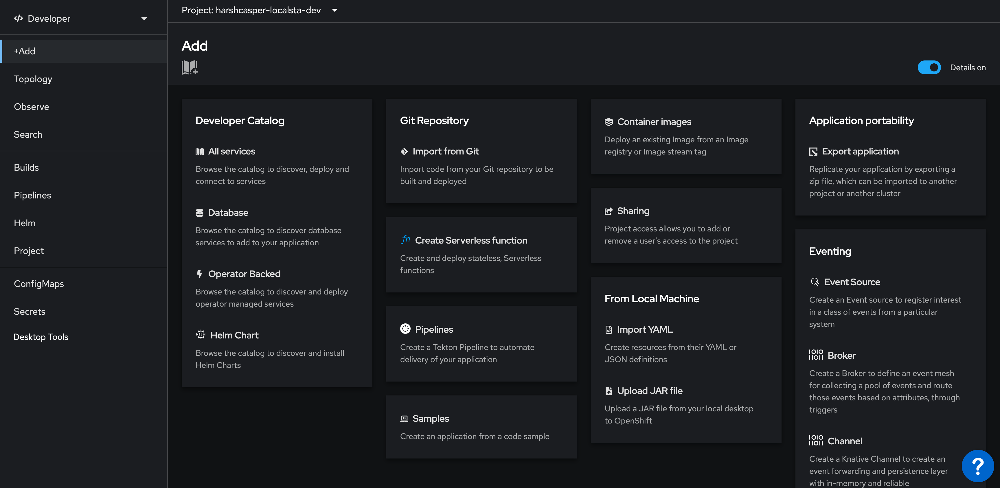
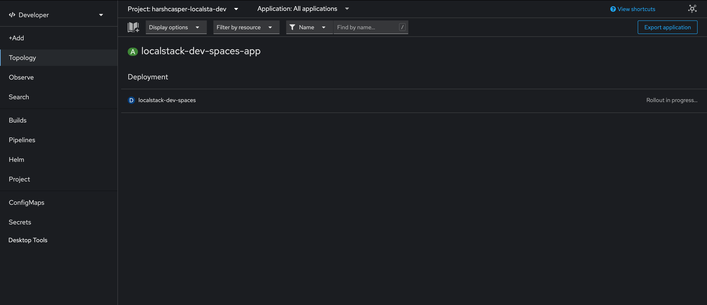
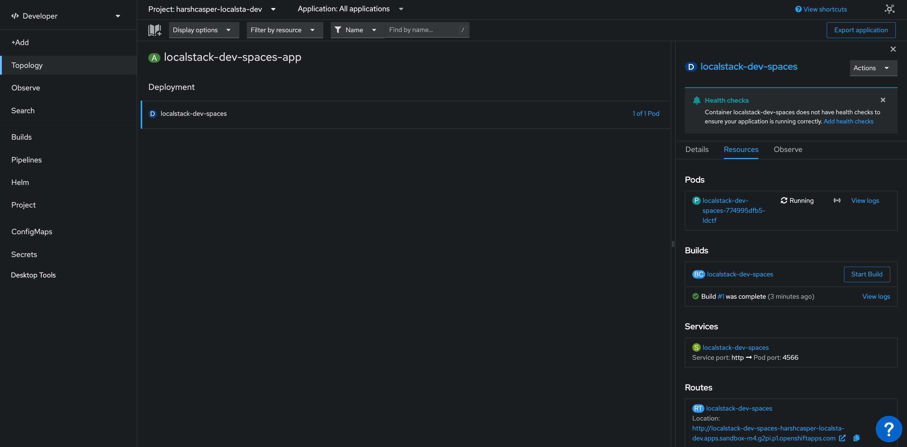

## Introduction

OpenShift is a container orchestration platform as a service designed to simplify the deployment, scaling, and management of containerized applications. Built on Kubernetes, OpenShift provides a comprehensive set of tools and features that facilitate the orchestration, automation, and monitoring of containerized workloads.

With OpenShift, you can deploy LocalStack on a managed Kubernetes cluster, as a cloud sandbox that emulates various AWS services & APIs. This guide demonstrates how you can deploy LocalStack on OpenShift using Devfile. You can use the deployed LocalStack container to create AWS resources that you can use for local development and testing purposes.


Creating shared/hosted LocalStack instances may have some licensing implications. For example, a valid license might be necessary for each user who interacts with the instance. If you have any questions or uncertainties regarding the licensing implications, we encourage you to [contact us](https://localstack.cloud/contact) for further details.



LocalStack on OpenShift can be used in conjunction with the [LocalStack Community image](https://hub.docker.com/r/localstack/localstack). However, specific features such as execution of Lambda functions as OpenShift pods and other container workloads is only available in the [LocalStack Pro image](https://hub.docker.com/r/localstack/localstack-pro).


## Getting started

This guide is designed for users new to LocalStack and assumes basic knowledge of the AWS CLI and our [`awslocal`](https://github.com/localstack/awscli-local) wrapper script. As a general prerequisite, you should have access to the [OpenShift Web Console](https://docs.openshift.com/container-platform/4.14/web_console/web-console-overview.html).

We will demonstrate how you can create local AWS resources using LocalStack using the AWS CLI. Instead of running LocalStack locally, you will deploy it on OpenShift and use the exposed endpoint to interact with the LocalStack container.

### Setting up LocalStack on OpenShift

You can deploy LocalStack via the **Developer** perspective in the OpenShift Web Console. Navigate to the **+Add** view to deploy LocalStack using a Devfile.

  

To deploy LocalStack on OpenShift, click on **Import from Git** in the **Git Repository** tile. In the Git section, enter the following Git repository URL to import the Devfile and Helm charts which contains the configuration for LocalStack: [**https://github.com/localstack/localstack-dev-spaces**](https://github.com/localstack/localstack-dev-spaces).

OpenShift Web Console will automatically detect the Devfile and display the import strategy. A unique application name will be generated to the application grouping to label your resources. A unique name will also be provided to the component that will be used to name associated resources. You can edit these values if you want.

Click on **Create** to deploy LocalStack on OpenShift.

### Viewing the LocalStack deployment

You can see the build status of the LocalStack deployment in the **Topology** view.

  

After successful deployment, you can see the **localstack-dev-spaces** pod in the **Topology** view. Click on the pod to view the details. You will be able to see the following details:

- Running pods along with the status and logs.
- Builds for your existing pods and an option to create new builds.
- Exposed services along with the service port and the pod port.
- Exposed routes for your deployed pods on the cluster.

  

### Creating AWS resources on OpenShift

Click on the **localstack-dev-spaces** pod to view the details. You will be able to see the exposed route for the LocalStack container. Copy the route URL and use it to interact with the LocalStack container.

To create an S3 bucket and an SQS queue, run the following commands:


$ export AWS_ENDPOINT_URL='<localstack-route-url>'
$ awslocal s3 mb s3://my-bucket
$ awslocal sqs create-queue --queue-name my-queue


In the above commands, replace `<localstack-route-url>` with the route URL of the LocalStack container. The `AWS_ENDPOINT_URL` environment variable is used to specify the endpoint URL of the LocalStack container. 


By default, the endpoint URL for `awslocal` is `http://localhost:4566`. Since we are running LocalStack on OpenShift, we need to specify the route URL of the LocalStack container. You can swap `awslocal` with the AWS CLI, by specifying the additional `--endpoint-url` parameter.


You can further use integrations, such as [CDK](https://docs.localstack.cloud/user-guide/integrations/aws-cdk/), [SAM CLI](https://docs.localstack.cloud/user-guide/integrations/aws-sam/), and [Terraform](https://docs.localstack.cloud/user-guide/integrations/terraform/), to interact with the Ephemeral Instance. In these integrations, you can change the `AWS_ENDPOINT_URL` environment variable to the endpoint URL of the Ephemeral Instance.

### Deleting the LocalStack deployment

To delete the LocalStack deployment, click on the **localstack-dev-spaces** pod in the **Topology** view. Click on the **Actions** menu and select **Delete Deployment**.
