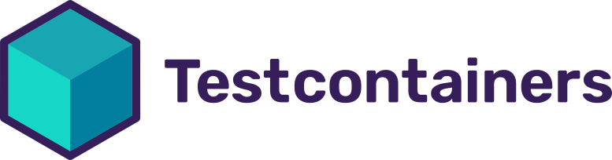

## Overview

[Testcontainers](https://www.testcontainers.com/) is a library that helps you to run your
tests against real dependencies.

In this guide, you will learn how to use [Testcontainers](https://www.testcontainers.com/)
with LocalStack.

## Covered Topics

* [Installing the Localstack module](#installing-the-localstack-module)
* [Obtaining a LocalStack container](#obtaining-a-localstack-container)
* [Configuring the AWS client](#configuring-the-aws-client)
* [Special Setup for using RDS](#special-setup-for-using-rds)
* [Useful Links](#useful-links)

### Installing the Localstack module



dotnet add package Testcontainers.LocalStack --version 3.0.0


go get github.com/testcontainers/testcontainers-go/modules/localstack


<dependency>
    <groupId>org.testcontainers</groupId>
    <artifactId>localstack</artifactId>
    <version>1.18.0</version>
    <scope>test</scope>
</dependency>


testImplementation 'org.testcontainers:localstack:1.18.0'


npm i @testcontainers/localstack



### Obtaining a LocalStack container



var localStackContainer = new LocalStackBuilder().Build();

await localStackContainer.StartAsync()
    .ConfigureAwait(false);


container, err := localstack.StartContainer(ctx, localstack.NoopOverrideContainerRequest)


LocalStackContainer localstack = new LocalStackContainer(DockerImageName.parse("localstack/localstack:3"));


const localstack = new LocalstackContainer("localstack/localstack:3").start()



## Configuring the AWS client



var config = new AmazonS3Config();
config.ServiceURL = localStackContainer.GetConnectionString();
using var client = new AmazonS3Client(config);


func s3Client(ctx context.Context, l *localstack.LocalStackContainer) (*s3.Client, error) {
    // the Testcontainers Docker provider is used to get the host of the Docker daemon
    provider, err := testcontainers.NewDockerProvider()
    if err != nil {
        return nil, err
    }

    host, err := provider.DaemonHost(ctx)
    if err != nil {
        return nil, err
    }

    mappedPort, err := l.MappedPort(ctx, nat.Port("4566/tcp"))
    if err != nil {
        return nil, err
    }

    customResolver := aws.EndpointResolverWithOptionsFunc(
        func(service, region string, opts ...interface{}) (aws.Endpoint, error) {
            return aws.Endpoint{
                PartitionID:   "aws",
                URL:           fmt.Sprintf("http://%s:%d", host, mappedPort.Int()),
                SigningRegion: region,
            }, nil
        })

    awsCfg, err := config.LoadDefaultConfig(context.TODO(),
        config.WithRegion(region),
        config.WithEndpointResolverWithOptions(customResolver),
        config.WithCredentialsProvider(credentials.NewStaticCredentialsProvider(accesskey, secretkey, token)),
    )
    if err != nil {
        return nil, err
    }

    client := s3.NewFromConfig(awsCfg, func(o *s3.Options) {
        o.UsePathStyle = true
    })

    return client, nil
}


S3Client s3 = S3Client.builder()
    .endpointOverride(localstack.getEndpoint())
    .credentialsProvider(StaticCredentialsProvider.create(AwsBasicCredentials.create(localstack.getAccessKey(), localstack.getSecretKey())))
    .region(Region.of(localstack.getRegion()))
    .build();


const awsConfig = {
      endpoint: localstack.getConnectionUri(),
      credentials: {
        accessKeyId: "test",
        secretAccessKey: "test",
      },
      region: "eu-central-1",
    };
const s3 = S3Client(awsConfig);



## Special Setup for using RDS

Some services like RDS require additional setup so that the correct port is exposed and accessible for the tests.
The reserved ports on LocalStack are between `4510-4559`, depending on your use case you might need to expose several ports using `witExposedPorts`.

Check the [pro-sample on how to use RDS with Testcontainers for Java](https://github.com/localstack/localstack-pro-samples/tree/master/testcontainers-java-sample).

The Testcontainer can be created like this:

```java
/**
  * Start LocalStackContainer with exposed Ports. Those ports are used by services like RDS, where several databases can be started, running on different ports.
  * In this sample we only map 5 ports, however, depending on your use case you may need to map ports up to 4559
*/
@Rule
public LocalStackContainer localstack = new LocalStackContainer(DockerImageName("localstack/localstack:2.0.0"))
                                                    .withExposedPorts(4510, 4511, 4512, 4513, 4514) // TODO the port can have any value between 4510-4559, but LS starts from 4510
                                                    .withEnv("LOCALSTACK_API_KEY", api_key); // TODO add your API key here

```

To find the exposed port which you can use to connect to the instance:

```java
// identify the port localstack provides for the instance
int localstack_port = response.dbInstance().endpoint().port();

// get the port it was mapped to, e.g. the one we can reach from host/the test
int mapped_port = localstack.getMappedPort(localstack_port);
```

## Useful Links

* https://www.testcontainers.com (Java, .NET, Go, Python, Ruby, Node.js)
* https://www.testcontainers.org (Java)
* https://www.testcontainers.org/modules/localstack (Java)
* https://golang.testcontainers.org (Go)
* https://golang.testcontainers.org/modules/localstack (Go)
* https://node.testcontainers.org (NodeJs)
* https://node.testcontainers.org/modules/localstack (NodeJs)
