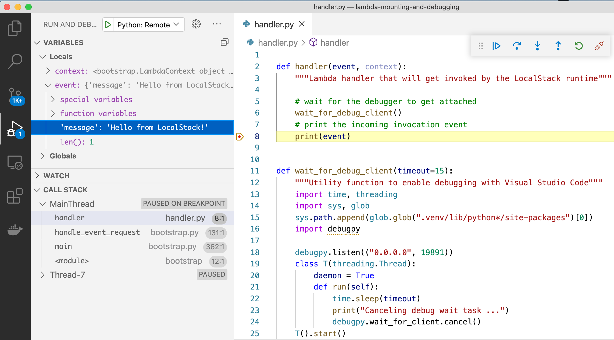
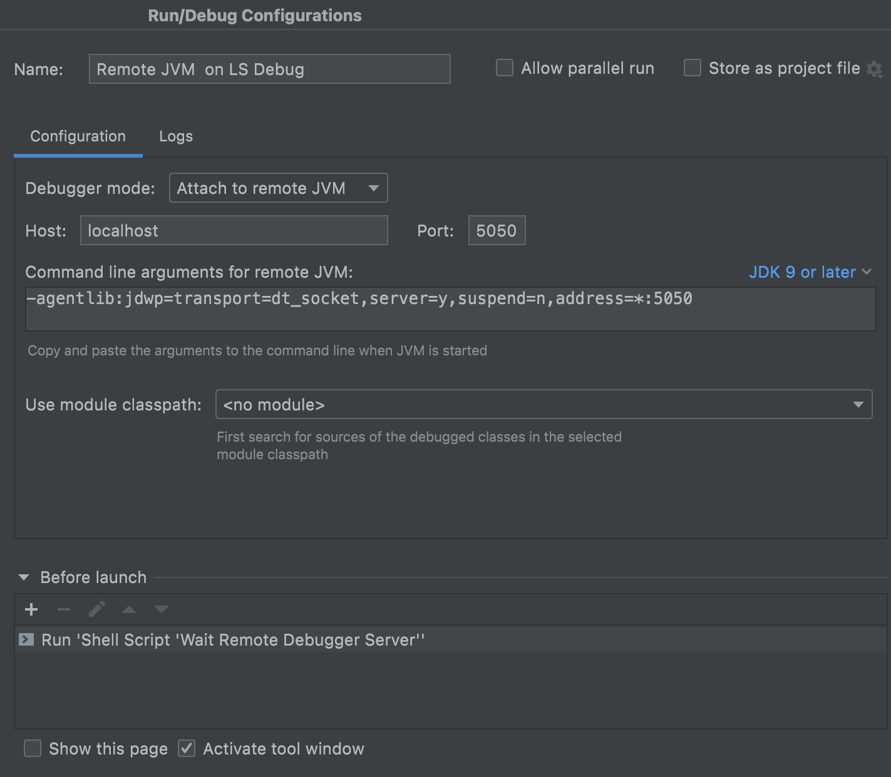

# Overview

This guide covers remote debugging of Lambda functions with the IDEs [Visual Studio Code](https://code.visualstudio.com/) and [IntelliJ IDEA](https://www.jetbrains.com/idea/).
For a simple working example of this feature, check out Pro sample [lambda-mounting-and-debugging](https://github.com/localstack/localstack-pro-samples/tree/master/lambda-mounting-and-debugging).

More examples and tooling support for local Lambda debugging (including support for other IDEs like PyCharm) is coming soon - stay tuned!

# Covered Topics

* [Debugging Python lambdas](#debugging-python-lambdas)
* [Debugging JVM lambdas](#debugging-jvm-lambdas)
* [Debugging Node.js lambdas](#debugging-nodejs-lambdas)
* [Useful Links](#useful-links)

## Debugging Python lambdas

Lambda functions debugging used to be a difficult task. LocalStack changes that
with the same local code mounting functionality that also helps you
to [iterate quickly over your function code]().

For a simple working example of this feature, you can refer to
[our samples](https://github.com/localstack/localstack-pro-samples/tree/master/lambda-mounting-and-debugging).
There, the necessary code fragments for enabling debugging are already present.


### Debugging a Python Lambda in Visual Studio Code

#### Configure LocalStack for VS Code remote Python debugging

First, make sure that LocalStack is started with the following configuration (see the [Configuration docs]() for more information):


$ LAMBDA_DOCKER_FLAGS='-p 19891:19891' localstack start


#### Preparing your code

For providing the debug server, we use [`debugpy`](https://github.com/microsoft/debugpy)
inside the Lambda function code. In general, all you need is the following code
fragment placed inside your handler code:

```python
import debugpy
debugpy.listen(("0.0.0.0", 19891))
debugpy.wait_for_client()  # blocks execution until client is attached
```

For extra convenience, you can use the `wait_for_debug_client` function from our example.
It implements the above-mentioned start of the debug server and also adds an automatic cancellation of the wait task if the debug client (i.e. VSCode) doesn't connect.

```python
def wait_for_debug_client(timeout=15):
    """Utility function to enable debugging with Visual Studio Code"""
    import time, threading
    import sys, glob
    sys.path.append(glob.glob(".venv/lib/python*/site-packages")[0])
    import debugpy

    debugpy.listen(("0.0.0.0", 19891))
    class T(threading.Thread):
        daemon = True
        def run(self):
            time.sleep(timeout)
            print("Canceling debug wait task ...")
            debugpy.wait_for_client.cancel()
    T().start()
    print("Waiting for client to attach debugger ...")
    debugpy.wait_for_client()
```

#### Configuring Visual Studio Code for remote Python debugging

For attaching the debug server from Visual Studio Code, you need to add a run configuration.

```json
{
    "version": "0.2.0",
    "configurations": [
        {
            "name": "Python: Remote Attach",
            "type": "python",
            "request": "attach",
            "connect": {
                "host": "localhost",
                "port": 19891
            },
            "pathMappings": [
                {
                    "localRoot": "${workspaceFolder}",
                    "remoteRoot": "."
                }
            ]
        }
    ]
}
```

In the next step we create our function. In order to debug the function in Visual Studio Code, run the preconfigured remote debugger, which will wait about 15 seconds as defined above, and then invoke the function.
Make sure to set a breakpoint in the Lambda handler code first, which can then later be inspected.

The screenshot below shows the triggered breakpoint with our `'Hello from LocalStack!'` in the variable inspection view:



#### Current Limitations

Due to the ports published by the lambda container for the debugger, you can currently only debug one Lambda at a time. Due to the port publishing, multiple concurrently running lambda environments are not supported.

### Debugging a Python Lambda in PyCharm Professional

Please be aware that [remote debugging in PyCharm](https://www.jetbrains.com/help/pycharm/remote-debugging-with-product.html) is only available in the Professional version. 

You do not need to change the `LAMBDA_DOCKER_FLAGS` when debugging with PyCharm Professional.

#### Configuring PyCharm for remote Python debugging

You can [follow the steps in the official docs](https://www.jetbrains.com/help/pycharm/remote-debugging-with-product.html#remote-debug-config), which will come down to:

* Create a debug configuration with the IDE host name `localhost` and the debug port `19891`. 
* Add path mapping with your project files on the host and map it to the remote directory `/var/task`.
* Copy the `pip install` command, and make sure to install the correct `pydevd-pycharm` version for your PyCharm IDE.


#### Preparing your code

PyCharm provides its own debugging package, called `pydevd-pycharm`. Essentially, you will add the following code to your lambda:

```python
import pydevd_pycharm
pydevd_pycharm.settrace('host.docker.internal', port=19891, stdoutToServer=True,
                            stderrToServer=True)
```

The `host.docker.internal` is a [special DNS name by Docker](https://docs.docker.com/desktop/networking/#use-cases-and-workarounds-for-all-platforms) and will make sure that the lambda running in the docker can connect to PyCharm running on your Localhost. 

You can use the `wait_for_debug_client` and add it to your lambda (please adapt the path to your `venv` directory if necessary):

```python
def wait_for_debug_client():
    """Utility function to enable debugging with PyCharm"""
    import sys, glob
    # enter the correct path here to your venv (where pydev_pycharm is installed
    my_venv = "venv/lib/python*/site-packages"
    sys.path.insert(0, glob.glob(my_venv)[0])
    import pydevd_pycharm
    # host.docker.internal should resolve to the host
    # see also: https://docs.docker.com/desktop/networking#use-cases-and-workarounds-for-all-platforms
    pydevd_pycharm.settrace('host.docker.internal', port=19891, stdoutToServer=True,
                            stderrToServer=True)
```

In the next step we create our function. In order to debug the function in PyCharm set a breakpoint in your function, run the Remote Debug configuration and then invoke the function.


### Creating the Lambda function

To create the Lambda function, you just need to take care of two things:
1. Deploy the function via an S3 Bucket. You need to use the magic variable `hot-reload` as the bucket name.
2. Set the S3 key to the path of the directory your lambda function resides in.
   The handler is then referenced by the filename of your lambda code and the function in that code that should be invoked.

So, in our [example](https://github.com/localstack/localstack-pro-samples/tree/master/lambda-mounting-and-debugging), this would be:


$ awslocal lambda create-function --function-name my-cool-local-function \
    --code S3Bucket="hot-reload",S3Key="$(pwd)/" \
    --handler handler.handler \
    --runtime python3.8 \
    --timeout 150 \
    --role arn:aws:iam::000000000000:role/lambda-role


We can quickly verify that it works by invoking it with a simple payload:


{}

$ awslocal lambda invoke --function-name my-cool-local-function \
    --payload '{"message": "Hello from LocalStack!"}' \
    output.txt

{}
{}

$ awslocal lambda invoke --function-name my-cool-local-function \
    --cli-binary-format raw-in-base64-out \
    --payload '{"message": "Hello from LocalStack!"}' \
    output.txt

{}


## Debugging JVM lambdas

### Configure LocalStack and your Lambda function for remote JVM debugging

Set `LAMBDA_DOCKER_FLAGS` to export the `5050` (you can use any other port of your choice) port which your IDE debugger will connect to.

```yaml
#docker-compose.yml

services:
  localstack:
    ...
    environment:
      ...
      - LAMBDA_DOCKER_FLAGS=-p 127.0.0.1:5050:5050
```

When creating your Lambda function, set the `_JAVA_OPTIONS` environment variable like so:


$ awslocal lambda create-function --function-name debugfunc \
--zip-file fileb://java-handler.zip \
--handler myindex.handler \
--runtime java8.al2 \
--timeout 150 \
--role arn:aws:iam::000000000000:role/lambda-role \
--environment '{"Variables": {"_JAVA_OPTIONS": "-Xshare:off -agentlib:jdwp=transport=dt_socket,server=y,suspend=y,address=0.0.0.0:5050"}}'


Note the `suspend=y` option here, it will delay code execution until the debugger is attached to the debugger server.
If you want to change that, simply switch to `suspend=n`.

By default the runtime environment for Java will set `-Xshare: on`, so we'll have to disable it here again.
Your IDE might show you the listen address as `*:5050`, but please note that this only works for Java 9+.

### Configuring IntelliJ IDEA for remote JVM debugging

Open the `Run/Debug Configurations` window and create a new `Shell Script` with
the following content:

```shell
while [[ -z $(docker ps | grep :5050) ]]; do sleep 1; done
```


This shell script should simplify the process a bit since the debugger server is not immediately available (only once Lambda container is up).

Then create a new `Remote JVM Debug` configuration and use the script from above as a `Before launch` target:



Now to debug your Lambda function, simply click on the `Debug` icon with `Remote JVM on LS Debug` configuration selected, and then invoke your Lambda function.

### Alternative setup for IntelliJ IDEA

The debugger can also act as a server by changing the drop-down "Debugger mode" to "Listen to remote JVM".
In this case you should not set `LAMBDA_DOCKER_FLAGS` since the port will be exposed on your host instead of the Lambda container.
Compared to the previous setup the "Wait Remote Debugger Server" run configuration should also be removed and instead tick the mark at "Auto restart" after switching to the "Listen to remote JVM" mode.

For the Lambda function you will have to adjust the environment variable to `"_JAVA_OPTIONS": "-Xshare:off -agentlib:jdwp=transport=dt_socket,server=n,address=172.17.0.1:5050,suspend=y,onuncaught=n"`.
Notice the `address=172.17.0.1:5050`.
Here we tell the Lambda function to connect to port 5050 on 172.17.0.1. When using Docker desktop you might have to set this to `address=host.docker.internal:5050` instead.


### Configuring Visual Studio Code for remote JVM debugging

Make sure you installed the following extensions:
* [Language Support for Java(TM) by Red Hat](https://marketplace.visualstudio.com/items?itemName=redhat.java)
* [Debugger for Java](https://marketplace.visualstudio.com/items?itemName=vscjava.vscode-java-debug)

Add a new task by creating/modifying the `.vscode/tasks.json` file:

```json
{
    "version": "2.0.0",
    "tasks": [
        {
          "label": "Wait Remote Debugger Server",
          "type": "shell",
          "command": "while [[ -z $(docker ps | grep :5050) ]]; do sleep 1; done; sleep 1;"
        }
    ]
}
```

Create a new `launch.json` file or edit an existing one from the `Run and Debug` tab,
then add the following configuration:

```json
{
    "version": "0.2.0",
    "configurations": [
        {
            "type": "java",
            "name": "Remote JVM on LS Debug",
            "projectRoot": "${workspaceFolder}",
            "request": "attach",
            "hostName": "localhost",
            "preLaunchTask": "Wait Remote Debugger Server",
            "port": 5050
        }
    ]
}
```

Now to debug your lambda function, click on the `Debug` icon with
`Remote JVM on LS Debug` configuration selected, and then invoke your
lambda function.

## Debugging Node.js lambdas

### Configure LocalStack for remote Node.js debugging

Set the `LAMBDA_DOCKER_FLAGS` to enable the debugger using `NODE_OPTIONS`:

```yaml
#docker-compose.yml

services:
  localstack:
    ...
    environment:
      ...
      - LAMBDA_DOCKER_FLAGS=-e NODE_OPTIONS=--inspect-brk=0.0.0.0:9229 -p 9229:9229
```


### Configuring Visual Studio Code for remote Node.js debugging

Add a new task by creating/modifying the `.vscode/tasks.json` file:

```json
{
    "version": "2.0.0",
    "tasks": [
        {
          "label": "Wait Remote Debugger Server",
          "type": "shell",
          "command": "while [[ -z $(docker ps | grep :9229) ]]; do sleep 1; done; sleep 1;"
        }
    ]
}
```

Create a new `launch.json` file or edit an existing one from the `Run and Debug` tab,
then add the following configuration:

```json
{
    "version": "0.2.0",
    "configurations": [
        {
            "address": "127.0.0.1",
            "localRoot": "${workspaceFolder}",
            "name": "Attach to Remote Node.js",
            "port": 9229,
            "remoteRoot": "/var/task/",
            "request": "attach",
            "type": "node",
            "preLaunchTask": "Wait Remote Debugger Server"
        },
    ]
}
```

A simple example of a Node.js lambda, `myindex.js` could look like this:
```js
exports.handler = async (event) => {
    console.log(event);
    const response = {
        statusCode: 200,
        body: "ok",
    };
    return response;
};
```

Create the lambda function using:

$ awslocal lambda create-function --function-name func1 \
    --code S3Bucket="hot-reload",S3Key="$(pwd)/" \
    --handler myindex.handler \
    --runtime nodejs14.x \
    --timeout 150 \
    --role arn:aws:iam::000000000000:role/lambda-role


Now to debug your lambda function, click on the `Debug` icon with
`Attach to Remote Node.js` configuration selected, and then invoke your
lambda function:


{}

$ awslocal lambda invoke --function-name func1 \
    --payload '{"hello":"world"}' \
    output.txt

{}
{}

$ awslocal lambda invoke --function-name func1 \
    --cli-binary-format raw-in-base64-out \
    --payload '{"hello":"world"}' \
    output.txt

{}



## Resources

* [Lambda Code Mounting and Debugging (Python)](https://github.com/localstack/localstack-pro-samples/tree/master/lambda-mounting-and-debugging)
* [Spring Cloud Function on LocalStack (Kotlin JVM)](https://github.com/localstack/localstack-pro-samples/tree/master/sample-archive/spring-cloud-function-microservice)
