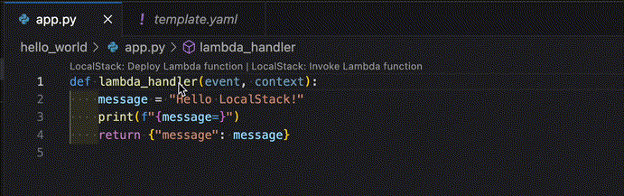
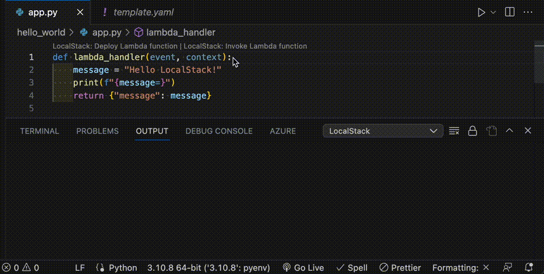

## Introduction

[LocalStack VSCode Extension](https://github.com/localstack/localstack-vscode-extension) supports deploying and invoking Python Lambda functions through [AWS SAM](https://github.com/aws/serverless-application-model) or [AWS CloudFormation](https://aws.amazon.com/cloudformation/resources/templates/).

## Prerequisites

- [VS Code](https://code.visualstudio.com/)
- [`samlocal`](https://github.com/localstack/aws-sam-cli-local) command line wrapper around the [AWS SAM CLI](https://github.com/aws/aws-sam-cli) for use with [LocalStack](https://github.com/localstack/localstack).
- [LocalStack](https://docs.localstack.cloud/getting-started/) running in the background.

## Getting Started

You can use a [sample project](https://github.com/joe4dev/lambda-python) to get started with the extension. The sample project contains a simple Lambda function and a SAM template. Clone the repository and open the project in VSCode.


$ git clone https://github.com/joe4dev/lambda-python.git
$ cd lambda-python
$ code .


Install the [LocalStack VSCode Extension](https://marketplace.visualstudio.com/items?itemName=localstack.localstack) as recommended by the project.

You can now open the Python handler function under `app/hello_world.py`. Click the CodeLens **Deploy Lambda function**, select the `template.yaml`, and choose a stack name such as `my-stack`.

  

Click the CodeLens **Invoke Lambda function** and pick the stack name `my-stack` and the function `hello-world-function`.

 

## Current Limitations

- The CodeLens for **Deploy Lambda function** always appears at the first line of each Python file.
- **Invoke Lambda function** currently only works in the region `us-east-1` and with an empty payload.
