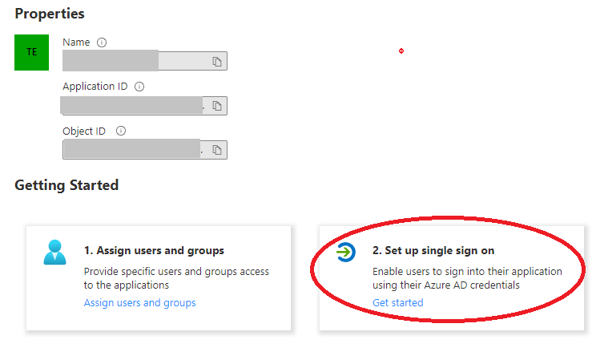
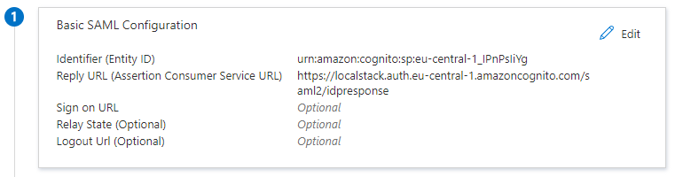
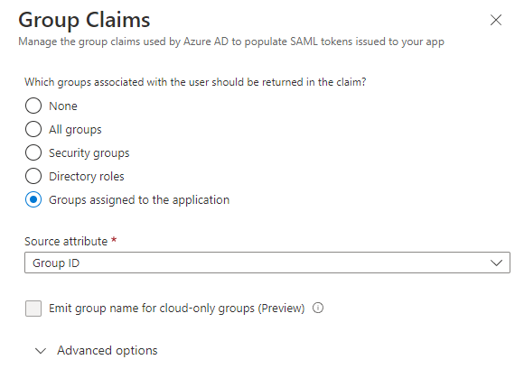
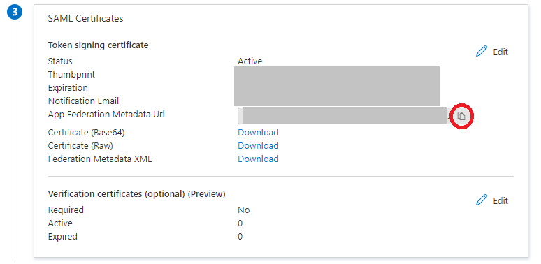

To configure SSO with an Azure AD Enterprise application, we provide a simple step-by-step solution below:

1. Navigate to "Set up single sign on" in your Azure AD Enterprise application.

    

2. In the Basic SAML Configuration, ensure that the settings match the following details

    

  Take the correct values for Identifier (Entity ID) and Reply URL from the Identity Provider configuration page.

3. In the Attributes & Claims section, add a group claim with the following configuration and save it.

    

4. In the SAML Certificates section, copy the App Federation Metadata Url

    

5. Navigate to our web application, or follow this <a href="https://app.localstack.cloud/workspace/sso">link</a>, and:

* Create a new Identity provider
* Enter a name for you Identity provider, and choose SAML as the provider type.
* Select URL for the Metadata file and paste the link that you copied previously in step 4.
* For the attribute mapping, provide the following value for the Email attribute: `http://schemas.xmlsoap.org/ws/2005/05/identity/claims/name` - (This should match the Claim name of user.userprincipalname in your Attributes & Claims)
* Leave First name attribute and Last name attribute blank.

6. Let your team members sign up to your LocalStack Organization via the Sign Up Portal Link.
