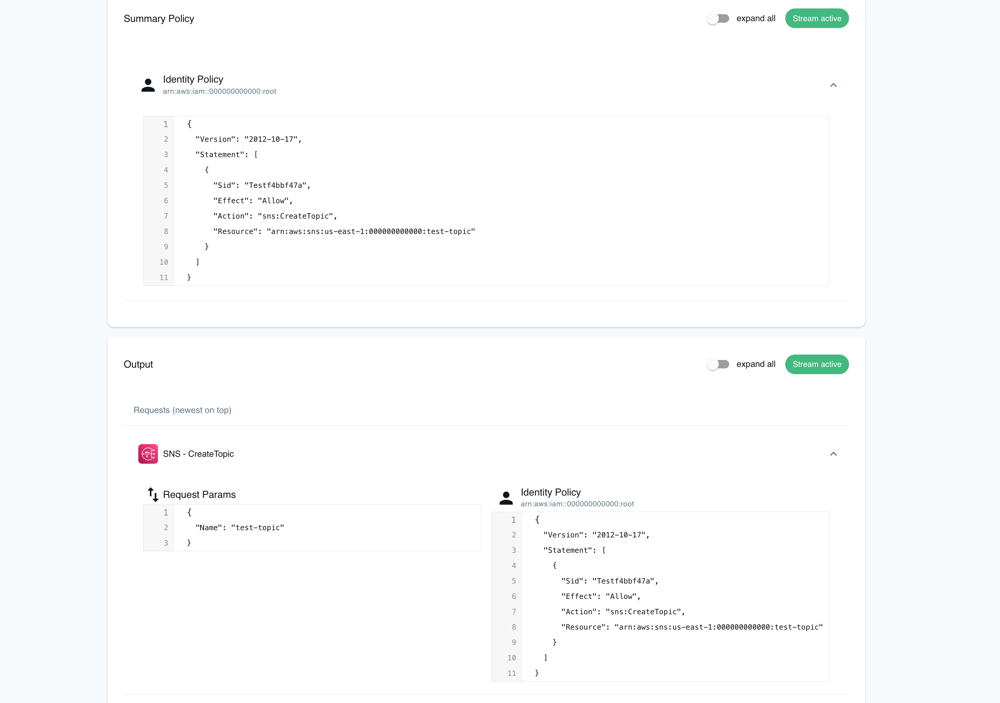

## Introduction

The IAM Policy Stream generates a steady stream of policies along with their corresponding principals or resources. When a request is made, it initially displays the principal or resource to which the policy will be attached. This is typically a service resource for resource-based policies, or an IAM principal for other cases. Subsequently, it displays the suggested policy. This feature aids in identifying the correct permissions for cloud applications and can help spot logical errors, such as unexpected actions in a policy.

## Getting started

This guide is designed for users who are new to the IAM Policy Stream. It assumes you have basic knowledge of the AWS CLI (and our [`awslocal`](https://github.com/localstack/awscli-local) wrapper script).

### Start your LocalStack container

To experiment with the IAM Policy Stream, initiate LocalStack using these flags:

1.  Enable debugging: `DEBUG=1`
2.  Set your LocalStack API key: `LOCALSTACK_API_KEY=<Your_API_Key>`
3.  Set the IAM Soft Mode: `IAM_SOFT_MODE=1`

You can execute the following command in your terminal to start your LocalStack container:


$ DEBUG=1 IAM_SOFT_MODE=1 localstack start


### Enable IAM Policy Stream

To enable the IAM Policy Stream, open a new terminal window or tab and run the following command:


$ localstack aws iam stream


### Create AWS Resources

In a separate terminal tab, we will create AWS resources to observe the necessary policies for them. In this example, we are creating an SNS topic using the following command:


$ awslocal sns create-topic --name test-topic


In the other tab, the required policy will be generated. This policy can then be attached to an IAM role, enabling it to create the resource.

```bash
Attached to identity: "arn:aws:iam::000000000000:root"

Policy:
{
  "Version": "2012-10-17",
  "Statement": [
    {
      "Sid": "Test3a92fb6c",
      "Effect": "Allow",
      "Action": "sns:CreateTopic",
      "Resource": "arn:aws:sns:us-east-1:000000000000:test-topic"
    }
  ]
}
```

## Web Application

The LocalStack Web Application includes an IAM Policy Stream dashboard, which allows you to discover the necessary permissions for AWS API calls. The Web Application provides the following features:

1.  Provides a live display of API calls and the specific policies each call generates.
2.  Offers a real-time summary policy, merging all individual policies into one consolidated policy.
3.  Includes a feature to activate or deactivate this functionality on-the-fly for performance tuning.
4.  Presents an option to reset the stream, facilitating a clean slate to generate new policies.


You don't need to set additional configuration variables, such as `DEBUG=1` or `IAM_SOFT_MODE=1`, when using the IAM Policy Stream with Web Application. However, it won't enforce policies or print IAM-related logs in the LocalStack container.


To use this feature, open the LocalStack Web Application in your browser, go to the IAM Policy Stream section, and click on **Enable** to view the **Summary Policy** and **Output**.


<br><br>

Run the following command in your terminal to generate a corresponding policy in the IAM Policy Stream dashboard:


$ awslocal sns create-topic --name test-topic


You will see the following output in the IAM Policy Stream dashboard:


