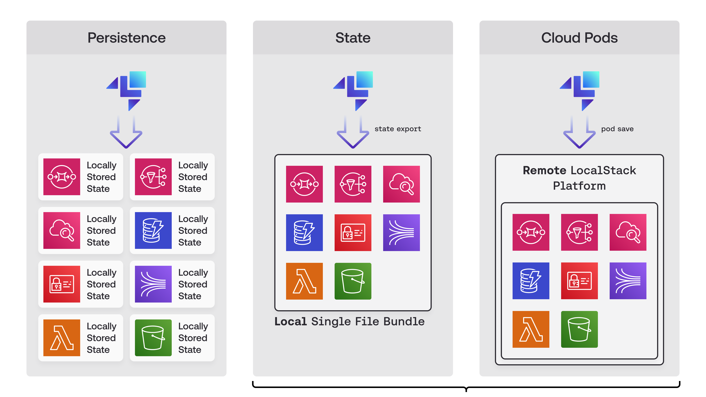

State Management in LocalStack allows you to save and load the state of your LocalStack instance. LocalStack is ephemeral in nature, so when you stop and restart your LocalStack instance, all the data is lost. With State Management, you can save the state of your LocalStack instance and load it back when you restart your LocalStack instance.

State Management in LocalStack encompasses the following features:

* [**Cloud Pods**](): Cloud Pods are persistent state snapshots of your LocalStack instance that can easily be shared, stored, versioned, and restored.
* [**Export & Import State**](): Export and import the state of your LocalStack instance on your local machine as a local file.
* [**Persistence**](): Persist the state of your LocalStack instance on your local machine using a configuration variable.

Anything that is inside a LocalStack container constitutes the "state.” The "state" can either be persisted on your local
machine and be loaded at startup (persistence), exported anytime as a single local file (state export), or stored on the LocalStack platform (cloud pods).
The underlying mechanisms of all three solutions are similar, but the layout obviously differs. We can observe how using state
locally and Cloud Pods are very similar, as they look like `local` and `remote` versions of the same bundle. To get a better understanding of how
these three features differ, they can be illustrated as following:

State Management is an essential feature that supports various use-cases, such as pre-seeding your fresh LocalStack instance with data, sharing your LocalStack instance's state with your team, fostering collaboration, and more.
