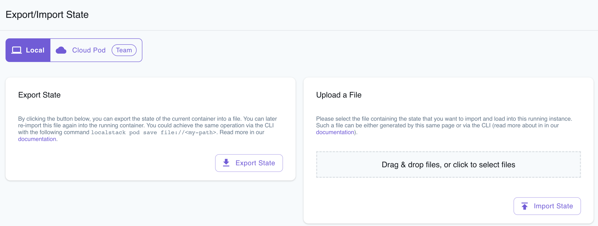

## Introduction

The LocalStack Web Application enables you to export your infrastructure state to a file and import it into another LocalStack instance. You can perform these import and export operations locally or by utilizing LocalStack's storage backend, which can store the state as a Cloud Pod.

## Local

The Local mode allows you to perform local exports and imports of your LocalStack instance's state. This mode is handy when you need to export your LocalStack instance's state and import it into another LocalStack instance that's running on the same local machine.

### Export the State

To export the state, follow these steps:

1. Navigate to the **Local** tab within the [Export/Import State](https://app.localstack.cloud/inst/default/state) page.
2. Create AWS resources locally as needed.
3. Click on the **Export State** button. This action will initiate the download of a ZIP file.

The downloaded ZIP file contains your container state, which can be injected into another LocalStack instance for further use.

### Import the State

To import the state, follow these steps:

1. Navigate to the **Local** tab within the [Export/Import State](https://app.localstack.cloud/inst/default/state) page.
2. Upload the ZIP file that contains your container state. This action will restore your previously loaded AWS resources.

To confirm the successful injection of the container state, visit the respective [Resource Browser](https://app.localstack.cloud/inst/default/resources) for the services and verify the resources.

## Cloud Pod (Team)

Cloud Pod allows you to capture a snapshot of your LocalStack instance's state. This snapshot can be injected into another LocalStack instance for various purposes. Additionally, you have the option to share the Cloud Pod with team members, enabling them to import the state into their respective LocalStack instances.

### Export the State

To export the state, follow these steps:

1. Navigate to the **Cloud Pod** tab within the [Export/Import State](https://app.localstack.cloud/inst/default/state) page.
2. Create AWS resources locally as needed.
3. Enter the Pod name and toggle between the **New Pod** and **Existing Pod** options.
4. Click on **Create New Pod**.

A new Cloud Pod will be created and will be available for import into another LocalStack instance. You can check out the list of available Cloud Pods in the [Cloud Pod](https://app.localstack.cloud/pods) page.

### Import the State

To import the state, follow these steps:

1. Navigate to the **Cloud Pod** tab within the [Export/Import State](https://app.localstack.cloud/inst/default/state) page.
2. Choose the Cloud Pod from the drop-down list.
3. Click on **Load State From Pod**.

To confirm the successful injection of the container state, visit the respective [Resource Browser](https://app.localstack.cloud/inst/default/resources) for the services and verify the resources.
