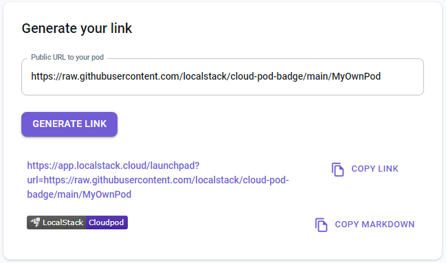
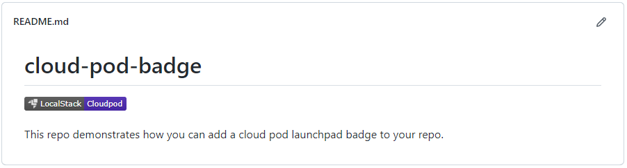
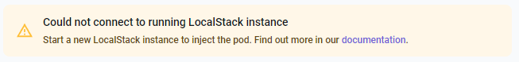
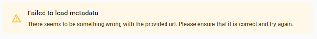

The LocalStack Cloud Pods Launchpad enables you to easily share and inject Cloud Pods into a LocalStack instance.

## Creating your shareable link

You can visit [Cloud Pods launchpad](https://app.localstack.cloud/launchpad) to generate a shareable link for your pods.



Enter a public URL to your pod Cloud Pod the first input field, then click **Generate Link**. You can copy the resulting link and share it with others. Additionally, you have the option to copy a markdown snippet for quickly adding a badge to your repository.


The Launchpad accepts any URL as input and directly passes it to your LocalStack instance for Cloud Pod injection. As a result, this process may carry the risk of unintended side effects, as there is no validation applied to the URL provided to the launchpad.

Furthermore, it's essential to exercise caution and only use URLs that you trust when utilizing the launchpad, as the URL is displayed in the user interface.


## Adding a badge to your repository

To add a badge to your README that links to the Cloud Pod Launchpad, you can include the following markdown snippet:

```markdown
[](https://app.localstack.cloud/launchpad?url=url_of_your_pod)
```



You need to include the `url_of_your_pod` as the `url` query parameter in the URL. For instance, if your Cloud Pod is hosted within the same repository, simply use the URL that directs to the raw Cloud Pod file.

Additionally, you can utilize the [Link Generator]() to generate a shareable link for your pod and copy the corresponding markdown snippet for your repository. Check out a proper example <a href="https://github.com/localstack/cloud-pod-badge" target="_blank">on th Cloud Pod badge GitHub repository</a>.

## Troubleshooting common problems

In this section we present an overview of common problems and how to solve them.

### LocalStack is not running

If your LocalStack instance is not running, you will encounter the following error message:



Start your LocalStack instance and attempt the operation once more. For detailed instructions on starting LocalStack, refer to the [Getting Started]() section.

### Failed to load metadata

If the launchpad encounters difficulties while loading the metadata of your pod, you will receive the following error message:



This can occur when the pod is no longer accessible or if the URL provided is invalid. Review the URL and attempt the operation once more.

### Failed to inject pod

If the launchpad is unable to successfully inject the pod into your LocalStack instance, you will encounter a `Pod injection failed` message in the log. This issue may arise from various factors, such as version disparities. For further insights and information, please review your LocalStack logs.
