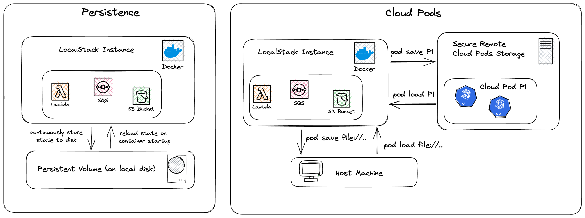


Cloud pods are only compatible with the specific version of LocalStack that was used to create them.
The LocalStack team are actively working on addressing this limitation.


Cloud Pods are a mechanism that allows you to take a snapshot of the state in your current LocalStack instance, persist it to a storage backend, and easily share it with your team members.

While the [Persistence]() feature ensures that the service state survives container restarts, Cloud Pods go beyond and allow more fine-grained control over your state.

Instead of simply restoring a state when restarting LocalStack, Cloud Pods allow you to take snapshots of your local instance (with the `save` command) and inject such snapshots into a running instance (with the `load` command) without requiring a restart.

In addition, we provide a remote storage backend that can be used to store the state of your running application and share it with your team members.

You can interact with Cloud Pods via the Web UI, and to load and store the persistent state of pods, you can use the `localstack` [command-line interface (CLI)]().

