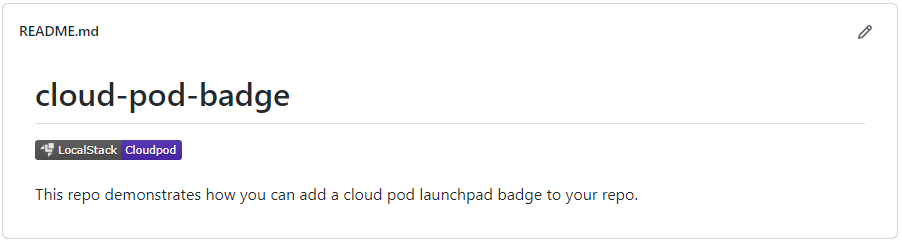

## Overview
For more general information about Cloud Pods, please visit the [Cloud Pods Overview](). <br>
The LocalStack Cloud Pods Launchpad allows you to quickly share and inject cloud pods into a LocalStack instance.


## Creating your sharable link
Navigate to [app.localstack.cloud/launchpad](https://app.localstack.cloud/launchpad) where you can create a sharable link for your pods.


Enter a public URl to your pod in the first input field, and click on 'Generate Link'.
The resulting link can be copied and shared with others.


Please consider that the launchpad takes an arbitrary URL as input and passes it onto your LocalStack instance to inject the pod. 
This may lead to unintended side effects, as the URL that is passed to the launchpad is not validated in any way. 

We also display the URL on the UI, so please make sure that your trust the URL when using the launchpad.



## Adding a badge to your repository


If you want to add a badge to your README that links to the Cloud Pod Launchpad, you can use the following markdown snippet:

```markdown
[](https://app.localstack.cloud/launchpad?url=url_of_your_pod)
```

Please note that you have to add the `url_of_your_pod` as the `url` query parameter to the URL.
For example if you are hosting the pod in the same repository, just use the URL pointing to the raw pod file.
Additionally, you can use the [Link Generator]() to create the sharable link for your pod.

Check out a proper example <a href="https://github.com/localstack/cloud-pod-badge" target="_blank">on this GitHub repository</a>.


## Troubleshooting common problems
In this section we present an overview of common problems and how to solve them.
### LocalStack is not running
In case your LocalStack instance is not running, you will see the following error message:


Please start up your LocalStack instance and try again. Find out more about how to start LocalStack in the [Getting Started]() section.

### Failed to load metadata
In case the launchpad fails to load the metadata of your pod, you will see the following error message:


This can happen if the pod is not available anymore or if the URL is not valid. Please check the URL and try again.

### Failed to inject pod
In case the launchpad fails to inject the pod into your LocalStack instance, you will see 'Pod injection failed' in the log message.
This may be due to a couple of reasons, like version mismatch. Please check out your LocalStack logs for more information.
