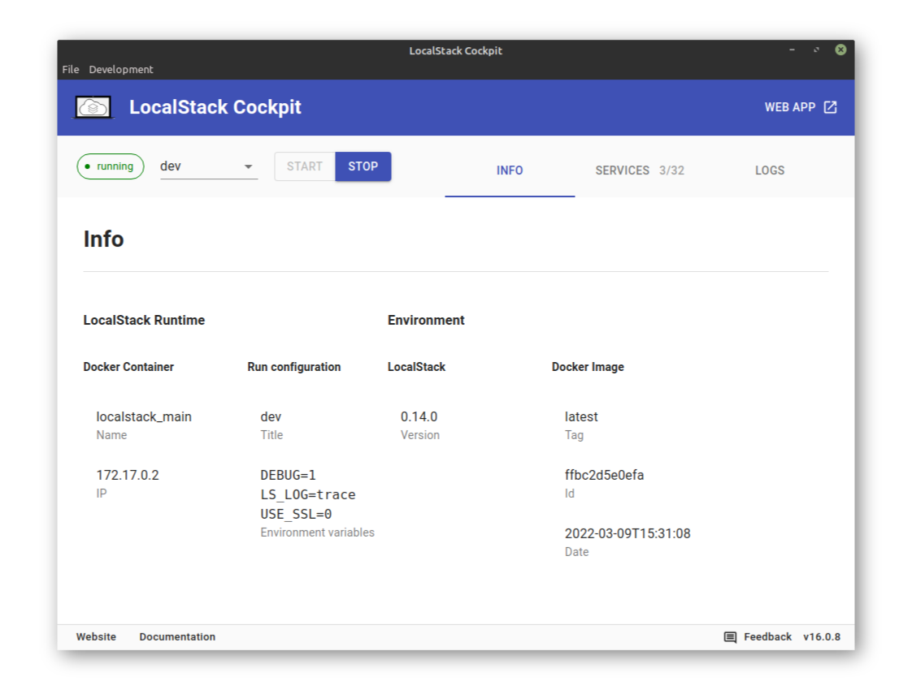

Getting started with LocalStack via the Cockpit is easy:
just download the Cockpit App for your operating system at
https://localstack.cloud/products/cockpit
make sure you have Docker installed, and you're ready to go!

## Prerequisites

To run LocalStack using the Cockpit you only need Docker and the Cockpit app.


*Note*: The Cockpit beta version is not yet verified on Windows and Mac app stores.
On [Windows](https://www.windowscentral.com/how-disable-smartscreen-trusted-app-windows-10) and [Mac](https://support.apple.com/guide/mac-help/open-a-mac-app-from-an-unidentified-developer-mh40616/mac) you need to allow your OS to run untrusted code.


## Features

The LocalStack Cockpit makes it easy for you to manage your LocalStack instance.
Here are some of the Cockpit's features:

### Automatic environment check

When the Cockpit starts it will automatically check your system environment whether everything is ready to start LocalStack.
It will also download the LocalStack Docker image for you, should it not be on your system.



### Run configurations

Manage and select LocalStack run configurations to start LocalStack with a particular configuration.
Save your LocalStack Pro API key, or a particular set of environment variables into a run configuration. 





### Manage your LocalStack instance

Start and stop LocalStack by simply clicking a button.
No mucking about in the CLI or a docker-compose file.
The environment and Services screen give you instant insights into your running instance.



### Quick log access

Get quick access to your LocalStack logs for instant insights.

*Note*: The beta version does not yet have auto-followcockpit, so you need to click "Refresh" and "Scroll to end".



## Known issues

- MacOS ≤ v10 not supported yet.
- There may be glibc issues on older Linux versions.

## Report issues

Please help us make LocalStack Cockpit better!
If you experience a problem, have feedback or a feature request for us, please [submit an issue](https://github.com/localstack/cockpit/issues).
Ideally add your log files, so that we can investigate into your problem more easily.

Logs folder:

- Linux: `~/.config/localstack-cockpit/logs/`
- macOS: `~/Library/Logs/localstack-cockpit/`
- Windows: `%USERPROFILE%\AppData\Roaming\localstack-cockpit\logs\`
