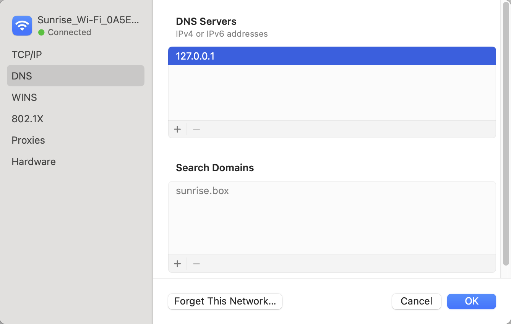

LocalStack includes a DNS server that enables seamless connectivity to LocalStack from different environments using `localhost.localstack.cloud`.
The DNS server is available on all IPv4 addresses within the LocalStack container (i.e., listening to `0.0.0.0`) and resolves `localhost.localstack.cloud` to the LocalStack container.
Therefore, containers that are configured to use the DNS server can reach LocalStack using `localhost.localstack.cloud`.
This configuration happens automatically for containers created by LocalStack, including compute resources such as Lambda, ECS, and EC2.
Your container can be configured to use the DNS server as demonstrated in the [Network Troubleshooting guide]().
If you wish to use the DNS server on your host system, follow the instructions under [System DNS configuration]().

LocalStack Pro additionally offers [Transparent Endpoint Injection]() (active by default),
which enables seamless connectivity to LocalStack without changing your application code targeting AWS.
The DNS server resolves AWS domains such as `*.amazonaws.com` including subdomains to the LocalStack container.
Therefore, your application seamlessly accesses the LocalStack APIs instead of the real AWS APIs.


On your host machine, `localhost.localstack.cloud` and any subdomains such as `mybucket.s3.localhost.localstack.cloud` resolve to `localhost` using a public DNS entry by LocalStack
unless your router has [DNS rebind protection]() enabled.



### Fallback DNS server

If you want to use another upstream DNS resolver than your default system DNS resolver or Google DNS (`8.8.8.8` fallback if detection fails),
specify the fallback DNS server where all non-redirected queries (i.e., not matching `DNS_NAME_PATTERNS_TO_RESOLVE_UPSTREAM`) will be forwarded to:

```bash
DNS_SERVER=1.1.1.1
```

By default, LocalStack attempts to detect the default system DNS resolver upon startup.
If this detection fails, LocalStack uses Google DNS `8.8.8.8` as a fallback.

### Skip LocalStack DNS resolution

If you want to resolve certain AWS URLs to AWS instead of LocalStack,
specify a comma-separated list of skip patterns using Python-flavored regex such as:

```bash
DNS_NAME_PATTERNS_TO_RESOLVE_UPSTREAM='.*(ecr|lambda).*.amazonaws.com'
```

Using this configuration, the LocalStack DNS server resolves all AWS domains to LocalStack _except_ ECR and Lambda domains which will be resolved via the `DNS_SERVER` (i.e., the real DNS entry by default).
For example, `https://123456789012.dkr.ecr.us-west-2.amazonaws.com` will be forwarded to the upstream DNS resolver and reach real AWS.
This can be used for hybrid setups, where certain API calls (e.g., ECR, Lambda) target AWS, whereas other services will target LocalStack.
The regex pattern follows Python flavored-regex and can be tested at [regex101.com](https://regex101.com/r/OzIsQa/1).

[The regex101 link is maintained by Joel Scheuner (requires linking to GitHub or Google account).
It redirects to the main page if the saved example would not work.]: #


Use this configuration with caution because we generally do not recommend connecting to real AWS from within LocalStack. 


### DNS Server bind address

If you experience problems when running LocalStack and the DNS server is the issue, you can disable the DNS server using:

```bash
DNS_ADDRESS=0
```


We do not recommend disabling the DNS server since this disables resolving `localhost.localstack.cloud` to the LocalStack container.



### LocalStack endpoints

If you operate behind an enterprise proxy and wish to customize the domain name returned by LocalStack services (e.g., SQS queue URL),
check out the [Configuration]() `LOCALSTACK_HOST`.

If you wish to customize internal LocalStack DNS routing of `localhost.localstack.cloud`,
refer to the instructions in the [Route53 documentation]().


## DNS rebind protection

If you rely on your local network's DNS, your router/DNS server might block requests due to the DNS Rebind Protection.
This feature is enabled by default in pfSense, OPNSense, OpenWRT, AVM FritzBox, and potentially also other devices.
Some of the vendors might allow upstream responses in the 127.0.0.0/8 range (like OpenWRT).


If you are using the LocalStack DNS server, DNS rebind protection should not cause any issues.


You can check if your DNS setup works correctly by resolving a subdomain of `localhost.localstack.cloud`:

$ dig test.localhost.localstack.cloud

; <<>> DiG 9.16.8-Ubuntu <<>> test.localhost.localstack.cloud
;; global options: +cmd
;; Got answer:
;; ->>HEADER<<- opcode: QUERY, status: NOERROR, id: 45150
;; flags: qr rd ra; QUERY: 1, ANSWER: 2, AUTHORITY: 0, ADDITIONAL: 1

;; OPT PSEUDOSECTION:
; EDNS: version: 0, flags:; udp: 65494
;; QUESTION SECTION:
;test.localhost.localstack.cloud. IN	A

;; ANSWER SECTION:
test.localhost.localstack.cloud. 10786 IN CNAME	localhost.localstack.cloud.
localhost.localstack.cloud. 389	IN	A	127.0.0.1

;; Query time: 16 msec
;; SERVER: 127.0.0.53#53(127.0.0.53)
;; WHEN: Fr Jän 14 11:23:12 CET 2022
;; MSG SIZE  rcvd: 90


If the DNS resolves the subdomain to your localhost (127.0.0.1), your setup is working.
If not, please check the configuration of your router / DNS if the Rebind Protection is active or [enable the LocalStack DNS on your system]().


## System DNS configuration

If you wish to use the DNS server on your host system, you need to expose the LocalStack DNS server and configure your operating system.
This is necessary if you want to test unmodified application code directly on your system against LocalStack and cannot configure the endpoint URL.


Please be careful when changing the network configuration on your system, as this may have undesired side effects.
Remember to save the default configuration and restore it after testing.


1. Expose the LocalStack DNS server:

    a) The LocalStack CLI automatically publishes port 53 if it can be bound on the host.

    b) For Docker Compose, add the following port mappings to your `docker-compose.yml`:

     ```yaml
     ports:
       - "127.0.0.1:53:53"                # Expose DNS server to host
       - "127.0.0.1:53:53/udp"            # Expose DNS server to host
     ```


If port 53 is already bound, `docker-compose up` fails with the error:
```plain
Error response from daemon: Ports are not available: exposing port UDP 127.0.0.1:53 -> 0.0.0.0:0: command failed
```

To find out if a program is listening on a port, run the following command:

```bash
# sudo is required if the port is < 1024
# [sudo] lsof -P -i :<port> | grep LISTEN
sudo lsof -P -i :53 | grep LISTEN
```

In macOS, a common process that listens on port 53 is `mDNSResponder`.
Docker for Mac 4.24 has a [known issue](https://docs.docker.com/desktop/release-notes/#4240) and suggests the following workaround:
> Deactivate network acceleration by adding `"kernelForUDP": false`, in the `settings.json` file located at `~/Library/Group Containers/group.com.docker/settings.json`.

Additionally, ensure that "Internet Sharing" is disabled in the system preferences as suggested in [this GitHub issue](https://github.com/docker/for-mac/issues/7008#issuecomment-1748344545).



2. Configure LocalStack to use a `DNS_SERVER` other than the host, for example using [CloudFlare DNS](https://www.cloudflare.com/learning/dns/what-is-1.1.1.1/) `DNS_SERVER=1.1.1.1`.
3. Configure your system to use the LocalStack DNS depending on your operating system:

### macOS

Search for "DNS servers" in the system preferences and add a new DNS server with the IP `127.0.0.1`.
Updates in the system settings are automatically reflected in `/etc/resolv.conf` and should add such an entry such as `nameserver 127.0.0.1`.



### Linux

In Linux, the configuration depends on your network manager/DNS configuration.

#### systemd-resolved

[//]: # (TODO: fix docs for Linux)
On many modern systemd-based distributions, like Ubuntu, systemd-resolved is used for name resolution.
LocalStack provides a CLI command for exactly this scenario.
To use systemd-resolved and the LocalStack domain resolution, try the following steps.

Start LocalStack Pro with `DNS_ADDRESS=127.0.0.1` as environment variable.
This makes LocalStack bind port 53 on 127.0.0.1, whereas systemd-resolved binds its stub resolver to 127.0.0.53:53, which prevents a conflict.
Once LocalStack is started, you can test the DNS server using `dig @127.0.0.1 s3.amazonaws.com` versus `dig @127.0.0.53 s3.amazonaws.com`, the former should return an A record `127.0.0.1`, the latter the real AWS DNS result.

Run:

$ localstack dns systemd-resolved


To revert, please run:

$ localstack dns systemd-resolved --revert



You need sudo privileges to execute this command.


This command sets the DNS server of the bridge interface of the docker network LocalStack currently runs in to the LocalStack container's IP address.
(The command does not work with host networking or without LocalStack running for this reason.)
Also, it configures the DNS route to exclusively (and only) route the following DNS names (and its subdomains) to the LocalStack DNS:

```text
~amazonaws.com
~aws.amazon.com
~cloudfront.net
~localhost.localstack.cloud
```

If you want to perform this action manually, please do the following steps:

1. Find out the bridge interface and container IP of your LocalStack container.
    Use `docker inspect localstack-main` to get the IP address and network, then `docker inspect network` to get the interface name.
    If the interface name is not mentioned, it is usually the first 12 characters of the network ID prefixed with `br-`, like `br-0ae393d3345e`.
    If you use the default bridge network, it is usually `docker0`.

1. Configure the DNS resolver for the bridge network:

    
    # resolvectl dns <network_name> <container_ip>
    

3. Set the DNS route to route only the above mentioned domain names (and subdomains) to LocalStack:

    
    # resolvectl domain <network_name> ~amazonaws.com ~aws.amazon.com ~cloudfront.net ~localhost.localstack.cloud
    

In both cases, you can use `resolvectl query s3.amazonaws.com` or `resolvectl query example.com` to check which interface your DNS request is routed through, to confirm only the above mentioned domains (and its subdomains) are routed to LocalStack.

When correctly configured, either using the LocalStack CLI command or manually, only the requests for the mentioned domain names are routed to LocalStack, all other queries will resolve as usual.

#### Other resolution settings

Depending on your Linux distribution, the settings to set a DNS server can be quite different.
In some systems, directly editing `/etc/resolv.conf` is possible, like described in [macOS]().
If your `/etc/resolv.conf` is overwritten by some service, it might be possible to install and enable/start `resolvconf` and specify the nameserver in `/etc/resolvconf/resolv.conf.d/head` with `nameserver 127.0.0.1`.
This will prepend this line in the resolv.conf file even after changes.


Using these options, every DNS request is forwarded to LocalStack, which will forward queries it does not need to modify (in essence all but certain AWS domains).
LocalStack does not share or store any forwarded DNS requests, except for local exception logging in debug mode.

