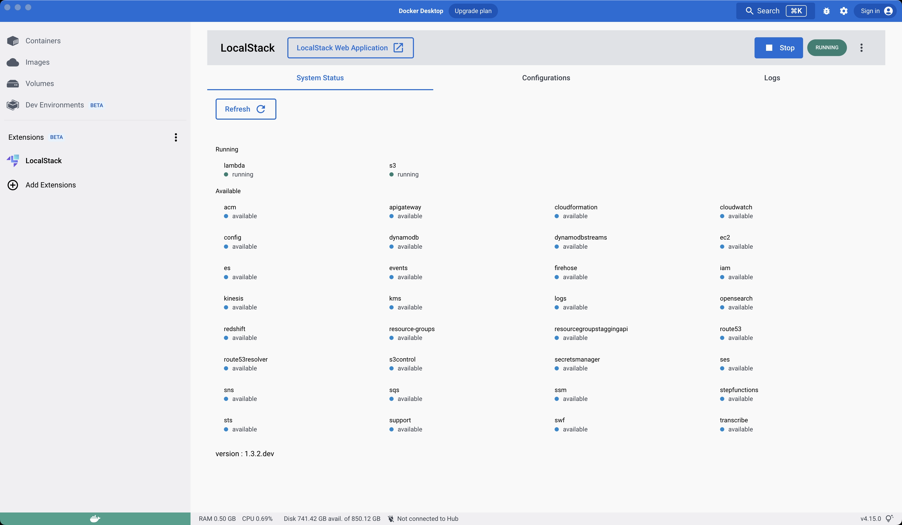

The LocalStack Extension for Docker Desktop enables developers working with LocalStack to operate their LocalStack instance via Docker Desktop, including checking service status, instance logs, and configure profiles. To install the LocalStack Extension for Docker Desktop, you just need to have [Docker Desktop installed on your machine](https://www.docker.com/products/docker-desktop).

## Installation

You can install the LocalStack Extension for Docker Desktop via pulling our public Docker image from Docker Hub:


$ docker extension install localstack/localstack-docker-desktop:0.1.0


To setup the Docker Extension by building the image locally, you can clone our [Docker Desktop extension](https://github.com/localstack/localstack-docker-extension) repository, and run the following command:


$ make install-extension


It will build the Docker image and install the extension on your Docker Desktop application.


*Note*: The LocalStack Extension for Docker Desktop is not yet verified and available on Docker Desktop marketplace. The current features are experimental in nature, and are subject to change in future iterations.


## Features

Currently, the LocalStack Extension for Docker Desktop supports the following features:

* **Control LocalStack**: Start, stop, and restart LocalStack from the Docker Desktop. You can also see the current status of your LocalStack instance and navigate to LocalStack Web Application.
* **LocalStack insights**: You can see the log information of the LocalStack instance and all the available services and their status on the service page.
* **LocalStack configurations**: You can manage and use your profiles via configurations and create new configurations for your LocalStack instance.

We also recommend you to add add `/tmp` to your shared files on Docker Desktop under **Settings** > **Resources** > **File sharing**. It is a temporary solution since it's where the LocalStack volume directory mounts.
