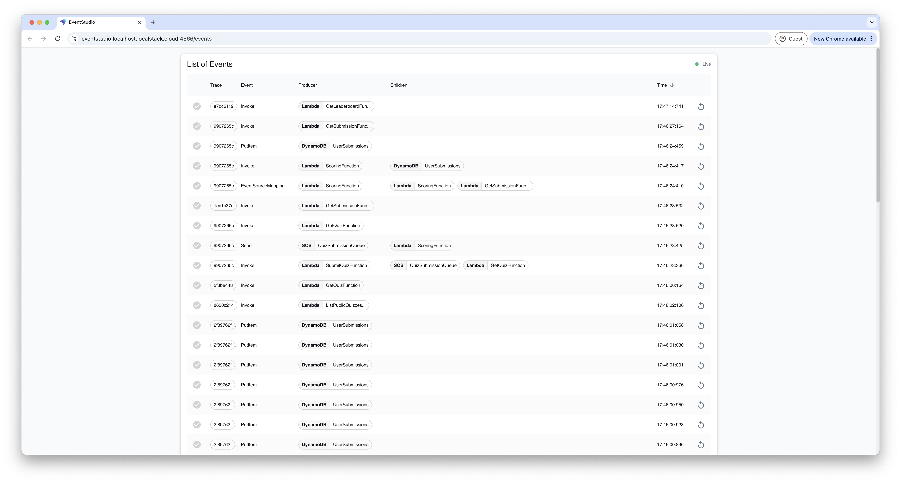
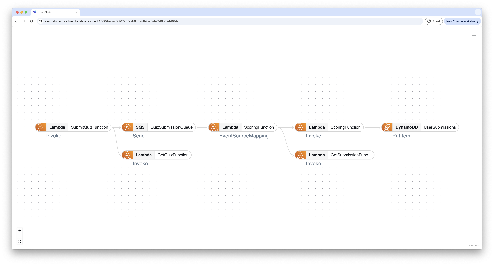
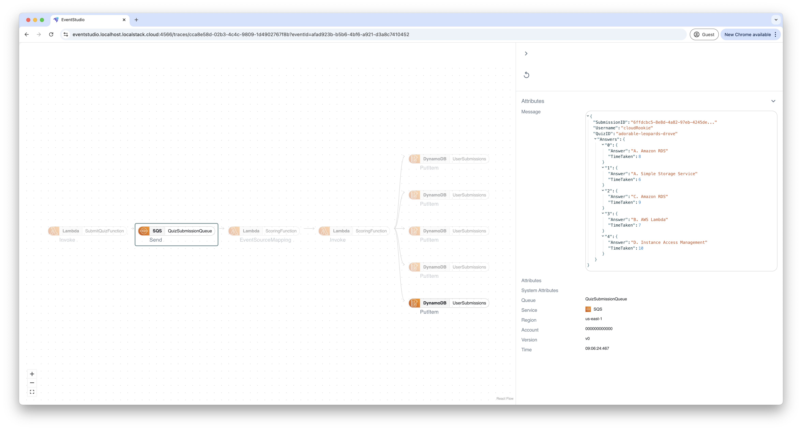
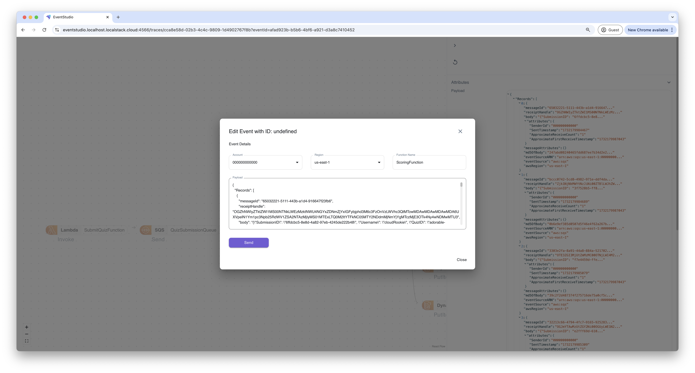

## Introduction

Event Studio allows users to view, collect, and inspect data exchanges, including event payloads and metadata, between AWS services.
It enhances system observability by displaying the data exchanged at every stage, facilitating clear understanding of event flows.
It further centralizes debugging by enabling event replay at any system stage for detailed analysis and troubleshooting.
In addition, it serves as a single point of truth to understand potential errors, service configuration mismatches and IAM permission issues.

With Event Studio, you can:

- Observe and understand the flow of events through your system.
- Replay events to troubleshoot AWS services involved in your workflow.
- Identify errors and obtain detailed information for corrections.
- Get immediate feedback on any misconfigurations in your services.
- Gain insights into IAM policies and detect missing permissions.
- Enhance event contexts for advanced flow tracing.


Event Studio is offered as a **preview** feature and is under active development.


## Installation

To install Event Studio, start your LocalStack container with your `LOCALSTACK_AUTH_TOKEN`:


$ export LOCALSTACK_AUTH_TOKEN=...
$ localstack start


Event Studio is available as a LocalStack Extension.
To install it, use the `extensions` sub-command in the `localstack` CLI.
Run the following command to install Event Studio:


$ localstack extensions install localstack-extension-event-studio


Check the LocalStack logs for Event Studio output, where you should see logs like:

```bash
localstack-main  | 2024-11-21T08:47:25.688  INFO --- [  MainThread] l.e.patterns.webapp        : eventstudio extension available at http://localhost.localstack.cloud:4566/_extension/eventstudio
localstack-main  | 2024-11-21T08:47:25.694  INFO --- [  MainThread] l.e.patterns.webapp        : eventstudio extension available at http://eventstudio.localhost.localstack.cloud:4566
localstack-main  | 2024-11-21T08:47:25.858  INFO --- [ady_monitor)] eventstudio.extension      : Extension Loaded
localstack-main  | Ready.
```

You can navigate to **https://eventstudio.localhost.localstack.cloud:4566** in your browser to view your events.

## Features

### List the local events

With Event Studio, you can view a detailed list of events in your application, including event producers, types, and timestamps.
The interface enables you to trace the flow of events, identify relationships between services, and analyze patterns for debugging or optimization.



### Display the connections

By clicking on the events, you can visualize the intricate relationships between AWS services in your event-driven architecture.
Event Studio offers a clear, interactive graph that shows how different AWS services interact, making it easy to track data flow, identify bottlenecks, and debug issues.



### View Event Details

When you click on the service, you can drill down into the specifics of each event, including the data exchanged between services, detailed payloads, and metadata.
Event Studio highlights errors, warnings, and potential IAM permission issues, enabling precise debugging and troubleshooting.
This detailed view ensures complete transparency and insight into system interactions at every step.



### Edit & Replay

Finally, you can modify event payloads and metadata directly within the interface to test different scenarios or adjust configurations.
Replay edited events through your system to analyze workflows, validate fixes, and ensure accurate service interactions.
This is essential for effectively debugging complex event-driven architectures.



## Supported Services

The following services are supported on Event Studio:

- [S3]()
- [SQS]()
- [SNS]()
- [DynamoDB]()
- [Lambda]()
- [EventBridge]()
