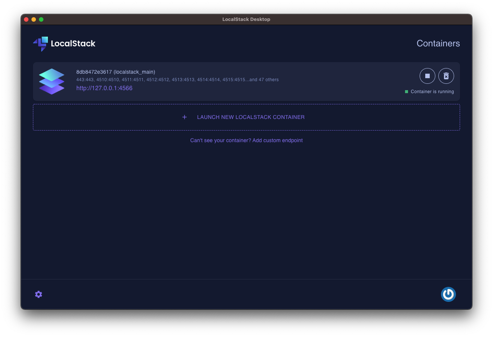
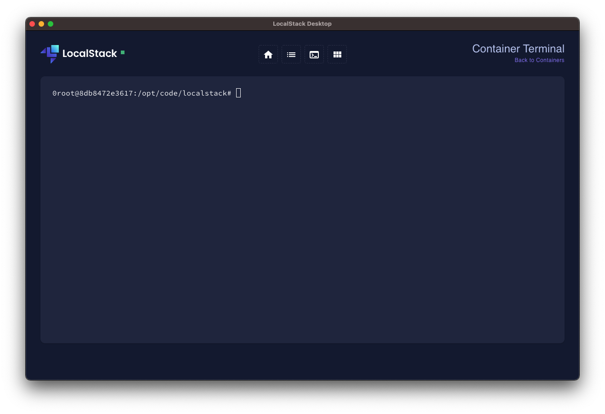
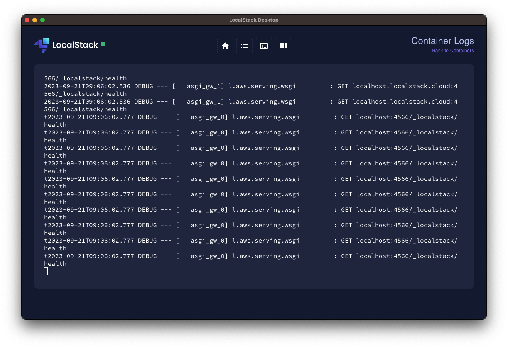
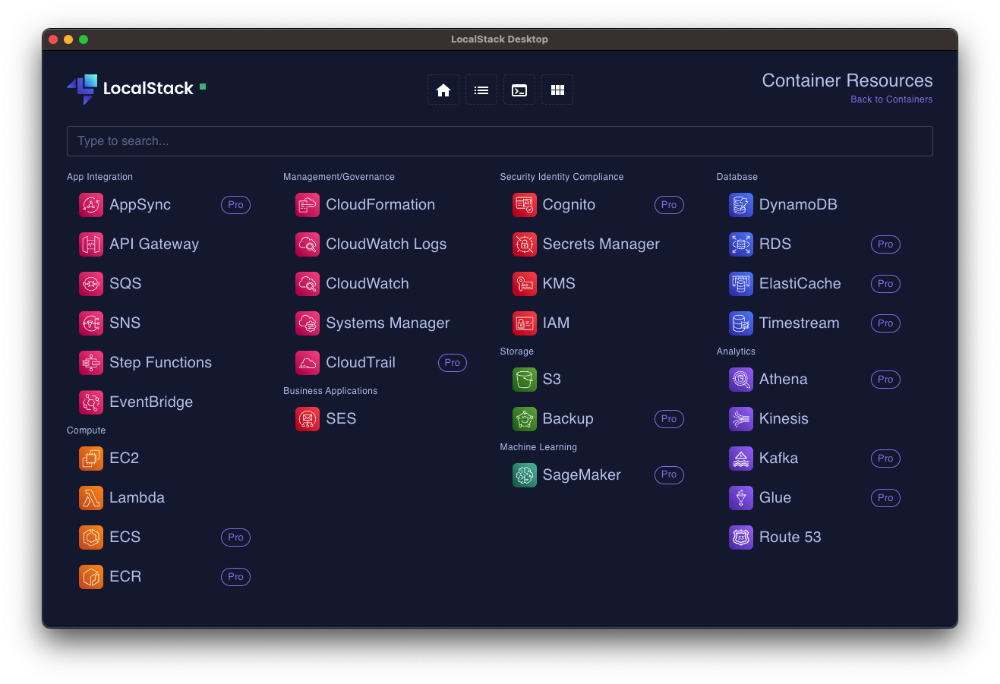

LocalStack Desktop is a desktop client that allows users to easily control and interact with their LocalStack instance. Using LocalStack Desktop, users can start and stop their LocalStack instance with a single click, create a new container, view logs, interact with LocalStack container via cli and use our resource browser.


LocalStack Desktop replaces the previous LocalStack Cockpit application. Cockpit isn't available or maintained anymore and we recommend you to use LocalStack Desktop instead.


## Installation

You can download LocalStack Desktop from our [web application](https://app.localstack.cloud/download).
To install LocalStack Desktop, **Docker** is the only prerequisite. 

## Features

LocalStack Desktop helps users to interact with their LocalStack instance with a simple and intuitive UI. Some of the features of LocalStack Desktop includes the ability to: Control LocalStack, Interact with LocalStack, get LocalStack insights and use the Resource browser.

### Control LocalStack

Using our Desktop application you will be able to start, stop, delete and create new containers with just a click. It also allows to set up a custom URL if you are using LocalStack outside of Docker or in Kubernetes.

### Interact with LocalStack

You can run commands within the LocalStack container by using our CLI

### LocalStack Insights

LocalStack Desktop provides quick access to your LocalStack logs for instant insights. See what's happening in details from the Logs tab.

### Resource browser

You can also create, modify, delete and read all of your resources from the Resource Browser tab, having the same experience that you would have using it in our [web application](https://app.localstack.cloud/inst/default/resources)

