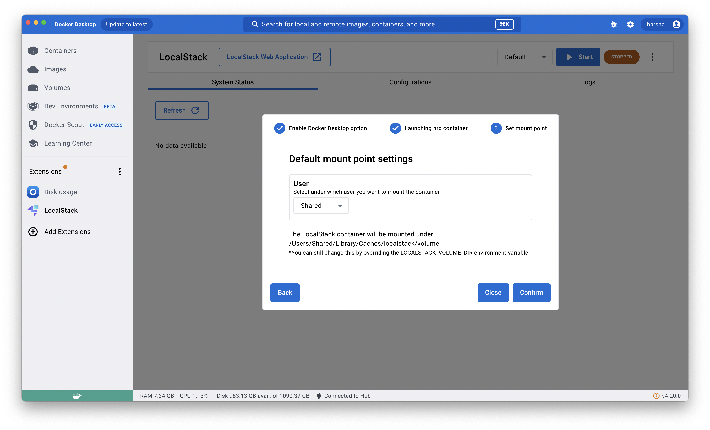

## Introduction

The LocalStack Extension for Docker Desktop enables developers working with LocalStack to operate their LocalStack container via Docker Desktop, including checking service status, container logs, and configuring profiles.
To install the LocalStack Extension for Docker Desktop, you need to have [Docker Desktop installed on your machine](https://www.docker.com/products/docker-desktop).

## Installation

To utilize LocalStack's Docker Extension, it is necessary to have a recent version of Docker Desktop (v4.8 or higher) installed on the local machine.
To enable the extension, access the **Extensions** tab and select the **Enable Docker Extensions** and **Show Docker Extensions system containers** option.

  

The LocalStack Extension for Docker Desktop has been validated and can be accessed on the Extensions Marketplace.
To begin using it, navigate to the **Extensions Marketplace**, search for **LocalStack**, and click the **Install** button to proceed with the installation.

  

An alternative method for installing the LocalStack's Extension for Docker Desktop is pulling the [public Docker image](https://hub.docker.com/r/localstack/localstack-docker-desktop) from Docker Hub and installing it!


$ docker extension install localstack/localstack-docker-desktop:0.5.3


After installation, you can access the LocalStack Extension for Docker Desktop from the **Extensions** tab.
Upon the initial launch of the extension, a prompt to select a mount point for the LocalStack container will appear.
Select your username from the drop-down menu.
Furthermore, you can modify this setting later by navigating to the **Configurations** tab and choosing a different mount point.

## Features

LocalStack's Docker Extension helps users to manage their LocalStack container with a simple and intuitive user interface through Docker Desktop.
The extension includes container management, configuration profile management, service status, and container logs!

### Container management

You can start, stop, and restart LocalStack from the Docker Desktop.
You can also see the current status of your LocalStack container and navigate to LocalStack Web Application.

### Container logs

You can see the log information of the LocalStack container and all the available services and their status on the service page.

### Configuration management

You can manage and use your profiles via configurations and create new configurations for your LocalStack container.

## Configure an Auth Token

To configure an Auth Token for the LocalStack Docker Extension, you need to create a new configuration profile.
Navigate to the **Configurations** tab and click the **New +** button.
Enter the configuration name and add the `LOCALSTACK_AUTH_TOKEN` environment variable with the desired value.

To start the LocalStack Pro container with the Auth Token, select the configuration profile from the drop-down menu and click the **Start** button.
