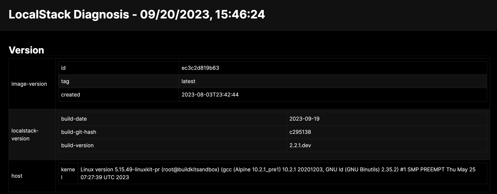

This extension makes Diagnosis Viewer to view the diagnostics endpoint available directly in LocalStack.

## Installation

To install the Extension, run the following command:


$ localstack extensions install localstack-extension-diagnosis-viewer


You can also install the Extension using the [Extensions Installer](https://app.localstack.cloud/extensions/remote?url=git+https://github.com/localstack/localstack-extensions/#egg=localstack-extension-diagnosis-viewer&subdirectory=diagnosis-viewer) which is available in the LocalStack Web Application.

## Usage

This Extension serves as a Web User-Interface for the diagnostic endpoint of LocalStack, which becomes active when LocalStack is launched with `DEBUG=1`.

You can access the diagnostic endpoint through the following command: 


$ curl -s localhost:4566/_localstack/diagnose


Subsequently, you can access the web UI at [**localhost:4566/diapretty**](http://localhost:4566/diapretty).

