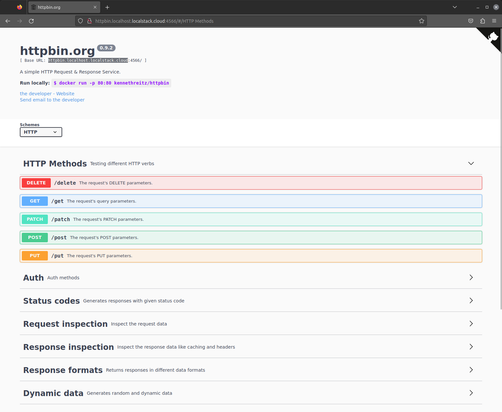
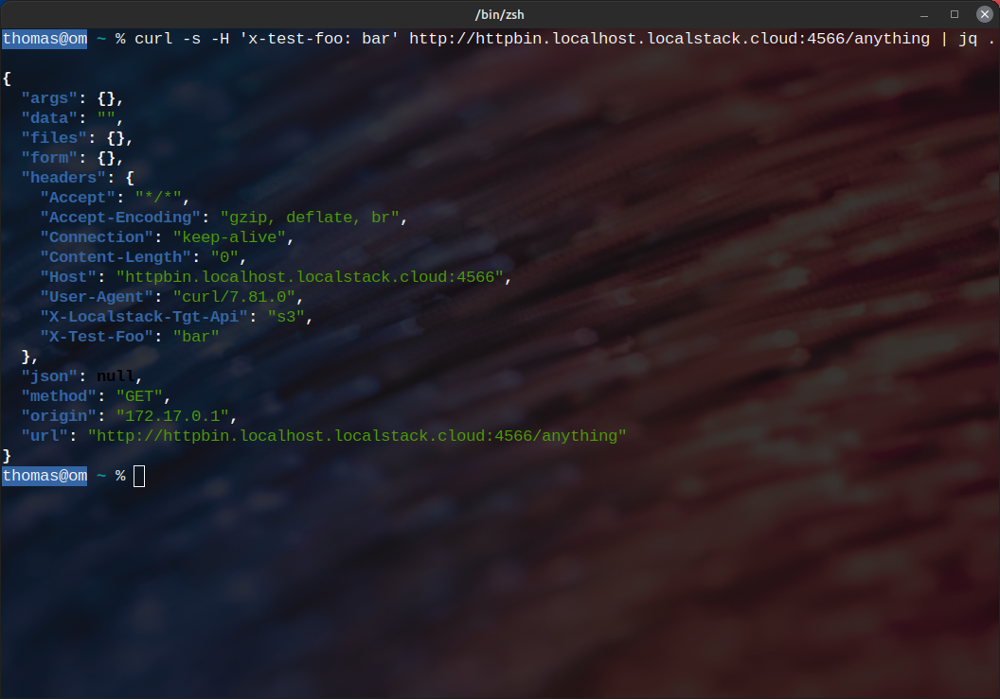

This extension makes [httpbin](https://httpbin.org/), a simple HTTP Request & Response Service, available directly in LocalStack.

## Installation

To install the Extension, run the following command:


$ localstack extensions install localstack-extension-httpbin


You can also install the Extension using the [Extensions Installer](https://app.localstack.cloud/extensions/remote?url=git+https://github.com/localstack/localstack-extensions/#egg=localstack-extension-httpbin&subdirectory=httpbin) which is available in the LocalStack Web Application.

## Usage

You can access the Flasgger UI by opening [**httpbin.localhost.localstack.cloud:4566**](http://httpbin.localhost.localstack.cloud:4566/) in your web browser.

  

You can call the API endpoints just as you would call any other API endpoint with httpbin.

  
