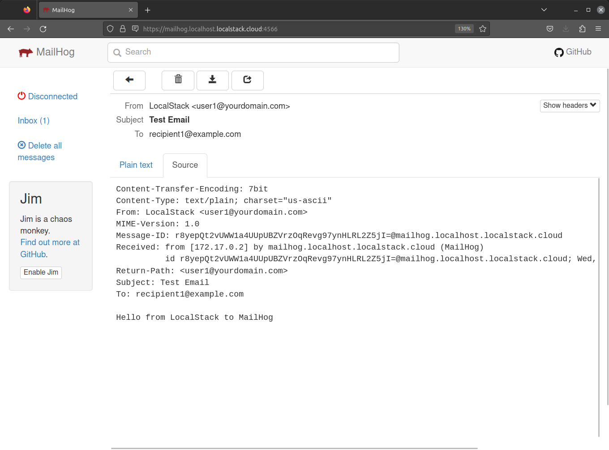

This extension makes [MailHog](https://github.com/mailhog/MailHog) for Web and API based STMP testing available directly in LocalStack.

## Installation

To install the Extension, run the following command:


$ localstack extensions install "git+https://github.com/localstack/localstack-extensions/#egg=localstack-mailhog-extension&subdirectory=mailhog"


You can also install the Extension using the [Extensions Installer](https://app.localstack.cloud/extensions/remote?url=git+https://github.com/localstack/localstack-extensions/#egg=localstack-extension-mailhog&subdirectory=mailhog) which is available in the LocalStack Web Application.

## Usage

When utilizing this extension, LocalStack is automatically set up to utilize the MailHog SMTP server for sending emails. You can execute the following AWS CLI commands to verify an email address and send an email:


$ awslocal ses verify-email-identity --email-address user1@yourdomain.com
$ awslocal ses send-email \
    --from user1@yourdomain.com \
    --message 'Body={Text={Data="Hello from LocalStack to MailHog"}},Subject={Data=Test Email}' \
    --destination 'ToAddresses=recipient1@example.com'


You can then access the MailHog UI at [**mailhog.localhost.localstack.cloud:4566**](http://mailhog.localhost.localstack.cloud:4566/) or [**localhost:4566/mailhog**](http://localhost:4566/mailhog/) to view the received email.

  

## Configuration

To configure the Extension, you can make use of the [MailHog configuration environment variables](https://github.com/mailhog/MailHog/blob/master/docs/CONFIG.md). When working with the LocalStack CLI, you can include them by employing the following syntax: `DOCKER_FLAGS='-e MH_<var>=<val> -e ...'`. In case you are working within a Docker-Compose setup, simply add these variables as environment settings for the respective container.

## Limitations

The MailHog UI offers real-time updates through WebSockets, a feature not currently supported on the default `:4566` port. If you encounter this error in the LocalStack logs when accessing the UI, rest assured that it can be safely ignored.
