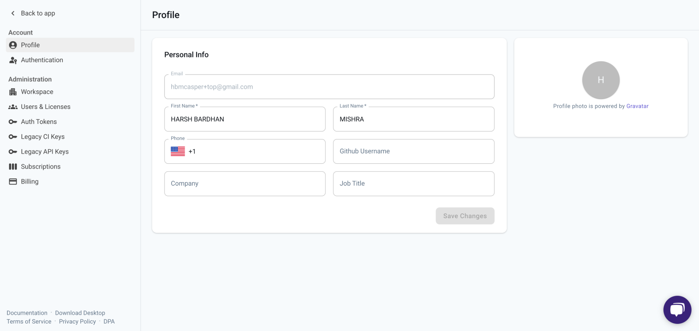

## Introduction

A user account on the LocalStack Web Application is required to access the following features:

- Advanced AWS services
- Resource Browsers
- Cloud Pods
- Extensions Library
- Stack Insights
- Ephemeral Instances
- IAM Policy Stream
- Chaos Engineering

To create an Auth Token for your LocalStack account, you need to sign up for an account on the LocalStack Web Application.

This token is used to authenticate your requests to the LocalStack platform and access the features mentioned above.

## Creating an Account

To create an account for LocalStack for AWS, please visit our [pricing page](https://www.localstack.cloud/pricing) and click on "Get Started for Free".
Follow the prompts to fill out your information and remember to verify your email to continue.

All new users are granted a 14-day free Trial of our Ultimate tier with no commitment.
At the end of your free trial period, you may select your preferred plan.

> Terms: [localstack.cloud/legal/tos](https://www.localstack.cloud/legal/tos)  
> Privacy Policy: [localstack.cloud/legal/privacy-policy](https://www.localstack.cloud/legal/privacy-policy)

## Logging In

Once your account is activated, log in at [**app.localstack.cloud**](https://app.localstack.cloud) using your selected sign-in method.

Supported login options:
- GitHub
- SSO (if configured)
- Email-based authentication

## Updating Account Settings

To update your profile or change account settings:

1. Click your name or organization's name in the top-left corner.
2. Select **Settings** from the dropdown.
3. Navigate to **Profile** to update your name, company, job title, phone number, or GitHub username.

  

Changes are saved automatically once submitted.
