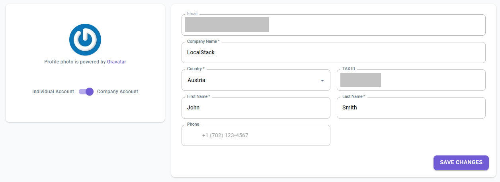

To start using LocalStack's Web Application, you must create an account. With a LocalStack account, you can sign-up for a license and use your API keys to access our advanced features. These include [AWS services]() marked under **Pro**, [Stack Insights](), [Cloud Pods](), and more!

## Creating an account

To create an account for LocalStack, visit [**app.localstack.cloud/sign-up**](https://app.localstack.cloud/sign-up). You can sign up with your email address or one of our supported social identity providers (such as GitHub).

## Account Types

You can choose between an **individual account** or a **company account**. When you sign up for LocalStack, you will automatically sign up for an individual account. These accounts are intended for non-company entities, such as individual developers.

To switch to a company account, you can do so from your [**app.localstack.cloud/account**](https://app.localstack.cloud/account) section. Click on the toggle to switch to a company account. You will be prompted to add the following information about your organization:

- Company Name
- Country
- Tax ID

The above information is required if you are acting on behalf of a company.

