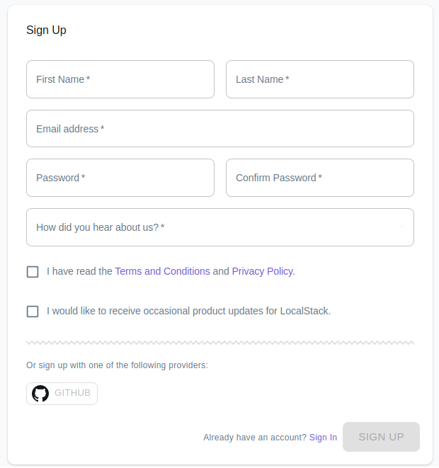

A LocalStack account is required to access features in the web app, and to access any of our paid offerings.

## Creating an Account

Visit [**app.localstack.cloud/sign-up**](https://app.localstack.cloud/sign-up) to create a user account for LocalStack.
You can sign up with your email address or one of our supported social identity providers (such as GitHub).

The Terms and Conditions can be found at <a href="https://www.localstack.cloud/legal/tos" target="_blank">https://www.localstack.cloud/legal/tos</a> and our privacy policy can be found at <a href="https://www.localstack.cloud/legal/privacy-policy" target="_blank">https://www.localstack.cloud/legal/privacy-policy</a>

## Updating Account Info and Settings

To update your account info, password and settings select the corresponding entry from the sidebar under the 'Account' menu entry.

