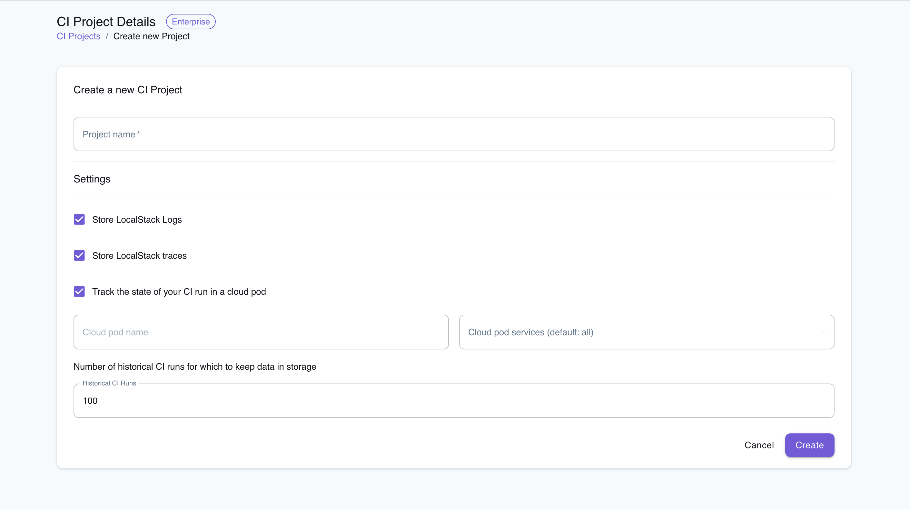
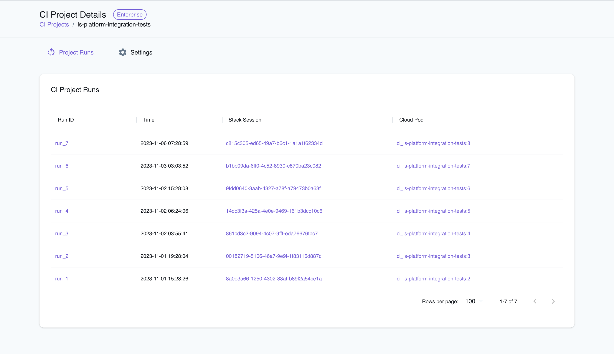
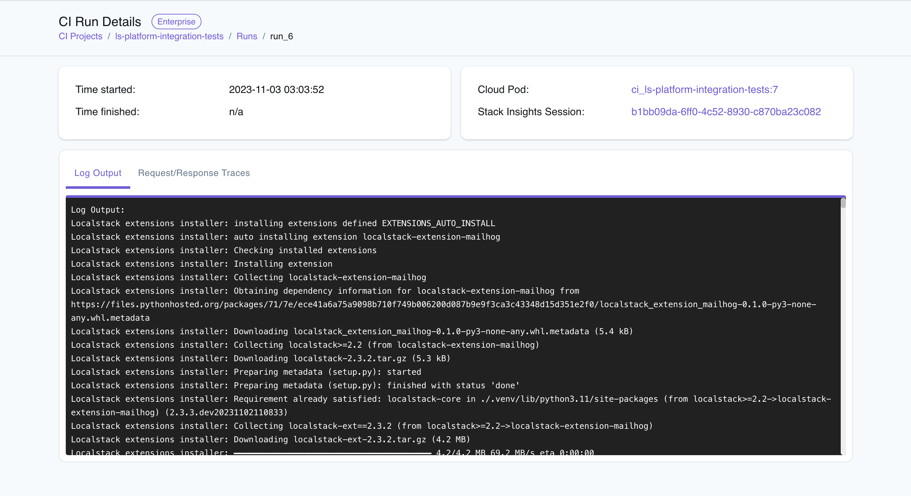
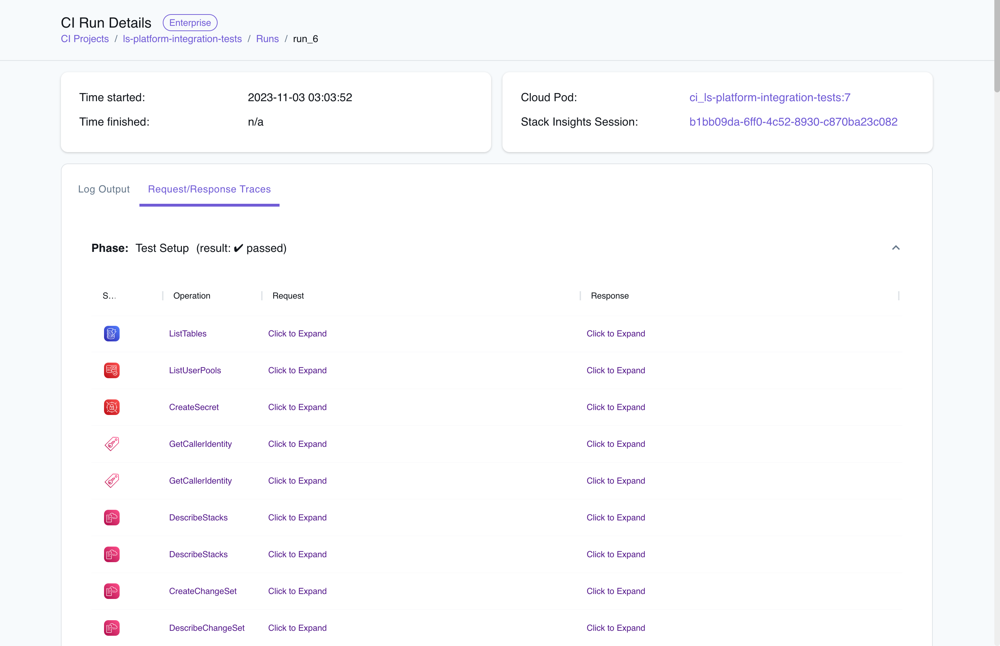
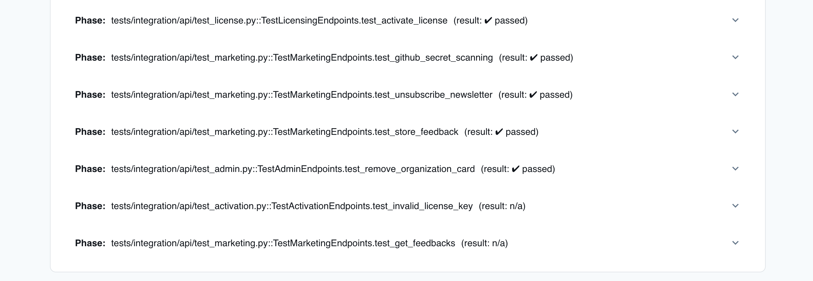

## Introduction

CI Analytics is a feature of LocalStack Web Application that allows users to get insights into their CI builds. CI Analytics unifies additional features, such as Cloud Pods & Stack Insights, and augments them with an integrated view of CI builds to provide users with insights and facilitate debugging. The features include:

- **CI Project Runs**: Offers a unified view of all CI builds for a particular project.
- **Log Output**: Enables viewing of detailed logs for individual CI builds.
- **Request/Response Traces**: Provides detailed traces of requests and responses, including the AWS service and operation involved, with expandable details of request and response data.
- **Cloud Pod State**: Allows viewing the state of LocalStack resources for a specific CI build, accessible via a Cloud Pod.
- **Stack Insights**: Displays a log of AWS API usage telemetry in your application stack, allowing you to examine the most frequently used services and API calls.

CI Analytics integrates with all of the popular CI/CD tools, including GitHub Actions, GitLab CI, CircleCI, to gather pipeline metrics that track the performance and results of your cloud infrastructure deployments.


CI Analytics is currently in **private preview**.
If you'd like to try it out, please [contact us](https://www.localstack.cloud/demo) to request access.


## Key Concepts

-   **CI Project**: It represents an application executing builds and tests in a Continuous Integration (CI) pipeline. This corresponds to a repository or CI workflow on platforms like GitHub or GitLab.
-   **CI Run**: It refers to a single CI build within a CI project. It typically corresponds to a single instance of a LocalStack container.
-   **CI Logs**: These are the log outputs from the LocalStack container during a CI run.
-   **CI Cloud Pod**: A Cloud Pod that records the state of a project at the end of a CI run, or at specific checkpoints during the run.
-   **CI Stack Insights**: This includes the Stack Insights session and associated data for a particular CI run.

## Getting started

This guide is designed for users new to CI Analytics and assumes basic knowledge of GitHub Actions and YAML. Though this guide uses GitHub Actions as an example, the steps are similar for other CI/CD tools. In this example, we will configure CI Analytics with an existing application that uses GitHub Actions.

### Prerequisites

- A [LocalStack Account](https://app.localstack.cloud/) and a [LocalStack API key](https://docs.localstack.cloud/getting-started/api-key/).
- A [GitHub Account](https://github.com/).

For practical testing, you can use an existing application that employs LocalStack for cloud infrastructure deployment on GitHub Actions. Alternatively, you can start by forking one of the [Developer Hub samples](https://docs.localstack.cloud/applications/).

### Create a CI project

To create a new CI project:

1.  Go to the [**CI Projects**](https://app.localstack.cloud/ci) section in the LocalStack Web Application.
2.  Click on **Create New Project**.


<br><br>

When creating a new CI project, fill in the following information:

-   **Project Name**: Enter a name for your CI project.
-   **Settings**: Adjust the default-enabled options as needed:
    -   **Store LocalStack Logs**: Check this to save logs from your LocalStack container.
    -   **Store LocalStack Traces**: Check this to save traces of your infrastructure tests.
    -   **Track the State of Your CI Run in a Cloud Pod**: Check this to monitor the state of your LocalStack resources during the CI run.
-   **Cloud Pod Services**: Specify the AWS services for which you want to store infrastructure states. Select from the available options.
-   **Historical CI Runs**: Set the number of past CI runs to retain (default is 100).

The **Cloud Pod Name** field will auto-fill with the name of your Cloud Pod, which identifies the resources created by LocalStack for your CI project. Click **Create** to finalize your CI project.

### Configure the CI pipeline

Go to the GitHub Action workflow where you intend to monitor CI analytics for your application stack. If you haven't already set up a CI pipeline using LocalStack for infrastructure deployments and tests, follow the instructions in our [GitHub Actions documentation](https://docs.localstack.cloud/user-guide/ci/github-actions/).

To link your CI pipeline to the project you created, use the `LS_CI_PROJECT` configuration variable. For instance, if your CI project is named `ls-platform-integration-tests`, include the line `LS_CI_PROJECT: ls-platform-integration-tests` in your GitHub Action workflow. 

Here's an example of a basic workflow configuration:

```yaml
name: localstack-ci-analytics-example
on: push
jobs:
  example-job:
    runs-on: ubuntu-latest
    steps:
      - name: Start LocalStack
        env:
          LOCALSTACK_API_KEY: ${{ secrets.LOCALSTACK_API_KEY }}
          LS_CI_PROJECT: ls-platform-integration-tests
        run: |
          pip install localstack awscli-local[ver1]
          docker pull localstack/localstack-pro
          localstack start -d
          localstack wait -t 30

      - name: Run some Tests against LocalStack
        run: |
          awslocal s3 mb s3://test
          awslocal s3 ls
          echo "Test Execution complete!"
```

### Configure the API key

The LocalStack CLI utilizes the `LOCALSTACK_API_KEY` for authentication with the LocalStack Platform. This process enables the storage of logs and request/response traces from your CI run in the LocalStack Web Application. For setting up an API key, refer our [documentation on configuring an API key](https://docs.localstack.cloud/user-guide/ci/github-actions/#configuring-an-api-key).

### Review the Analytics

You can now trigger the CI pipeline to run your application stack in a CI environment. Navigate to the [**CI Projects**](https://app.localstack.cloud/ci) dashboard on the LocalStack Web Application. Here, you'll find the CI project you created earlier. Click on the project to access its CI runs.


<br><br>

In the project's detail view, you can select a specific **Run ID** to examine its details. The CI run details page will display various information, including logs and other relevant data.


<br><br>

For in-depth analysis, you have the option to view **Request/Response Traces** for the CI run. These traces provide detailed insights into each request and response during the run. You can expand these traces to explore specific details and scroll down to review the traces for each test case.


<br><br>

You can additionally scroll down to review the traces for each test case.


<br><br>

Lastly, you can navigate to the top of the page to explore the **Cloud Pod** and **Stack Insights** related to the CI run. These features offer a broader view of the CI run's impact and performance.
