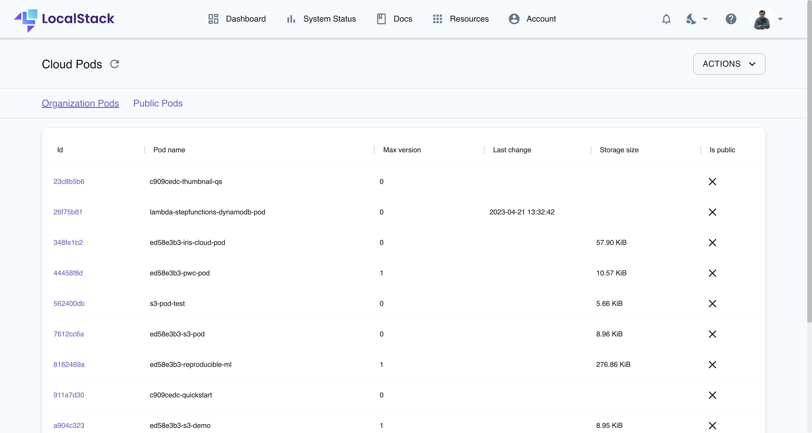
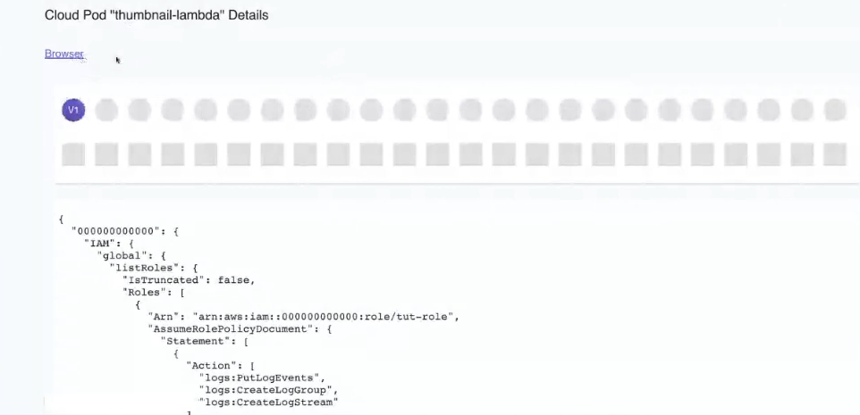
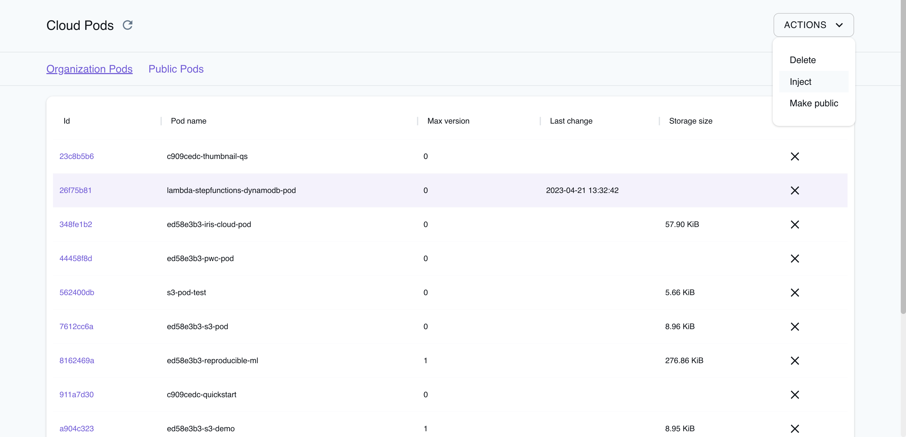

[Cloud Pods Browser](https://app.localstack.cloud/pods) contains all your Cloud Pods and each Cloud Pod's version history over the LocalStack Web Application. Cloud Pods Browser is accessible to LocalStack Team & Enterprise users. You can own Cloud Pods individually or share the ownership of a Cloud Pod in an organization. Alternatively, you can also make a Cloud Pod by configuring the [visibility of your Cloud Pod](https://docs.localstack.cloud/user-guide/tools/cloud-pods/pods-cli/#save).

## Usage

You can use [Cloud Pods](https://docs.localstack.cloud/user-guide/tools/cloud-pods/) to manage your local AWS infrastructure and collaborate with others:

- Cloud Pods are accessible to all LocalStack Team users in your organization namespace. Public Cloud Pods are accessible to all LocalStack users.
- Cloud Pods version history is available, and you can view the version history of a Cloud Pod and access a previous version of a Cloud Pod.
- Cloud Pods can be made public, injected into a running LocalStack container, or deleted from the LocalStack Web Application.


LocalStack Pro users cannot access Cloud Pods Browser. Community & Pro users can use the [Community Cloud Pods](https://docs.localstack.cloud/user-guide/tools/cloud-pods/community/) and save their Cloud Pods locally or on a GitHub/GitLab repository. [Cloud Pods launchpad](https://docs.localstack.cloud/user-guide/tools/cloud-pods/launchpad/) can be used to inject a Cloud Pod into a running LocalStack container through a simple click.


## Access the version history

To view the version history of a Cloud Pod, click on the Cloud Pod's name in the Cloud Pods Browser. You will be able the listed versions and you can click on a version to view the Cloud Pod's details in a JSON format.

To create a new version of a Cloud Pod, refer to the [Cloud Pods CLI](https://docs.localstack.cloud/user-guide/tools/cloud-pods/pods-cli/#save) documentation.

## Save a Cloud Pod

Users do not need to upload their Cloud Pod to the LocalStack Web Application since the Cloud Pods CLI automatically uploads it via the `save` operation. Similarly, the Cloud Pods CLI automatically injects the Cloud Pod into a running LocalStack container via the `load` operation after specifying the Cloud Pod's name. You can alternatively select a Cloud Pod on the Cloud Pods Browser and inject it into a running LocalStack container.

We use a secure storage mechanism to store Cloud Pods on the LocalStack Web Application. When you push a Cloud Pod, it is stored securely in our storage backend in AWS, with each user/organization receiving a dedicated, isolated S3 bucket. Pushing and pulling a Cloud Pod from our Web Application is facilitated by using secure S3 pre-signed URLs for the Cloud Pods CLI to interact directly with the S3 bucket rather than piping the state files through our LocalStack Platform APIs.
