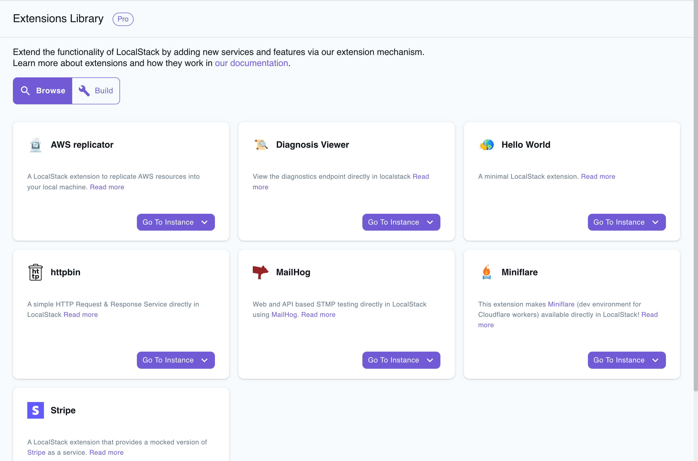

## Introduction

LocalStack extensions allows you to extend and customize LocalStack. A LocalStack extension is a Python application that runs together with LocalStack within the LocalStack container.

LocalStack extensions are available to licensed users, and the list of available extensions can be found in the [Extensions Library](https://app.localstack.cloud/extensions/library).

## Installing an Extension

To install an extension using the LocalStack Extensions Library, you can navigate to the [**app.localstack.cloud/extensions/library**](https://app.localstack.cloud/extensions/library) and click on the **Go to Instance** button to open the list of available instances. If you are running your LocalStack instance locally, you can click on the **Default** option.

You will be redirected to the LocalStack instance page, where you can directly click the **Install** button to install the Extension. The installation process will take a few seconds, and **will restart your LocalStack instance**. Click **Continue** to proceed.

## Managing Extensions

You can further manage the installed extensions by navigating to the **Extensions** tab in the LocalStack Instance page. You can remove an Extension by clicking the **Remove** button.

### Supported Extensions

The following extensions are currently available in the extensions Library:

-   [AWS Replicator](https://docs.localstack.cloud/user-guide/tools/localstack-extensions/aws-replicator-extension/): Replicate AWS resources into your local machine.
-   [Stripe](https://docs.localstack.cloud/user-guide/tools/localstack-extensions/stripe-extension/): Mocked version of Stripe for testing purposes.
-   [Miniflare](https://docs.localstack.cloud/user-guide/tools/localstack-extensions/miniflare-extension/): Local serverless execution environment for Cloudflare Workers.
-   [MailHog](https://docs.localstack.cloud/user-guide/tools/localstack-extensions/mailhog/): Email testing server integrated with LocalStack.
-   [httpbin](https://docs.localstack.cloud/user-guide/tools/localstack-extensions/httpbin-extension/): HTTP server with predefined responses.
-   [Diagnostic Viewer](https://docs.localstack.cloud/user-guide/tools/localstack-extensions/diagnosis-viewer-extension/): View and analyze LocalStack diagnostic logs.
