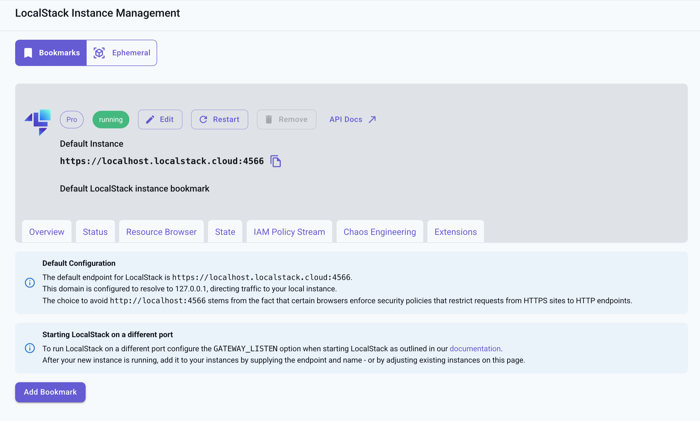

## Introduction

LocalStack Instance Management lets you view and manage your LocalStack instances while you build and test your cloud applications locally. You can access this feature through the [**LocalStack Instances**](https://app.localstack.cloud/instances) section in the sidebar of the LocalStack Web Application.

Instance Management offers these features:

-   **Status**: Shows the status of the services running in the LocalStack container.
-   **Resource Browser**: Lets you view and manage your local AWS resources.
-   **State**: Allows you to export and import the state of your LocalStack instances.
-   **Extensions**: Provides extra integrations to improve your LocalStack experience.

## Instance Bookmark

Instance Bookmark lets users save references to instances without directly creating or managing them. To create an Instance Bookmark, do the following:

-   Click on the **Add Bookmark** button on the Instance Management page.
-   Enter a name for the bookmark, specify the endpoint, and add a description.
-   Click on the **Save Bookmark** button.

## Connect to an instance on a different machine

You can use the Instance Bookmark feature to connect the LocalStack Web Application to a LocalStack instance running on a different machine.

To connect the Web Application with your running LocalStack instance, you need to ensure the endpoint URL’s server SSL certificate corresponds to the hostname/IP address of the URL. This is necessary when the endpoint URL is set as something like `https://myhost:4566` or uses an IP address like `https://1.2.3.4:4566`. Sites with an `https://...` URL must use HTTPS for requests, and the SSL certificate must match the hostname (e.g., localhost.localstack.cloud).

To address this, consider setting up a local TCP proxy server that listens on `127.0.0.1:4566` and forwards all requests to the endpoint where your LocalStack instance runs. In the Web user interface, you can keep the default setting, `https://localhost.localstack.cloud:4566`. Tools like [simpleproxy](https://manpages.ubuntu.com/manpages/trusty/man1/simpleproxy.1.html) or [proxy.py](https://github.com/abhinavsingh/proxy.py) can help set this up.

Alternatively, you can direct `localhost.localstack.cloud` to your target machine's IP address by modifying the `/etc/hosts` file, which is useful if you’re using the LocalStack Web UI on a macOS or Linux-based machine.


To bind to a custom IP address and port, configure the ['GATEWAY_LISTEN' configuration variable](https://docs.localstack.cloud/references/configuration/#core). For troubleshooting, refer to the [network troubleshooting guide](https://docs.localstack.cloud/references/network-troubleshooting/).

