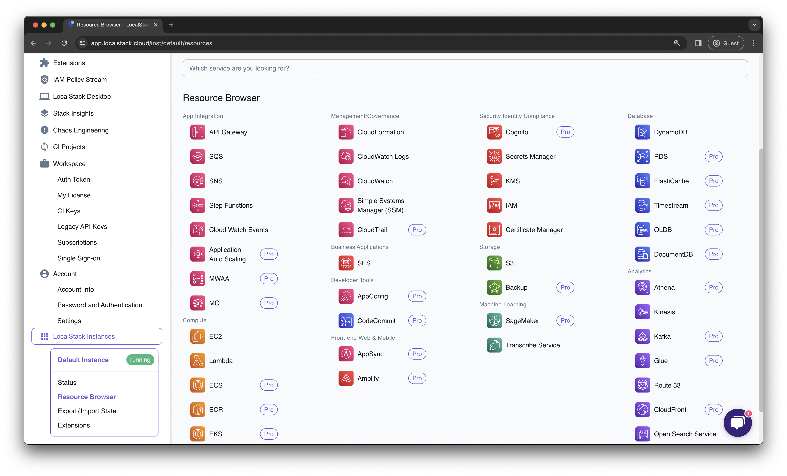

## Introduction

The LocalStack Resource Browser allow you to view, manage, and deploy AWS resources locally while building & testing their cloud applications locally. It provides an internal, integrated experience, similar to the AWS Management Console, to manage the ephemeral resources in a LocalStack container on your local machine.

The Resource Browser provide an experience similar to the AWS Management Console. However, the Resource Browser is not a replacement for the AWS Management Console and only replicate some of the features of the AWS Management Console. We recommend using our [integrations](https://docs.localstack.cloud/user-guide/integrations/) to create your resources, with the Resource Browser being used for quick viewing and management of your resources.

The LocalStack Web Application connects to your LocalStack container and retrieves the information about your local resources directly via `localhost` without using the internet. None of the information is sent to the internet, or stored on any external servers maintained by LocalStack.


An AWS region dropdown menu in the dashboard is located on the top right of the page. You can select your desired region to ensure that you can view your resources. If you cannot view resources that you have recently created, you should verify that you are checking the resources in the correct region.


## Supported services

The Resource Browser supports the following AWS services:

| Resource Group               | Service                                                                                               | 
|------------------------------|-------------------------------------------------------------------------------------------------------|
| **App Integration**          | [API Gateway](https://app.localstack.cloud/inst/default/resources/apigateway)                          | 
|                              | [Amazon MQ](https://app.localstack.cloud/inst/default/resources/mq/brokers)                                    | 
|                              | [Amazon MWAA](https://app.localstack.cloud/inst/default/resources/mwaa/environments)                                | 
|                              | [Amazon SNS](https://app.localstack.cloud/inst/default/resources/sns)                                  | 
|                              | [Amazon SQS](https://app.localstack.cloud/inst/default/resources/sqs)                                  | 
|                              | [Application Auto Scaling](https://app.localstack.cloud/inst/default/resources/application-autoscaling) | 
|                              | [AWS Step Functions](https://app.localstack.cloud/inst/default/resources/stepfunctions)                | 
| **Compute**                  | [Amazon EC2](https://app.localstack.cloud/inst/default/resources/ec2)                                  | 
|                              | [Amazon ECS](https://app.localstack.cloud/inst/default/resources/ecs)                                  | 
|                              | [Amazon ECR](https://app.localstack.cloud/inst/default/resources/ecr/repositories)                                  | 
|                              | [Amazon EKS](https://app.localstack.cloud/inst/default/resources/eks/clusters)                                  | 
|                              | [AWS Lambda](https://app.localstack.cloud/inst/default/resources/lambda/functions)                                | 
| **Management/Governance**    | [AWS Account](https://app.localstack.cloud/inst/default/resources/account/contactinfo) |
|                              | [AWS CloudFormation](https://app.localstack.cloud/inst/default/resources/cloudformation)                | 
|                              | [Amazon CloudWatch](https://app.localstack.cloud/inst/default/resources/cloudwatch)                      | 
|                              | [Amazon CloudTrail](https://app.localstack.cloud/inst/default/resources/cloudtrail/events)                      | 
|                              | [Amazon EventBridge (CloudWatch Events)](https://app.localstack.cloud/inst/default/resources/events)    | 
|                              | [AWS Systems Manager (SSM)](https://app.localstack.cloud/inst/default/resources/ssm)                    | 
| **Business Applications**    | [Amazon SES](https://app.localstack.cloud/inst/default/resources/ses)                                    | 
| **Developer Tools**          | [AWS AppConfig](https://app.localstack.cloud/inst/default/resources/appconfig/applications)                          | 
|                              | [AWS CodeCommit](https://app.localstack.cloud/inst/default/resources/codecommit/repositories)                        | 
| **Front-end Web & Mobile**   | [AWS Amplify](https://app.localstack.cloud/inst/default/resources/amplify/apps)                                | 
|                              | [AWS AppSync](https://app.localstack.cloud/inst/default/resources/appsync)                                | 
| **Security Identity Compliance** | [AWS ACM (Certificate Manager)](https://app.localstack.cloud/inst/default/resources/acm/certificates)               | 
|                              | [Amazon Cognito Identity](https://app.localstack.cloud/inst/default/resources/cognito-idp)              | 
|                              | [AWS IAM (Identity and Access Management)](https://app.localstack.cloud/inst/default/resources/iam)    | 
|                              | [AWS Key Management Service (KMS)](https://app.localstack.cloud/inst/default/resources/kms)            | 
|                              | [AWS Secrets Manager](https://app.localstack.cloud/inst/default/resources/secretsmanager)                | 
| **Storage**                  | [Amazon S3](https://app.localstack.cloud/inst/default/resources/s3)                                      | 
|                              | [AWS Backup](https://app.localstack.cloud/inst/default/resources/backup/plans)                                |
| **Machine Learning**         | [Amazon SageMaker](https://app.localstack.cloud/inst/default/resources/sagemaker/models)                        | 
|                              | [Amazon Transcribe](https://app.localstack.cloud/inst/default/resources/transcribe/transcriptionjobs)                      | 
| **Database**                 | [Amazon DynamoDB](https://app.localstack.cloud/inst/default/resources/dynamodb)                          | 
|                              | [Amazon RDS](https://app.localstack.cloud/inst/default/resources/rds)                                    | 
|                              | [Amazon ElastiCache](https://app.localstack.cloud/inst/default/resources/elasticache)                    | 
|                              | [Amazon QLDB](https://app.localstack.cloud/inst/default/resources/qldb/ledgers)                                  | 
|                              | [Amazon DocumentDB](https://app.localstack.cloud/inst/default/resources/docdb/clusters) | 
|                               | [Amazon Neptune](https://app.localstack.cloud/inst/default/resources/neptune/clusters) |
|                              | [Amazon Timestream](https://app.localstack.cloud/inst/default/resources/timestream-write) |
| **Analytics**                | [Amazon Athena](https://app.localstack.cloud/inst/default/resources/athena/databases)                     | 
|                              | [Amazon Kinesis](https://app.localstack.cloud/inst/default/resources/kinesis)                            | 
|                              | [Amazon MSK (Managed Streaming for Kafka)](https://app.localstack.cloud/inst/default/resources/kafka)     |  
|                              | [AWS Glue](https://app.localstack.cloud/inst/default/resources/glue)                                      | 
|                              | [Amazon Route 53](https://app.localstack.cloud/inst/default/resources/route53)                            | 
|                              | [Amazon CloudFront](https://app.localstack.cloud/inst/default/resources/cloudfront/distributions)                        | 
|                              | [Amazon OpenSearch Service](https://app.localstack.cloud/inst/default/resources/opensearch/domains) | 
| **Cloud Financial Management** | [AWS Cost Explorer](https://app.localstack.cloud/inst/default/resources/ce/costcategorydefinitions)                              |

## Troubleshooting

If you encounter a `Network Failure` error message while accessing the Resource Browser, it is likely that the LocalStack container is not running or the instance is not reachable at the endpoint specified in the instance bookmark.
