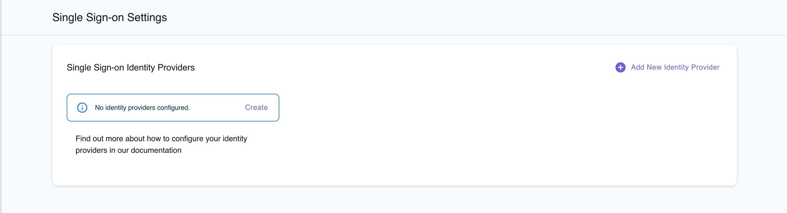

Custom Single-Sign On (SSO) Identity providers, can be enabled to facilitate the process of quickly onboarding team members from your organization.

In order to configure SSO access, first sign in to the LocalStack Web application under [app.localstack.cloud](https://app.localstack.cloud/).
In your profile settings, navigate to the Single Sign-on tab which will list existing SSO Identity Providers (if any exist).

Next, click the button to create a new identity provider (IdP), where you can choose between the two leading industry standards:

- OpenID Connect (OIDC): [openid.net/connect](https://openid.net/connect/)
- SAML: [saml.xml.org/saml-specifications](http://saml.xml.org/saml-specifications)

## Configuring SSO using OpenID Connect (OIDC)

In the form illustrated below, you can then enter the main information for the new IdP (using OpenID Connect):

- Name of your identity provider
- Client ID, Client Secret, Attributes request method, OIDC issues, Authorize scopes, and more.
  - You should be able to find these attributes in your OIDC IdP configuration.

## Configuring SSO using SAML

When configuring SSO using SAML, you can configure the settings of the Identity Provider via a standard SAML metadata file (see illustration below).
The SAML metadata file can be specified either via URL or via a file upload.

Select **Enable IdP sign out flow** if you want your users to be logged out from our app and your SAML IdP when they log out from your our Web Application.

## Attribute mapping

These attributes can be defined to automatically map attributes of user entities in your internal IdP to user attributes in the LocalStack platform.

The following user attribute mappings can currently be configured:

- Email
- First name
- Last name

The Email should be configured to ensure correct functionality.

## Callback URL, Sign Up Portal URL and Identifier (Entity Id)

After configuring the base details for your Identity Provider (IdP), the following additional information can be copied from the UI:

- **Callback URL**: The Callback URL that you may need to configure  in the settings of your IdP.
- **Identifier (Entity Id)**: The Identifier (Entity Id) that you may need to configure in the settings of your IdP.
- **Sign Up Portal URL**: This is the URL that can be shared with your users to start the SSO signup flow for the LocalStack Web Application. The format of this endpoint is `https://app.localstack.cloud/auth/sso/<organizationId>/<ssoName>`

## User Roles and Permissions

For each new member that joins your org, you can specify user roles and permissions that should be assigned to them.
- **Default User Role**:  The Role that should be assigned to users of your organization signing up via SSO. In most cases, this should be a Member.
- **Default User Permissions**: Use this to define which permissions should be assigned to users of your organization signing up via SSO.
  - Tip: In order to enable self-serve licences (i.e., allowing your users to allocate themselves their own license), make sure to select the **Allow member to issue a license for themselves (or a legacy API key)** permission.

