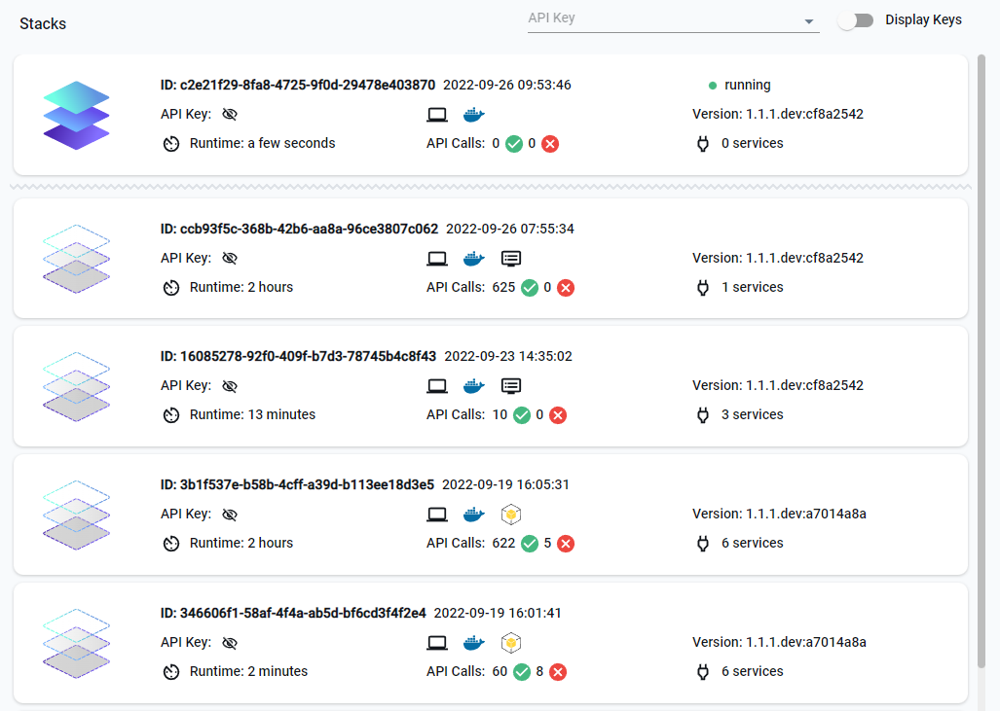

## Introduction

LocalStack collects execution events to provide usage analytics and insights into development and testing. Stack Insights let users report AWS API usage telemetry to their LocalStack account.

Stack Insights show which APIs are used, which clients or integrations use specific services and API operations, and which services cause the most API errors.


Your privacy matters to us! We only collect anonymized and sanitized data.
No sensitive information about your application is ever collected or exposed.
The data is only used to provide you with insights into the usage of LocalStack and to help us improve the product.


## Getting started

 
 

To start using this feature, log in to your [LocalStack account](https://app.localstack.cloud/) and start a [LocalStack instance on your local machine](). The system will start making your events accessible on the [Stack Insights dashboard](https://app.localstack.cloud/stacks).

Click on the Stack widget to see:

- Number of API calls
- Services used
- Runtime duration for each instance
- Timestamps for each instance
- Number of successful and failed API calls

Click on an individual stack for more details, such as:
- Number of API calls
- Service invocations
- User agent (e.g., `aws-cli`, `terraform`)
- Specific services called during the instance
- Use the slide toggle to select a time period to view specific API calls

Stack insights are collected only if the session runs for less than 24 hours.
View the list of events during the entire Stack lifetime, including:
- Service
- Operation
- Status code
- Server time
- User agent

## Configuration

You can disable event reporting on your LocalStack client by setting the environment variable `DISABLE_EVENTS=1`.


Brave blocks `localhost` requests due to security by default via shields.
While some sites need access to `localhost` / `127.0.0.1` to work correctly, an easy option to allow a user to enable this is manually enabling via the site via `brave://settings/content/insecureContent`.

